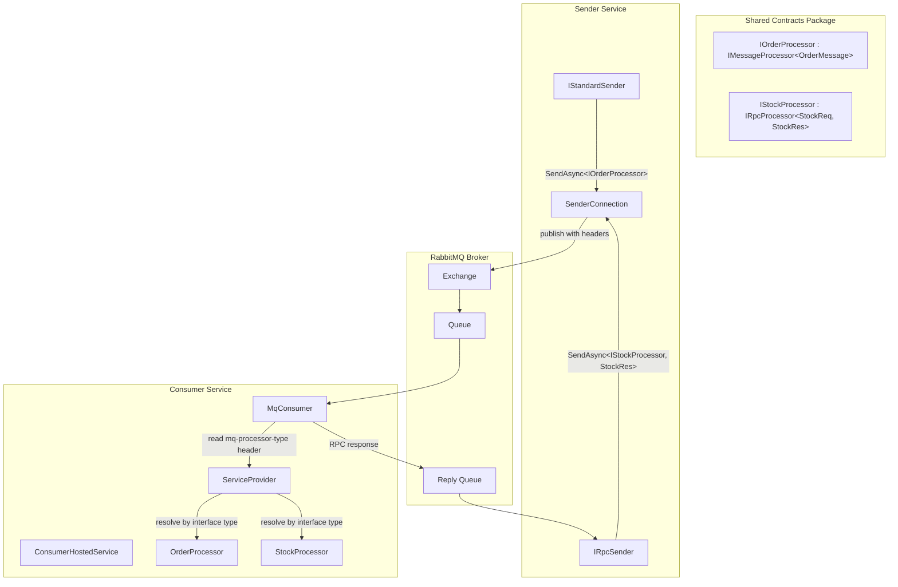
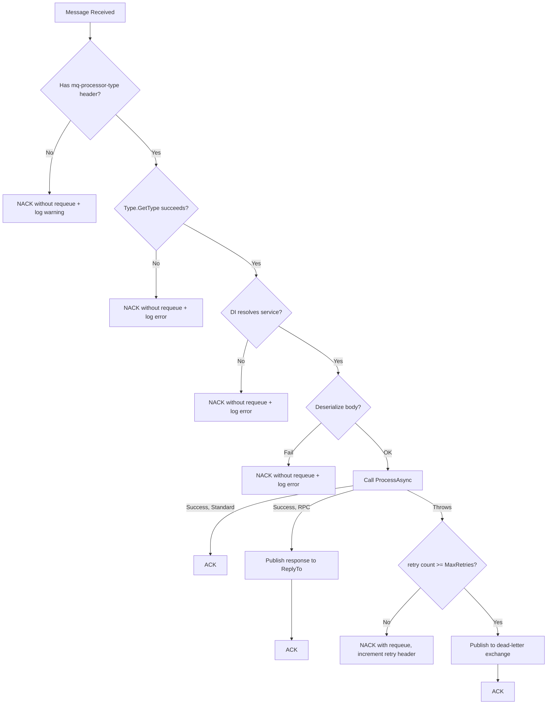

# Design Document: MqCSFramework

## Overview

MqCSFramework is a single-package, RabbitMQ-only messaging framework for .NET 10. It provides compile-time type-safe sending via processor contract interfaces, automatic consumer dispatch using DI resolution from message headers, and independent connection management per sender/consumer.

The framework supports two messaging patterns:
- **Standard** (fire-and-forget): publish a message, no response expected
- **RPC** (request-reply): publish a request, await a typed response

The key design principle is **simplicity**: one NuGet package, no transport abstraction, no routing tables, no processor registration at the consumer. The consumer resolves processors purely from the `mq-processor-type` header at runtime.

### Design Goals

1. Compile-time safety — the sender cannot send a message type that doesn't match the processor's expectation
2. Zero consumer configuration for processors — register in DI, the consumer auto-discovers via headers
3. Independent connections — each sender/consumer manages its own connection lifecycle
4. Minimal API surface — two sender interfaces, two processor base interfaces, one builder

### Dependencies

| Package | Version | Purpose |
|---------|---------|---------|
| RabbitMQ.Client | 7.x | Broker communication (fully async API) |
| Microsoft.Extensions.Hosting | 10.x | BackgroundService, DI integration |
| Microsoft.Extensions.DependencyInjection | 10.x | Keyed services, service resolution |
| System.Text.Json | 10.x | Message serialization |
| Microsoft.Extensions.Logging | 10.x | Structured logging |

## Architecture



### Message Flow — Standard Pattern

1. Sender calls `IStandardSender.SendAsync<TProcessor, TMessage>(message)`
2. Framework serializes message to JSON
3. Framework sets headers: `mq-processor-type` = `typeof(TProcessor).AssemblyQualifiedName`, `mq-pattern` = `"standard"`
4. Framework publishes to configured exchange/routing key via RabbitMQ.Client 7.x
5. Consumer receives message, reads `mq-processor-type` header
6. Consumer calls `Type.GetType(headerValue)` → resolves from DI → calls `ProcessAsync`
7. On success: ACK. On failure: NACK (with requeue/dead-letter based on retry config)

### Message Flow — RPC Pattern

1. Sender calls `IRpcSender.SendAsync<TProcessor, TResponse, TRequest>(request)`
2. Framework declares an exclusive reply queue named `{queueName}.reply.{GUID}` (unique per sender instance)
3. Framework sets headers: `mq-processor-type`, `mq-pattern` = `"rpc"`, plus `ReplyTo` and `CorrelationId`
4. Consumer receives, resolves processor, calls `ProcessAsync` which returns `TResponse`
5. Consumer serializes response and publishes to the reply queue
6. Sender awaits response with timeout → returns `TResponse` or throws `RpcTimeoutException`
7. If processor throws, consumer wraps error and publishes error response → sender throws `RpcRemoteException`

## Components and Interfaces

### Processor Contracts (Shared between sender and consumer)

```csharp
namespace MqCSFramework;

/// <summary>
/// Base interface for standard message processors.
/// Define a contract interface inheriting this in your shared contracts package.
/// </summary>
public interface IMessageProcessor<in TMessage> where TMessage : class
{
    Task ProcessAsync(TMessage message, MessageContext context, CancellationToken ct = default);
}

/// <summary>
/// Base interface for RPC processors that return a response.
/// Define a contract interface inheriting this in your shared contracts package.
/// </summary>
public interface IRpcProcessor<in TRequest, TResponse> where TRequest : class where TResponse : class
{
    Task<TResponse> ProcessAsync(TRequest request, MessageContext context, CancellationToken ct = default);
}
```

### Abstract Base Classes (Processor implementations inherit from these)

The consumer dispatches via the non-generic base interfaces (`IMessageProcessor`, `IRpcProcessor`) which have raw byte methods. The abstract base classes implement deserialization and delegate to the typed `ProcessAsync`.

```csharp
namespace MqCSFramework;

/// <summary>
/// Non-generic base interface for standard processors.
/// The consumer calls ProcessRawAsync — no reflection needed.
/// </summary>
public interface IMessageProcessor
{
    Task ProcessRawAsync(ReadOnlyMemory<byte> body, MessageContext context, CancellationToken ct = default);
}

/// <summary>
/// Generic interface extending the non-generic base. Defines the typed ProcessAsync.
/// </summary>
public interface IMessageProcessor<in TMessage> : IMessageProcessor where TMessage : class
{
    Task ProcessAsync(TMessage message, MessageContext context, CancellationToken ct = default);
}

/// <summary>
/// Non-generic base interface for RPC processors.
/// The consumer calls ProcessRawRpcAsync — no reflection needed.
/// </summary>
public interface IRpcProcessor
{
    Task<byte[]> ProcessRawRpcAsync(ReadOnlyMemory<byte> body, MessageContext context, CancellationToken ct = default);
}

/// <summary>
/// Generic interface extending the non-generic base. Defines the typed ProcessAsync.
/// </summary>
public interface IRpcProcessor<in TRequest, TResponse> : IRpcProcessor where TRequest : class where TResponse : class
{
    Task<TResponse> ProcessAsync(TRequest request, MessageContext context, CancellationToken ct = default);
}

/// <summary>
/// Abstract base class for standard processors.
/// Implements ProcessRawAsync: deserializes the body and calls the typed ProcessAsync.
/// </summary>
public abstract class StandardProcessor<TMessage> : IMessageProcessor<TMessage>
    where TMessage : class
{
    public Task ProcessRawAsync(ReadOnlyMemory<byte> body, MessageContext context, CancellationToken ct = default)
    {
        var message = JsonSerializer.Deserialize<TMessage>(body.Span)!;
        return ProcessAsync(message, context, ct);
    }

    public abstract Task ProcessAsync(TMessage message, MessageContext context, CancellationToken ct = default);
}

/// <summary>
/// Abstract base class for RPC processors.
/// Implements ProcessRawRpcAsync: deserializes, calls typed ProcessAsync, serializes response.
/// </summary>
public abstract class RpcProcessor<TRequest, TResponse> : IRpcProcessor<TRequest, TResponse>
    where TRequest : class
    where TResponse : class
{
    public async Task<byte[]> ProcessRawRpcAsync(ReadOnlyMemory<byte> body, MessageContext context, CancellationToken ct = default)
    {
        var request = JsonSerializer.Deserialize<TRequest>(body.Span)!;
        var response = await ProcessAsync(request, context, ct);
        return JsonSerializer.SerializeToUtf8Bytes(response);
    }

    public abstract Task<TResponse> ProcessAsync(TRequest request, MessageContext context, CancellationToken ct = default);
}
```

**Consumer dispatch (no reflection, no extra interfaces):**
```csharp
// Standard:
if (processor is IMessageProcessor standardProcessor)
    await standardProcessor.ProcessRawAsync(ea.Body, context, ct);

// RPC:
if (processor is IRpcProcessor rpcProcessor)
    var responseBytes = await rpcProcessor.ProcessRawRpcAsync(ea.Body, context, ct);
```

### Sender Interfaces

```csharp
namespace MqCSFramework;

/// <summary>
/// Sends standard (fire-and-forget) messages.
/// The TProcessor generic constraint enforces compile-time type safety.
/// </summary>
public interface IStandardSender
{
    Task<string> SendAsync<TProcessor, TMessage>(
        TMessage message,
        SendOptions? options = null,
        CancellationToken ct = default)
        where TProcessor : IMessageProcessor<TMessage>
        where TMessage : class;
}

/// <summary>
/// Sends RPC (request-reply) messages and awaits a typed response.
/// </summary>
public interface IRpcSender
{
    Task<TResponse> SendAsync<TProcessor, TResponse, TRequest>(
        TRequest request,
        RpcOptions? options = null,
        CancellationToken ct = default)
        where TProcessor : IRpcProcessor<TRequest, TResponse>
        where TRequest : class
        where TResponse : class;
}
```

### Message Context

```csharp
namespace MqCSFramework;

/// <summary>
/// Metadata available to processors when handling a message.
/// </summary>
public sealed record MessageContext
{
    public required string MessageId { get; init; }
    public required string CorrelationId { get; init; }
    public required DateTimeOffset Timestamp { get; init; }
    public required string Pattern { get; init; }
    public required IReadOnlyDictionary<string, string> Headers { get; init; }
}
```

### Configuration Options

```csharp
namespace MqCSFramework;

/// <summary>
/// RabbitMQ connection settings shared by senders and consumers.
/// </summary>
public sealed class RabbitMqConnectionOptions
{
    public required string HostName { get; set; }
    public int Port { get; set; } = 5672;
    public string UserName { get; set; } = "guest";
    public string Password { get; set; } = "guest";
    public string VirtualHost { get; set; } = "/";
    public bool UseSsl { get; set; }
    public string? ClientProvidedName { get; set; }
}

/// <summary>
/// Options for configuring a standard sender.
/// </summary>
public sealed class StandardSenderOptions
{
    public required RabbitMqConnectionOptions Connection { get; set; }
    public required string Exchange { get; set; }
    public string RoutingKey { get; set; } = "";
}

/// <summary>
/// Options for configuring an RPC sender.
/// </summary>
public sealed class RpcSenderOptions
{
    public required RabbitMqConnectionOptions Connection { get; set; }
    public required string Exchange { get; set; }
    public string RoutingKey { get; set; } = "";
    public TimeSpan Timeout { get; set; } = TimeSpan.FromSeconds(30);
}

/// <summary>
/// Options for configuring a consumer.
/// </summary>
public sealed class ConsumerOptions
{
    public required RabbitMqConnectionOptions Connection { get; set; }
    public required string QueueName { get; set; }
    public ushort PrefetchCount { get; set; } = 10;
    public int MaxRetries { get; set; } = 3;
    public string? DeadLetterExchange { get; set; }
    public string? DeadLetterRoutingKey { get; set; }
    public bool SuppressMessageBodyLogging { get; set; }
    public IReadOnlyList<string> MaskedFields { get; set; } = [];
}

/// <summary>
/// Per-message send options (override defaults).
/// </summary>
public sealed class SendOptions
{
    public string? RoutingKey { get; set; }
    public string? CorrelationId { get; set; }
    public IReadOnlyDictionary<string, string>? AdditionalHeaders { get; set; }
}

/// <summary>
/// Per-message RPC options (override defaults).
/// </summary>
public sealed class RpcOptions
{
    public string? RoutingKey { get; set; }
    public string? CorrelationId { get; set; }
    public TimeSpan? Timeout { get; set; }
    public IReadOnlyDictionary<string, string>? AdditionalHeaders { get; set; }
}
```

### Builder Pattern

```csharp
namespace MqCSFramework;

public static class ServiceCollectionExtensions
{
    public static IServiceCollection AddMqCSFramework(
        this IServiceCollection services,
        Action<MqBuilder> configure)
    {
        var builder = new MqBuilder(services);
        configure(builder);
        builder.Build();
        return services;
    }
}

public sealed class MqBuilder
{
    private readonly IServiceCollection _services;
    private readonly List<ConsumerRegistration> _consumers = [];

    internal MqBuilder(IServiceCollection services) => _services = services;

    public MqBuilder AddSender(string name, Action<StandardSenderOptions> configure)
    {
        // Registers a keyed IStandardSender singleton
        // Each sender gets its own RabbitMQ connection
        return this;
    }

    public MqBuilder AddRpcSender(string name, Action<RpcSenderOptions> configure)
    {
        // Registers a keyed IRpcSender singleton
        // Each sender gets its own RabbitMQ connection
        return this;
    }

    public MqBuilder AddConsumer(string name, Action<ConsumerOptions> configure)
    {
        // Registers consumer configuration; actual hosting via BackgroundService
        return this;
    }

    internal void Build()
    {
        // Registers ConsumerHostedService if any consumers configured
        // Registers sender implementations as keyed services
    }
}
```

### Consumer Implementation

```csharp
namespace MqCSFramework.Internal;

/// <summary>
/// Manages a single consumer — owns its connection, channel, and message dispatch loop.
/// </summary>
internal sealed class MqConsumer : IAsyncDisposable
{
    private readonly ConsumerOptions _options;
    private readonly IServiceProvider _serviceProvider;
    private readonly ILogger<MqConsumer> _logger;
    private IConnection? _connection;
    private IChannel? _channel;

    public async Task StartAsync(CancellationToken ct)
    {
        // 1. Create connection via ConnectionFactory.CreateConnectionAsync()
        // 2. Create channel via connection.CreateChannelAsync()
        // 3. Set prefetch: channel.BasicQosAsync(prefetchCount)
        // 4. Register AsyncEventingBasicConsumer
        // 5. consumer.ReceivedAsync += DispatchMessage
        // 6. channel.BasicConsumeAsync(queueName, autoAck: false, consumer)
    }

    private async Task DispatchMessage(object sender, BasicDeliverEventArgs ea)
    {
        // 1. Read mq-processor-type header → Type.GetType(value)
        // 2. Read mq-pattern header ("standard" or "rpc")
        // 3. Resolve processor from DI: _serviceProvider.GetService(processorType)
        // 4. If standard: cast to IProcessorDispatch → call DispatchAsync(body, context, ct)
        //    The base class (StandardProcessor<T>) deserializes and calls typed ProcessAsync
        // 5. If RPC: cast to IRpcProcessorDispatch → call DispatchRpcAsync(body, context, ct)
        //    The base class (RpcProcessor<TReq, TRes>) deserializes, calls ProcessAsync, serializes response
        // 6. On success: ACK. On failure: retry logic (increment mq-retry-count, dead-letter if exceeded)
        // NO REFLECTION — dispatch is a simple interface cast + method call
    }

    public async ValueTask DisposeAsync()
    {
        // Close channel and connection gracefully
    }
}
```

### Consumer Hosted Service

```csharp
namespace MqCSFramework.Internal;

/// <summary>
/// BackgroundService that starts and manages all registered consumers.
/// </summary>
internal sealed class ConsumerHostedService : BackgroundService
{
    private readonly IReadOnlyList<MqConsumer> _consumers;

    protected override async Task ExecuteAsync(CancellationToken stoppingToken)
    {
        // Start all consumers in parallel
        // Await stoppingToken cancellation
        // On shutdown: dispose all consumers (triggers graceful close)
    }
}
```

### Connection Management

```csharp
namespace MqCSFramework.Internal;

/// <summary>
/// Manages a single RabbitMQ connection for a sender.
/// Handles reconnection via RabbitMQ.Client's built-in automatic recovery.
/// </summary>
internal sealed class RabbitMqConnection : IAsyncDisposable
{
    private readonly RabbitMqConnectionOptions _options;
    private IConnection? _connection;
    private IChannel? _channel;

    public async Task<IChannel> GetChannelAsync(CancellationToken ct)
    {
        // Lazily create connection + channel
        // RabbitMQ.Client 7.x has built-in AutomaticRecoveryEnabled
        // We rely on that rather than custom reconnect logic
    }

    public async ValueTask DisposeAsync()
    {
        if (_channel is not null) await _channel.CloseAsync();
        if (_connection is not null) await _connection.CloseAsync();
        _channel?.Dispose();
        _connection?.Dispose();
    }
}
```

### Standard Sender Implementation

```csharp
namespace MqCSFramework.Internal;

internal sealed class RabbitMqStandardSender : IStandardSender
{
    private readonly RabbitMqConnection _connection;
    private readonly StandardSenderOptions _options;
    private readonly ILogger<RabbitMqStandardSender> _logger;

    public async Task<string> SendAsync<TProcessor, TMessage>(
        TMessage message, SendOptions? options = null, CancellationToken ct = default)
        where TProcessor : IMessageProcessor<TMessage>
        where TMessage : class
    {
        var messageId = Guid.NewGuid().ToString();
        var correlationId = options?.CorrelationId ?? Guid.NewGuid().ToString();
        var routingKey = options?.RoutingKey ?? _options.RoutingKey;

        var body = JsonSerializer.SerializeToUtf8Bytes(message);

        var props = new BasicProperties
        {
            MessageId = messageId,
            CorrelationId = correlationId,
            Timestamp = new AmqpTimestamp(DateTimeOffset.UtcNow.ToUnixTimeSeconds()),
            ContentType = "application/json",
            Headers = new Dictionary<string, object?>
            {
                ["mq-processor-type"] = typeof(TProcessor).AssemblyQualifiedName,
                ["mq-pattern"] = "standard"
            }
        };

        // Merge additional headers if provided
        var channel = await _connection.GetChannelAsync(ct);
        await channel.BasicPublishAsync(_options.Exchange, routingKey, false, props, body, ct);

        _logger.LogInformation("Published standard message {MessageId} for {Processor}",
            messageId, typeof(TProcessor).Name);

        return messageId;
    }
}
```

### RPC Sender Implementation

```csharp
namespace MqCSFramework.Internal;

internal sealed class RabbitMqRpcSender : IRpcSender
{
    private readonly RabbitMqConnection _connection;
    private readonly RpcSenderOptions _options;
    private readonly ILogger<RabbitMqRpcSender> _logger;

    // Pending RPC calls awaiting responses
    private readonly ConcurrentDictionary<string, TaskCompletionSource<byte[]>> _pending = new();

    public async Task<TResponse> SendAsync<TProcessor, TResponse, TRequest>(
        TRequest request, RpcOptions? options = null, CancellationToken ct = default)
        where TProcessor : IRpcProcessor<TRequest, TResponse>
        where TRequest : class
        where TResponse : class
    {
        var messageId = Guid.NewGuid().ToString();
        var correlationId = options?.CorrelationId ?? messageId;
        var timeout = options?.Timeout ?? _options.Timeout;
        var routingKey = options?.RoutingKey ?? _options.RoutingKey;

        var tcs = new TaskCompletionSource<byte[]>(TaskCreationOptions.RunContinuationsAsynchronously);
        _pending[correlationId] = tcs;

        try
        {
            var body = JsonSerializer.SerializeToUtf8Bytes(request);
            var channel = await _connection.GetChannelAsync(ct);

            var props = new BasicProperties
            {
                MessageId = messageId,
                CorrelationId = correlationId,
                ReplyTo = _replyQueueName, // "{routingKey}.reply.{guid}" — unique per sender instance
                Timestamp = new AmqpTimestamp(DateTimeOffset.UtcNow.ToUnixTimeSeconds()),
                ContentType = "application/json",
                Headers = new Dictionary<string, object?>
                {
                    ["mq-processor-type"] = typeof(TProcessor).AssemblyQualifiedName,
                    ["mq-pattern"] = "rpc"
                }
            };

            await channel.BasicPublishAsync(_options.Exchange, routingKey, false, props, body, ct);

            // Await response with timeout
            using var cts = CancellationTokenSource.CreateLinkedTokenSource(ct);
            cts.CancelAfter(timeout);

            var responseBytes = await tcs.Task.WaitAsync(cts.Token);

            // Check for error response
            // Deserialize and return
            return JsonSerializer.Deserialize<TResponse>(responseBytes)
                ?? throw new InvalidOperationException("Failed to deserialize RPC response");
        }
        catch (OperationCanceledException) when (!ct.IsCancellationRequested)
        {
            throw new RpcTimeoutException(correlationId, timeout);
        }
        finally
        {
            _pending.TryRemove(correlationId, out _);
        }
    }

    // Called by the reply consumer when a response arrives
    internal void HandleReply(string correlationId, byte[] body, bool isError)
    {
        if (!_pending.TryGetValue(correlationId, out var tcs))
            return;

        if (isError)
        {
            var errorMessage = JsonSerializer.Deserialize<string>(body) ?? "Unknown remote error";
            tcs.SetException(new RpcRemoteException(correlationId, errorMessage));
            return;
        }

        tcs.SetResult(body);
    }
}
```

## Data Models

### Wire Format

Messages on the wire have this structure:

| Component | Content |
|-----------|---------|
| Body | UTF-8 JSON-serialized message/request |
| Header: `mq-processor-type` | Processor interface AssemblyQualifiedName (e.g., `MyApp.Contracts.IOrderProcessor, MyApp.Contracts`) |
| Header: `mq-pattern` | `"standard"` or `"rpc"` |
| Property: `MessageId` | GUID string |
| Property: `CorrelationId` | GUID string (links request to response) |
| Property: `Timestamp` | Unix epoch seconds |
| Property: `ReplyTo` | Reply queue name (RPC only, format: `{queueName}.reply.{GUID}`) |
| Property: `ContentType` | `"application/json"` |

### RPC Response Envelope

For RPC responses published back to the reply queue:

```csharp
internal sealed record RpcResponseEnvelope
{
    public required bool IsError { get; init; }
    public required byte[] Payload { get; init; }
    public string? ErrorMessage { get; init; }
    public string? ErrorType { get; init; }
}
```

When a processor throws, the consumer serializes:
```json
{
  "isError": true,
  "payload": null,
  "errorMessage": "Order not found",
  "errorType": "System.InvalidOperationException"
}
```

On success:
```json
{
  "isError": false,
  "payload": "<base64 encoded TResponse JSON>"
}
```

### Dead Letter Tracking

Retry count is tracked via a custom header `mq-retry-count` (integer). On each NACK + requeue, the consumer increments this header. When `mq-retry-count >= MaxRetries`, the message is published to the dead-letter exchange instead of being requeued.


## Correctness Properties

*A property is a characteristic or behavior that should hold true across all valid executions of a system — essentially, a formal statement about what the system should do. Properties serve as the bridge between human-readable specifications and machine-verifiable correctness guarantees.*

### Property 1: Message Envelope Correctness

*For any* processor type `TProcessor` and any valid message, when `SendAsync<TProcessor, TMessage>` is called (standard or RPC), the resulting published message SHALL have:
- Header `mq-processor-type` equal to `typeof(TProcessor).AssemblyQualifiedName`
- Header `mq-pattern` equal to `"standard"` for `IStandardSender` or `"rpc"` for `IRpcSender`
- A non-empty `MessageId` that is a valid GUID
- A `Timestamp` > 0 representing the current time
- A non-empty `CorrelationId`

**Validates: Requirements 1.3, 1.4, 1.5, 2.3, 2.4**

### Property 2: Serialization Round-Trip

*For any* valid message object of type `TMessage`, serializing it to JSON bytes and then deserializing those bytes back to `TMessage` SHALL produce an object equal to the original.

**Validates: Requirements 1.6, 7.1**

### Property 3: Consumer Dispatch Correctness

*For any* message with a valid `mq-processor-type` header referencing a processor registered in DI, and a valid `mq-pattern` header (`"standard"` or `"rpc"`), the consumer SHALL:
- Resolve the correct processor from the service provider
- Deserialize the body to the processor's expected message type
- Call `ProcessAsync` on that processor with the deserialized message and a valid `MessageContext`

**Validates: Requirements 3.2, 3.3, 3.4, 3.5**

### Property 4: RPC Round-Trip Correlation

*For any* RPC request sent with a `CorrelationId`, when the consumer processes it successfully and publishes a response, the response SHALL carry the same `CorrelationId` and the sender SHALL receive the deserialized `TResponse` object matching what the processor returned.

**Validates: Requirements 2.5, 2.6**

### Property 5: RPC Error Propagation

*For any* RPC request where the processor throws an exception, the sender SHALL receive an `RpcRemoteException` containing the original exception's message.

**Validates: Requirements 2.8**

### Property 6: Processor Fault Tolerance

*For any* message where the processor throws an exception, the consumer SHALL NACK the message and continue processing subsequent messages without crashing.

**Validates: Requirements 9.1, 9.2**

### Property 7: Dead-Letter Routing on Retry Exhaustion

*For any* message with a retry count greater than or equal to `MaxRetries`, the consumer SHALL publish the message to the configured dead-letter exchange rather than requeuing it.

**Validates: Requirements 9.3**

### Property 8: Sensitive Field Masking

*For any* message containing fields whose names appear in the configured `MaskedFields` list, the logged representation SHALL replace those field values with `"***MASKED***"` while preserving all non-masked field values.

**Validates: Requirements 8.4**

### Property 9: Correlation ID Propagation in Logs

*For any* message processed by the consumer, all log entries emitted during that message's processing SHALL include the message's `CorrelationId`.

**Validates: Requirements 8.2**

## Error Handling

### Exception Types

```csharp
namespace MqCSFramework;

/// <summary>Thrown when an RPC call times out waiting for a response.</summary>
public sealed class RpcTimeoutException : Exception
{
    public string CorrelationId { get; }
    public TimeSpan Timeout { get; }

    public RpcTimeoutException(string correlationId, TimeSpan timeout)
        : base($"RPC call {correlationId} timed out after {timeout.TotalSeconds}s")
    {
        CorrelationId = correlationId;
        Timeout = timeout;
    }
}

/// <summary>Thrown when the remote processor threw an exception during RPC processing.</summary>
public sealed class RpcRemoteException : Exception
{
    public string CorrelationId { get; }
    public string RemoteExceptionType { get; }

    public RpcRemoteException(string correlationId, string message, string? remoteExceptionType = null)
        : base($"Remote processor error for {correlationId}: {message}")
    {
        CorrelationId = correlationId;
        RemoteExceptionType = remoteExceptionType ?? "Unknown";
    }
}

/// <summary>Thrown when message serialization/deserialization fails.</summary>
public sealed class MessageSerializationException : Exception
{
    public string? MessageId { get; }

    public MessageSerializationException(string message, string? messageId = null, Exception? inner = null)
        : base(message, inner)
    {
        MessageId = messageId;
    }
}
```

### Error Handling Strategy

| Scenario | Sender Behavior | Consumer Behavior |
|----------|----------------|-------------------|
| Processor throws | N/A | NACK, increment retry count, requeue (or dead-letter if retries exhausted) |
| Serialization failure (consumer) | N/A | NACK without requeue (message is malformed), log error |
| Missing `mq-processor-type` header | N/A | NACK without requeue, log warning |
| Unresolvable processor type | N/A | NACK without requeue, log error |
| RPC timeout | Throw `RpcTimeoutException` | N/A |
| RPC processor throws | Throw `RpcRemoteException` | Publish error envelope to reply queue, ACK original |
| Connection lost | Exception on next send (auto-recovery handles reconnect) | Auto-recovery reconnects, consumer re-subscribes |
| Serialization failure (sender) | Throw `MessageSerializationException` | N/A |

### Consumer Error Flow



## Testing Strategy

### Property-Based Testing

**Library:** [FsCheck](https://fscheck.github.io/FsCheck/) (via FsCheck.Xunit) — well-established property-based testing for .NET.

**Configuration:**
- Minimum 100 iterations per property test
- Each property test references its design document property
- Tag format: `Feature: queue-framework, Property {number}: {description}`

**Properties to implement as PBT:**
1. Message Envelope Correctness — generate random processor types and messages, verify headers
2. Serialization Round-Trip — generate random message records, verify serialize/deserialize identity
3. Consumer Dispatch Correctness — generate random registered processors + matching messages, verify dispatch
4. RPC Round-Trip Correlation — generate random requests/responses, verify correlation through the pipeline
5. RPC Error Propagation — generate random exceptions from processors, verify RpcRemoteException at sender
6. Processor Fault Tolerance — generate random exceptions, verify NACK + consumer continuity
7. Dead-Letter Routing — generate messages with varying retry counts, verify dead-letter threshold
8. Sensitive Field Masking — generate messages with random field names (some masked, some not), verify log output
9. Correlation ID Propagation — generate random correlation IDs, verify they appear in all log entries

### Unit Tests (Example-Based)

- DI registration: AddSender, AddRpcSender, AddConsumer resolve correctly
- Keyed service injection via `[FromKeyedServices]`
- Configuration binding from IConfiguration
- RPC timeout behavior (short timeout, no consumer)
- Missing header rejection
- Unregistered processor type rejection
- Multiple consumers in single host

### Integration Tests

- End-to-end standard message flow with real RabbitMQ (via Testcontainers)
- End-to-end RPC flow with real RabbitMQ
- Connection failure and automatic recovery
- Multiple independent connections to different virtual hosts
- Dead-letter exchange routing with actual broker

### Source Project Structure

```
src/MqCSFramework/
  Configuration/              ← Options classes
    RabbitMqConnectionOptions.cs
    StandardSenderOptions.cs
    RpcSenderOptions.cs
    ConsumerOptions.cs
    SendOptions.cs
    RpcOptions.cs
  Exceptions/                 ← Custom exception types
    RpcTimeoutException.cs
    RpcRemoteException.cs
    MessageSerializationException.cs
  Internal/                   ← Internal implementations (not public API)
    RabbitMqConnection.cs
    RabbitMqStandardSender.cs
    RabbitMqRpcSender.cs
    MqConsumer.cs
    ConsumerHostedService.cs
    RpcResponseEnvelope.cs
  IMessageProcessor.cs        ← Processor interfaces (non-generic + generic)
  IRpcProcessor.cs
  IStandardSender.cs          ← Sender interfaces
  IRpcSender.cs
  StandardProcessor.cs        ← Abstract base classes
  RpcProcessor.cs
  MessageContext.cs            ← Message metadata record
  MqHeaders.cs                ← Header constants
  MqBuilder.cs                ← Fluent DI builder
  ServiceCollectionExtensions.cs
```

### Test Project Structure

```
tests/
  MqCSFramework.Tests/
    Properties/           ← Property-based tests (FsCheck)
      MessageEnvelopePropertyTests.cs
      SerializationRoundTripPropertyTests.cs
      ConsumerDispatchPropertyTests.cs
      RpcRoundTripPropertyTests.cs
      FaultTolerancePropertyTests.cs
      DeadLetterPropertyTests.cs
      LogMaskingPropertyTests.cs
    Unit/                 ← Example-based unit tests
      BuilderTests.cs
      DiRegistrationTests.cs
      ConfigurationBindingTests.cs
      ErrorHandlingTests.cs
    Integration/          ← Real RabbitMQ tests (Testcontainers)
      StandardFlowTests.cs
      RpcFlowTests.cs
      ConnectionResilienceTests.cs
```

## Usage Examples

### Shared Contracts Project

```csharp
// MyApp.Contracts/Messages/OrderMessage.cs
namespace MyApp.Contracts.Messages;

public record OrderMessage(Guid OrderId, string CustomerName, decimal Amount, DateTimeOffset CreatedAt);
```

```csharp
// MyApp.Contracts/Messages/StockRequest.cs
namespace MyApp.Contracts.Messages;

public record StockRequest(string Sku, int Quantity);
public record StockResponse(bool Available, int RemainingStock, decimal UnitPrice);
```

```csharp
// MyApp.Contracts/Processors/IOrderProcessor.cs
using MqCSFramework;

namespace MyApp.Contracts.Processors;

public interface IOrderProcessor : IMessageProcessor<OrderMessage>;
```

```csharp
// MyApp.Contracts/Processors/IStockProcessor.cs
using MqCSFramework;

namespace MyApp.Contracts.Processors;

public interface IStockProcessor : IRpcProcessor<StockRequest, StockResponse>;
```

### Sender Program

```csharp
// MyApp.Sender/Program.cs
using Microsoft.Extensions.DependencyInjection;
using Microsoft.Extensions.Hosting;
using MqCSFramework;
using MyApp.Contracts.Messages;
using MyApp.Contracts.Processors;

var builder = Host.CreateApplicationBuilder(args);

builder.Services.AddMqCSFramework(mq =>
{
    mq.AddSender("orders", opts =>
    {
        opts.Connection = new RabbitMqConnectionOptions
        {
            HostName = "localhost",
            ClientProvidedName = "order-sender"
        };
        opts.Exchange = "orders-exchange";
        opts.RoutingKey = "orders.new";
    });

    mq.AddRpcSender("stock", opts =>
    {
        opts.Connection = new RabbitMqConnectionOptions
        {
            HostName = "localhost",
            ClientProvidedName = "stock-rpc-sender"
        };
        opts.Exchange = "stock-exchange";
        opts.RoutingKey = "stock.check";
        opts.Timeout = TimeSpan.FromSeconds(10);
    });
});

var app = builder.Build();

// Standard send
var standardSender = app.Services.GetRequiredKeyedService<IStandardSender>("orders");
var messageId = await standardSender.SendAsync<IOrderProcessor, OrderMessage>(
    new OrderMessage(Guid.NewGuid(), "Alice", 99.99m, DateTimeOffset.UtcNow));

Console.WriteLine($"Order sent: {messageId}");

// RPC send
var rpcSender = app.Services.GetRequiredKeyedService<IRpcSender>("stock");
var response = await rpcSender.SendAsync<IStockProcessor, StockResponse, StockRequest>(
    new StockRequest("SKU-12345", 2));

Console.WriteLine($"Stock check: Available={response.Available}, Remaining={response.RemainingStock}");
```

### Consumer Program

```csharp
// MyApp.Consumer/Program.cs
using Microsoft.Extensions.DependencyInjection;
using Microsoft.Extensions.Hosting;
using MqCSFramework;
using MyApp.Consumer.Processors;
using MyApp.Contracts.Processors;

var builder = Host.CreateApplicationBuilder(args);

// Register processors as standard DI singletons
builder.Services.AddSingleton<IOrderProcessor, OrderProcessor>();
builder.Services.AddSingleton<IStockProcessor, StockProcessor>();

builder.Services.AddMqCSFramework(mq =>
{
    mq.AddConsumer("orders", opts =>
    {
        opts.Connection = new RabbitMqConnectionOptions
        {
            HostName = "localhost",
            ClientProvidedName = "order-consumer"
        };
        opts.QueueName = "orders-queue";
        opts.PrefetchCount = 20;
        opts.MaxRetries = 3;
        opts.DeadLetterExchange = "orders-dlx";
        opts.SuppressMessageBodyLogging = false;
        opts.MaskedFields = ["password", "creditCard"];
    });

    mq.AddConsumer("stock", opts =>
    {
        opts.Connection = new RabbitMqConnectionOptions
        {
            HostName = "localhost",
            ClientProvidedName = "stock-consumer"
        };
        opts.QueueName = "stock-queue";
        opts.PrefetchCount = 10;
    });
});

await builder.Build().RunAsync();
```

```csharp
// MyApp.Consumer/Processors/OrderProcessor.cs
using MqCSFramework;
using MyApp.Contracts.Messages;
using MyApp.Contracts.Processors;

namespace MyApp.Consumer.Processors;

public class OrderProcessor(ILogger<OrderProcessor> logger) : StandardProcessor<OrderMessage>, IOrderProcessor
{
    public override async Task ProcessAsync(OrderMessage message, MessageContext context, CancellationToken ct = default)
    {
        logger.LogInformation("Processing order {OrderId} for {Customer}",
            message.OrderId, message.CustomerName);

        // Business logic here...
        await Task.CompletedTask;
    }
}
```

```csharp
// MyApp.Consumer/Processors/StockProcessor.cs
using MqCSFramework;
using MyApp.Contracts.Messages;
using MyApp.Contracts.Processors;

namespace MyApp.Consumer.Processors;

public class StockProcessor(ILogger<StockProcessor> logger) : RpcProcessor<StockRequest, StockResponse>, IStockProcessor
{
    public override Task<StockResponse> ProcessAsync(StockRequest request, MessageContext context, CancellationToken ct = default)
    {
        logger.LogInformation("Checking stock for SKU {Sku}, quantity {Qty}",
            request.Sku, request.Quantity);

        // Business logic...
        var response = new StockResponse(Available: true, RemainingStock: 42, UnitPrice: 19.99m);
        return Task.FromResult(response);
    }
}
```

### appsettings.json Configuration Example

```json
{
  "MqCSFramework": {
    "Senders": {
      "orders": {
        "Connection": {
          "HostName": "rabbitmq.prod.internal",
          "Port": 5672,
          "UserName": "app-sender",
          "Password": "secret",
          "VirtualHost": "/production",
          "UseSsl": true,
          "ClientProvidedName": "order-service-sender"
        },
        "Exchange": "orders-exchange",
        "RoutingKey": "orders.new"
      }
    },
    "Consumers": {
      "orders": {
        "Connection": {
          "HostName": "rabbitmq.prod.internal",
          "Port": 5672,
          "UserName": "app-consumer",
          "Password": "secret",
          "VirtualHost": "/production",
          "UseSsl": true,
          "ClientProvidedName": "order-service-consumer"
        },
        "QueueName": "orders-queue",
        "PrefetchCount": 20,
        "MaxRetries": 5,
        "DeadLetterExchange": "orders-dlx",
        "DeadLetterRoutingKey": "orders.dead",
        "SuppressMessageBodyLogging": true,
        "MaskedFields": ["password", "token", "creditCardNumber"]
      }
    }
  }
}
```
