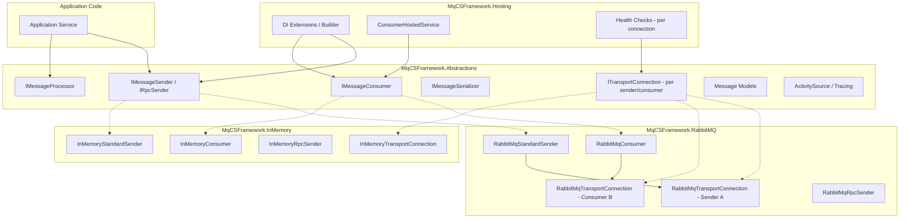
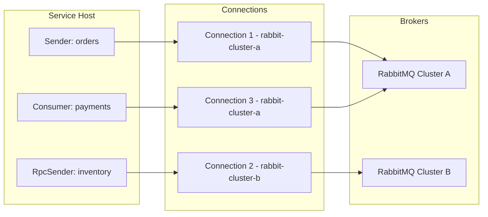
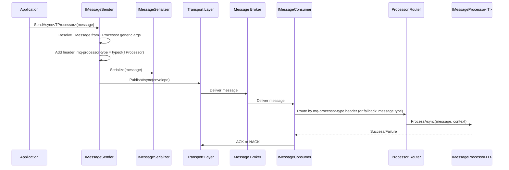
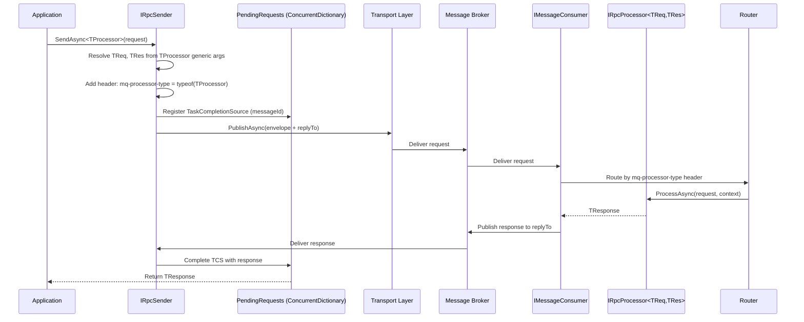

# Design Document: MqCSFramework

## Overview

MqCSFramework is a lightweight, broker-agnostic message queue framework for .NET 10. It provides a clean abstraction layer over message brokers with two transport implementations (RabbitMQ, In-Memory) and two messaging patterns (Standard fire-and-forget, RPC request-reply).

The design prioritizes simplicity over the reference implementation by:
- Introducing a **transport abstraction layer** that doesn't exist in the current codebase
- Using **keyed DI services** instead of manual ConcurrentDictionary-based singleton factories
- **Independent connections per sender/consumer** — each has its own connection options, enabling a single service to connect to multiple RabbitMQ instances simultaneously
- Reducing the type count through generic interfaces with clear responsibilities
- Following modern .NET patterns: async-first, nullable, `IAsyncDisposable`, `ActivitySource`

### Package Dependency Graph

```
MqCSFramework.Hosting ──► MqCSFramework.Abstractions
MqCSFramework.RabbitMQ ──► MqCSFramework.Abstractions
MqCSFramework.InMemory ──► MqCSFramework.Abstractions
```

- `MqCSFramework.Abstractions` has zero third-party dependencies (only `Microsoft.Extensions.*` contracts)
- `MqCSFramework.RabbitMQ` depends on `RabbitMQ.Client` (v7.x)
- `MqCSFramework.InMemory` has no external dependencies
- `MqCSFramework.Hosting` depends on `Microsoft.Extensions.Hosting`


## Architecture

### High-Level System Diagram



### Connection Model

Each sender and consumer owns its own `ITransportConnection` instance. There is **no shared global connection**. This architecture enables:

- A single service to connect to **multiple RabbitMQ instances** (different hosts, credentials, virtual hosts)
- Independent connection lifecycle per sender/consumer — one failing connection does not affect others
- Per-connection health reporting
- Isolated reconnection behavior — one sender reconnecting does not disrupt other senders or consumers



### Message Flow: Standard (Fire-and-Forget)



### Message Flow: RPC (Request-Reply)




### Design Decisions

| Decision | Choice | Rationale |
|----------|--------|-----------|
| Transport abstraction | Interface-based (`ITransportConnection`, `ITransportChannel`) | Enables broker swapping via DI without code changes |
| Named sender/consumer instances | .NET 8+ keyed services (`[FromKeyedServices]`) | Eliminates manual ConcurrentDictionary factories from reference impl |
| Connection per sender/consumer | Each sender/consumer gets its own `ITransportConnection` | Enables connecting to multiple brokers from one service, fault isolation per endpoint |
| Serialization | `IMessageSerializer` interface, default `System.Text.Json` | Pluggable without adding dependencies to abstractions package |
| RPC response tracking | `ConcurrentDictionary<string, TaskCompletionSource<T>>` keyed by messageId | Proven pattern from reference, lightweight and lock-free |
| Processor routing | Route by `mq-processor-type` header only (interface full name). No fallback — messages without the header are rejected. | Simple, predictable routing. All messages must be sent via the framework. |
| Connection lifecycle | Lazy initialization with semaphore, auto-reconnect on failure (per connection) | Matches reference pattern but cleaner with `IAsyncDisposable` |
| Tracing | Single `ActivitySource("MqCSFramework")` with W3C propagation | Standard .NET/OTel pattern, zero external dependency |
| Health checks | `IHealthCheck` per sender/consumer connection (keyed) | ASP.NET Core native, reports per-connection status |
| Consumer hosting | One `BackgroundService` managing multiple consumer instances | Simplification of reference's `IRabbitMQConsumerStarter` pattern |

## Components and Interfaces

### Package: MqCSFramework.Abstractions

This package contains all public contracts. Application code references only this package.

#### Core Transport Interfaces

```csharp
namespace MqCSFramework.Abstractions;

/// <summary>
/// Represents a connection to a message broker. Manages connection lifecycle.
/// One instance per sender or consumer — NOT shared globally.
/// </summary>
public interface ITransportConnection : IAsyncDisposable
{
    string Name { get; }
    bool IsConnected { get; }
    Task ConnectAsync(CancellationToken ct = default);
    Task<ITransportChannel> CreateChannelAsync(CancellationToken ct = default);
    event Func<Exception, Task>? ConnectionLost;
    event Func<Task>? ConnectionRecovered;
}

/// <summary>
/// A channel over a transport connection. Handles publish/consume operations.
/// </summary>
public interface ITransportChannel : IAsyncDisposable
{
    Task PublishAsync(MessageEnvelope envelope, CancellationToken ct = default);
    Task StartConsumingAsync(string queueName, Func<ReceivedMessage, Task<ProcessResult>> handler, CancellationToken ct = default);
    Task AcknowledgeAsync(ulong deliveryTag, CancellationToken ct = default);
    Task NegativeAcknowledgeAsync(ulong deliveryTag, bool requeue, CancellationToken ct = default);
}
```

#### Sender Interfaces

```csharp
/// <summary>
/// Fire-and-forget message sender. Publishes a message without expecting a response.
/// The sender always specifies the target processor contract interface for compile-time routing.
/// </summary>
public interface IMessageSender
{
    /// <summary>
    /// Send a message targeting a specific processor contract interface.
    /// TProcessor must be a processor contract interface (e.g., IOrderPlacedProcessor : IMessageProcessor&lt;OrderPlaced&gt;).
    /// The interface's full type name is added as a header for routing on the consumer side.
    /// TMessage is inferred from the interface's generic parameters.
    /// </summary>
    Task<string> SendAsync<TProcessor>(
        object message,
        SendOptions? options = null,
        CancellationToken ct = default)
        where TProcessor : class;
}

/// <summary>
/// RPC sender. Publishes a request and awaits a typed response.
/// The sender always specifies the target processor contract interface for compile-time routing.
/// </summary>
public interface IRpcSender
{
    /// <summary>
    /// Send an RPC request targeting a specific processor contract interface.
    /// TProcessor must be a processor contract interface (e.g., ICheckStockProcessor : IRpcProcessor&lt;CheckStockRequest, CheckStockResponse&gt;).
    /// TRequest and TResponse are inferred from the interface's generic parameters.
    /// The response type is compile-time enforced — no need to specify it manually.
    /// </summary>
    Task<TResponse> SendAsync<TProcessor, TResponse>(
        object request,
        RpcOptions? options = null,
        CancellationToken ct = default)
        where TProcessor : class
        where TResponse : class;
}
```

**Processor-linked routing mechanism:**

The sender always references a **processor contract interface** (never the concrete implementation). This ensures clean separation between sender and consumer — the sender only needs the shared contracts package.

When `SendAsync<TProcessor>` is called:
1. `TProcessor` must be a processor contract interface (e.g., `IOrderPlacedProcessor : IMessageProcessor<OrderPlaced>`)
2. The framework resolves `TMessage` (or `TRequest`/`TResponse`) from the interface's generic parameters via cached reflection
3. It validates the message object is assignable to the expected type
4. It adds the header `mq-processor-type` with the interface's full type name
5. On the consumer side, the router matches the `mq-processor-type` header to the registered processor that implements that interface

**Architecture:**

```
Shared Contracts Package (referenced by sender + consumer):
├── IOrderPlacedProcessor : IMessageProcessor<OrderPlaced>
├── ICheckStockProcessor : IRpcProcessor<CheckStockRequest, CheckStockResponse>
├── OrderPlaced (record)
├── CheckStockRequest (record)
└── CheckStockResponse (record)

Sender (references Contracts + MqCSFramework.Abstractions):
    await sender.SendAsync<IOrderPlacedProcessor>(new OrderPlaced { ... });
    var stock = await rpcSender.SendAsync<ICheckStockProcessor>(new CheckStockRequest("SKU-001"));

Consumer (references Contracts + MqCSFramework.Abstractions + MqCSFramework.Hosting):
    public class OrderPlacedProcessor : IOrderPlacedProcessor { ... }
    public class CheckStockProcessor : ICheckStockProcessor { ... }
    
    // Registration:
    mq.AddProcessor<OrderPlacedProcessor>();  // resolves IOrderPlacedProcessor automatically
    mq.AddRpcProcessor<CheckStockProcessor>(); // resolves ICheckStockProcessor automatically
```

**Usage:**

```csharp
// Sender side — always uses the contract interface
await sender.SendAsync<IOrderPlacedProcessor>(new OrderPlaced { OrderId = "123" });
var stock = await rpcSender.SendAsync<ICheckStockProcessor>(new CheckStockRequest("SKU-001"));
// ↑ Returns CheckStockResponse — inferred from ICheckStockProcessor's generic args
```

#### Processor Interfaces

```csharp
/// <summary>
/// Processes a standard (fire-and-forget) message of type TMessage.
/// Implement this interface and register via DI.
/// </summary>
public interface IMessageProcessor<in TMessage> where TMessage : class
{
    Task ProcessAsync(TMessage message, MessageContext context, CancellationToken ct = default);
}

/// <summary>
/// Processes an RPC request of type TRequest and returns TResponse.
/// </summary>
public interface IRpcProcessor<in TRequest, TResponse>
    where TRequest : class
    where TResponse : class
{
    Task<TResponse> ProcessAsync(TRequest request, MessageContext context, CancellationToken ct = default);
}
```


#### Serialization Interface

```csharp
/// <summary>
/// Pluggable message serialization. Default implementation uses System.Text.Json.
/// </summary>
public interface IMessageSerializer
{
    byte[] Serialize<T>(T message) where T : class;
    T Deserialize<T>(ReadOnlySpan<byte> data) where T : class;
    object Deserialize(ReadOnlySpan<byte> data, Type type);
    string ContentType { get; } // e.g. "application/json"
}
```

#### Consumer Interface

```csharp
/// <summary>
/// Represents a message consumer that listens on a queue and dispatches to processors.
/// Managed by the hosting layer's BackgroundService.
/// </summary>
public interface IMessageConsumer : IAsyncDisposable
{
    string QueueName { get; }
    Task StartAsync(CancellationToken ct = default);
    Task StopAsync(CancellationToken ct = default);
    bool IsRunning { get; }
}
```

#### Configuration Options

```csharp
/// <summary>
/// Options for sending a standard message.
/// </summary>
public record SendOptions
{
    public string? Exchange { get; init; }
    public string? RoutingKey { get; init; }
    public string? CorrelationId { get; init; }
    public string? SenderIdentity { get; init; }
    public bool Persistent { get; init; } = true;
    public IDictionary<string, object?>? Headers { get; init; }
}

/// <summary>
/// Options for sending an RPC request.
/// </summary>
public record RpcOptions
{
    public string? RoutingKey { get; init; }
    public string? CorrelationId { get; init; }
    public string? SenderIdentity { get; init; }
    public TimeSpan Timeout { get; init; } = TimeSpan.FromSeconds(30);
    public IDictionary<string, object?>? Headers { get; init; }
}
```


### Package: MqCSFramework.RabbitMQ

Implements all transport interfaces using `RabbitMQ.Client` v7.x (fully async API).

#### Key Classes

```csharp
namespace MqCSFramework.RabbitMQ;

/// <summary>
/// RabbitMQ implementation of ITransportConnection.
/// Manages a single AMQP connection with auto-reconnect.
/// Each sender/consumer gets its own instance — connections are NOT shared.
/// </summary>
public sealed class RabbitMqTransportConnection : ITransportConnection
{
    private IConnection? _connection;
    private readonly ConnectionFactory _factory;
    private readonly RabbitMqConnectionOptions _options;
    private readonly ILogger<RabbitMqTransportConnection> _logger;
    private readonly SemaphoreSlim _connectLock = new(1, 1);

    public string Name { get; }

    // Lazy-init with semaphore, reconnect on ConnectionLost event
    // Name is set from the sender/consumer registration name (e.g. "orders", "inventory")
}

/// <summary>
/// RabbitMQ channel wrapper implementing ITransportChannel.
/// </summary>
public sealed class RabbitMqTransportChannel : ITransportChannel
{
    private readonly IChannel _channel;
    private readonly RabbitMqChannelOptions _options;
    // Wraps RabbitMQ.Client.IChannel operations
}

/// <summary>
/// Standard sender using RabbitMQ transport.
/// Owns its own ITransportConnection instance.
/// </summary>
public sealed class RabbitMqStandardSender : IMessageSender, IAsyncDisposable
{
    private readonly ITransportConnection _connection; // dedicated connection for this sender
    private readonly IMessageSerializer _serializer;
    private readonly RabbitMqSenderOptions _options;
    private readonly ActivitySource _activitySource;
    private ITransportChannel? _channel;
    // Lazy channel init, reset-on-failure pattern from reference
}

/// <summary>
/// RPC sender using RabbitMQ transport.
/// Owns its own ITransportConnection instance.
/// Manages a reply queue and pending request dictionary.
/// </summary>
public sealed class RabbitMqRpcSender : IRpcSender, IAsyncDisposable
{
    private readonly ITransportConnection _connection; // dedicated connection for this sender
    private readonly IMessageSerializer _serializer;
    private readonly RabbitMqRpcSenderOptions _options;
    private readonly ConcurrentDictionary<string, TaskCompletionSource<byte[]>> _pendingRequests = new();
    private readonly ActivitySource _activitySource;
    private ITransportChannel? _channel;
    private string? _replyQueueName;
    // Same pattern as reference RPCResponseManager but inline
}

/// <summary>
/// RabbitMQ consumer that listens on a queue and routes to processors.
/// Owns its own ITransportConnection instance.
/// </summary>
public sealed class RabbitMqConsumer : IMessageConsumer
{
    private readonly ITransportConnection _connection; // dedicated connection for this consumer
    private readonly IMessageSerializer _serializer;
    private readonly ProcessorRouter _router;
    private readonly RabbitMqConsumerOptions _options;
    private readonly ActivitySource _activitySource;
    private ITransportChannel? _channel;
    // Message dispatch: deserialize → route by Type header → invoke processor → ACK/NACK
}
```

#### RabbitMQ Configuration

```csharp
/// <summary>
/// Connection options that are embedded in each sender/consumer configuration.
/// There is NO global shared connection — each sender/consumer carries its own.
/// </summary>
public sealed class RabbitMqConnectionOptions
{
    public string HostNames { get; set; } = "localhost";
    public string UserName { get; set; } = "guest";
    public string Password { get; set; } = "guest";
    public string VirtualHost { get; set; } = "/";
    public string? SslServerName { get; set; }
    public bool AutomaticRecoveryEnabled { get; set; } = true;
    public TimeSpan NetworkRecoveryInterval { get; set; } = TimeSpan.FromSeconds(5);
}

public sealed class RabbitMqSenderOptions
{
    /// <summary>
    /// Connection properties for this specific sender.
    /// Each sender connects independently.
    /// </summary>
    public RabbitMqConnectionOptions Connection { get; set; } = new();

    public string? Exchange { get; set; }
    public string RoutingKey { get; set; } = "";
    public bool ConfirmSelect { get; set; } = true;
    public IList<string>? MaskedFields { get; set; }
    public LogLevel MessageLogLevel { get; set; } = LogLevel.Information;
    public bool LogMessageBody { get; set; } = true;
}

public sealed class RabbitMqRpcSenderOptions
{
    /// <summary>
    /// Connection properties for this specific RPC sender.
    /// Each RPC sender connects independently.
    /// </summary>
    public RabbitMqConnectionOptions Connection { get; set; } = new();

    public string? Exchange { get; set; }
    public string RoutingKey { get; set; } = "";
    public bool ConfirmSelect { get; set; } = true;
    public IList<string>? MaskedFields { get; set; }
    public LogLevel MessageLogLevel { get; set; } = LogLevel.Information;
    public bool LogMessageBody { get; set; } = true;
    public TimeSpan DefaultTimeout { get; set; } = TimeSpan.FromSeconds(30);
    public int MaxRetryAttempts { get; set; } = 3;
}

public sealed class RabbitMqConsumerOptions
{
    /// <summary>
    /// Connection properties for this specific consumer.
    /// Each consumer connects independently.
    /// </summary>
    public RabbitMqConnectionOptions Connection { get; set; } = new();

    public string QueueName { get; set; } = "";
    public ushort PrefetchCount { get; set; } = 10;
    public bool AutoAck { get; set; } = false;
    public bool IsRpc { get; set; } = false;
    public int ProcessingTimeoutMs { get; set; } = 30000;
    public int DelayRetryLimit { get; set; } = 0;
    public string? ErrorQueueName { get; set; }
    public IList<string>? MaskedFields { get; set; }
    public LogLevel MessageLogLevel { get; set; } = LogLevel.Information;
    public bool LogMessageBody { get; set; } = true;
}
```


### Package: MqCSFramework.InMemory

In-process transport for testing and local development. No network calls, no broker required.

```csharp
namespace MqCSFramework.InMemory;

/// <summary>
/// In-memory transport connection. Routes messages through Channel<T> queues.
/// </summary>
public sealed class InMemoryTransportConnection : ITransportConnection
{
    private readonly ConcurrentDictionary<string, Channel<MessageEnvelope>> _queues = new();
    // Always "connected", creates InMemoryTransportChannel instances
}

/// <summary>
/// In-memory channel. Publish writes to a Channel<T>, consume reads from it.
/// </summary>
public sealed class InMemoryTransportChannel : ITransportChannel
{
    // Publish → write to named Channel<T>
    // Consume → read loop from named Channel<T>
}

/// <summary>
/// In-memory standard sender. Direct dispatch through in-process channels.
/// </summary>
public sealed class InMemoryStandardSender : IMessageSender { }

/// <summary>
/// In-memory RPC sender. Uses TaskCompletionSource for response correlation.
/// </summary>
public sealed class InMemoryRpcSender : IRpcSender { }

/// <summary>
/// In-memory consumer. Reads from a Channel<T> and dispatches to processors.
/// </summary>
public sealed class InMemoryConsumer : IMessageConsumer { }
```

### Package: MqCSFramework.Hosting

Provides the Generic Host integration: DI registration, BackgroundService, health checks.

```csharp
namespace MqCSFramework.Hosting;

/// <summary>
/// BackgroundService that manages consumer lifecycle.
/// Reads consumer configurations and starts/stops IMessageConsumer instances.
/// </summary>
public sealed class ConsumerHostedService : BackgroundService
{
    private readonly IEnumerable<IMessageConsumer> _consumers;
    private readonly ILogger<ConsumerHostedService> _logger;

    protected override async Task ExecuteAsync(CancellationToken stoppingToken)
    {
        // Start all registered consumers
        // On cancellation: graceful stop with timeout
    }
}

/// <summary>
/// Health check for a specific sender/consumer transport connection.
/// One health check instance per registered sender/consumer.
/// </summary>
public sealed class TransportHealthCheck : IHealthCheck
{
    private readonly ITransportConnection _connection;

    public async Task<HealthCheckResult> CheckHealthAsync(
        HealthCheckContext context, CancellationToken ct = default)
    {
        // Connected → Healthy
        // Recovering → Degraded
        // Disconnected → Unhealthy
        // Tags include the connection name for per-endpoint reporting
    }
}
```

#### DI Extension Methods (Builder Pattern)

```csharp
namespace MqCSFramework.Hosting;

public static class ServiceCollectionExtensions
{
    /// <summary>
    /// Adds MqCSFramework services.
    /// </summary>
    public static IServiceCollection AddMqCSFramework(
        this IServiceCollection services,
        Action<MqCSFrameworkBuilder> configure)
    {
        var builder = new MqCSFrameworkBuilder(services);
        configure(builder);
        return services;
    }
}

public sealed class MqCSFrameworkBuilder
{
    public IServiceCollection Services { get; }

    /// <summary>
    /// Register a standard sender as a keyed service.
    /// Each sender has its own connection options — no shared global connection.
    /// </summary>
    public MqCSFrameworkBuilder AddSender(string name, Action<RabbitMqSenderOptions> configure);

    /// <summary>
    /// Register an RPC sender as a keyed service.
    /// Each RPC sender has its own connection options — no shared global connection.
    /// </summary>
    public MqCSFrameworkBuilder AddRpcSender(string name, Action<RabbitMqRpcSenderOptions> configure);

    /// <summary>
    /// Register a consumer that listens on a queue.
    /// Each consumer has its own connection options — no shared global connection.
    /// </summary>
    public MqCSFrameworkBuilder AddConsumer(string name, Action<RabbitMqConsumerOptions> configure);

    /// <summary>
    /// Register an in-memory sender (for testing). Uses shared in-process channels.
    /// </summary>
    public MqCSFrameworkBuilder AddInMemorySender(string name);

    /// <summary>
    /// Register an in-memory consumer (for testing). Uses shared in-process channels.
    /// </summary>
    public MqCSFrameworkBuilder AddInMemoryConsumer(string name, string queueName);

    /// <summary>
    /// Add health checks for all registered sender/consumer connections.
    /// Each connection is reported independently.
    /// </summary>
    public MqCSFrameworkBuilder AddHealthChecks();

    /// <summary>
    /// Replace the default System.Text.Json serializer.
    /// </summary>
    public MqCSFrameworkBuilder UseSerializer<TSerializer>()
        where TSerializer : class, IMessageSerializer;
}
```


#### Usage Example

```csharp
// Program.cs — Sender service connecting to TWO different RabbitMQ clusters
var builder = Host.CreateApplicationBuilder(args);

builder.Services.AddMqCSFramework(mq =>
{
    // Each sender/consumer carries its own connection options.
    // No global UseRabbitMq() — connections are independent.
    mq.AddSender("orders", opts =>
    {
        builder.Configuration.GetSection("MqCSFramework:Senders:orders").Bind(opts);
    });
    mq.AddRpcSender("inventory", opts =>
    {
        builder.Configuration.GetSection("MqCSFramework:RpcSenders:inventory").Bind(opts);
    });
    mq.AddHealthChecks();
});

var app = builder.Build();
await app.RunAsync();

// Usage in a service:
public class OrderService(
    [FromKeyedServices("orders")] IMessageSender sender,
    [FromKeyedServices("inventory")] IRpcSender rpcSender)
{
    public async Task PlaceOrderAsync(OrderPlaced order)
    {
        // "orders" sender connects to rabbit-cluster-a
        await sender.SendAsync(order);

        // "inventory" RPC sender connects to rabbit-cluster-b (different broker!)
        var stock = await rpcSender.SendAsync<CheckStockRequest, CheckStockResponse>(
            new CheckStockRequest(order.ProductId));
    }
}
```

```csharp
// Program.cs — Consumer service
var builder = Host.CreateApplicationBuilder(args);

// Register processors as standard DI singletons — no special builder method needed
builder.Services.AddSingleton<IOrderPlacedProcessor, OrderPlacedProcessor>();

builder.Services.AddMqCSFramework(mq =>
{
    mq.AddConsumer("orders", opts =>
    {
        builder.Configuration.GetSection("MqCSFramework:Consumers:orders").Bind(opts);
    });
    mq.AddHealthChecks();
});

var app = builder.Build();
await app.RunAsync();

// Contract interface (in shared contracts package):
public interface IOrderPlacedProcessor : IMessageProcessor<OrderPlaced> { }

// Processor implementation (in consumer project):
public class OrderPlacedProcessor : IOrderPlacedProcessor
{
    public async Task ProcessAsync(OrderPlaced message, MessageContext context, CancellationToken ct)
    {
        // Handle the order...
    }
}
```


### Internal Components

#### MessageDispatcher

Resolves the processor from DI and dispatches the message. Replaces ProcessorRouter, ProcessorRegistration, and ProcessorTypeResolver.

```csharp
internal sealed class MessageDispatcher
{
    private readonly IServiceProvider _serviceProvider;
    private readonly IMessageSerializer _serializer;
    private readonly ILogger<MessageDispatcher> _logger;

    // Cache: processor interface Type → TMessage type (resolved once from generic args)
    private readonly ConcurrentDictionary<Type, Type> _messageTypeCache = new();
    // Cache: processor interface Type → TResponse type (for RPC, resolved once)
    private readonly ConcurrentDictionary<Type, Type> _responseTypeCache = new();

    public async Task<ProcessResult> DispatchStandardAsync(ReceivedMessage message, CancellationToken ct);
    public async Task<(ProcessResult result, byte[]? response)> DispatchRpcAsync(ReceivedMessage message, CancellationToken ct);
}
```

**Dispatch flow:**
1. Read `mq-processor-type` header → `Type.GetType(headerValue)` to get the processor interface type
2. If null or header missing → NACK, throw `UnknownMessageTypeException`
3. Resolve the processor from DI: `serviceProvider.GetService(processorInterfaceType)`
4. If null → NACK (processor not registered)
5. Get `TMessage` from the interface's generic args (cached in `_messageTypeCache`)
6. Deserialize message body to `TMessage` using `IMessageSerializer`
7. Call `ProcessAsync(message, context, ct)` via reflection-free invocation (cast to the known interface)
8. For RPC: serialize the response and return the bytes

No startup registration, no dictionaries, no `ProcessorRegistration` records. Just DI + one type cache.

#### MessageMasker

Utility for masking sensitive fields in JSON log output. Ported from reference's `JSONMessageMasker`.

```csharp
internal static class MessageMasker
{
    private const string MaskValue = "***MASKED***";

    public static string Mask(string json, HashSet<string>? maskedFields);
    public static HashSet<string>? BuildFieldSet(IList<string>? fieldNames);
}
```

#### RpcPendingRequest

Encapsulates a pending RPC request with timeout handling (replaces reference's `SenderTaskCompletionSource`).

```csharp
internal sealed class RpcPendingRequest<TResponse> : IDisposable where TResponse : class
{
    private readonly TaskCompletionSource<TResponse> _tcs = new(TaskCreationOptions.RunContinuationsAsynchronously);
    private readonly CancellationTokenSource _timeoutCts;

    public Task<TResponse> Task => _tcs.Task;
    public void SetResult(TResponse response);
    public void SetException(Exception ex);
    public void Dispose(); // Cancels timeout timer
}
```


## Data Models

### Message Envelope (Internal Transport Format)

```csharp
/// <summary>
/// The internal envelope that wraps a serialized message for transport.
/// </summary>
public sealed record MessageEnvelope
{
    public required byte[] Body { get; init; }
    public required string MessageId { get; init; }
    public required string MessageType { get; init; }
    public string? CorrelationId { get; init; }
    public string? ReplyTo { get; init; }
    public string? Exchange { get; init; }
    public string? RoutingKey { get; init; }
    public string ContentType { get; init; } = "application/json";
    public bool Persistent { get; init; } = true;
    public DateTimeOffset Timestamp { get; init; } = DateTimeOffset.UtcNow;
    public string? SenderIdentity { get; init; }
    public IDictionary<string, object?> Headers { get; init; } = new Dictionary<string, object?>();
}
```

### Received Message (Consumer Side)

```csharp
/// <summary>
/// A message received from the transport, before deserialization.
/// </summary>
public sealed record ReceivedMessage
{
    public required byte[] Body { get; init; }
    public required ulong DeliveryTag { get; init; }
    public required string MessageId { get; init; }
    public required string MessageType { get; init; }
    public string? CorrelationId { get; init; }
    public string? ReplyTo { get; init; }
    public string? Exchange { get; init; }
    public string? RoutingKey { get; init; }
    public string? ContentType { get; init; }
    public DateTimeOffset Timestamp { get; init; }
    public string? SenderIdentity { get; init; }
    public IReadOnlyDictionary<string, object?> Headers { get; init; } = new Dictionary<string, object?>();
    public bool Redelivered { get; init; }
}
```

### Message Context (Processor Side)

```csharp
/// <summary>
/// Context passed to processors. Contains metadata about the received message.
/// </summary>
public sealed record MessageContext
{
    public required string MessageId { get; init; }
    public required string CorrelationId { get; init; }
    public required string MessageType { get; init; }
    public DateTimeOffset Timestamp { get; init; }
    public string? SenderIdentity { get; init; }
    public IReadOnlyDictionary<string, object?> Headers { get; init; } = new Dictionary<string, object?>();
    public bool Redelivered { get; init; }
    public CancellationToken CancellationToken { get; init; }
}
```


### Process Result (Internal)

```csharp
/// <summary>
/// Result of processing a message, used to determine ACK/NACK behavior.
/// </summary>
public enum ProcessResult
{
    Success,
    Failure,
    Requeue
}
```

### RPC Error Response

```csharp
/// <summary>
/// Standard error response for RPC failures. Serialized and sent back to caller.
/// </summary>
public sealed record RpcErrorResponse
{
    public bool IsError { get; init; } = true;
    public required string ErrorCode { get; init; }
    public required string ErrorMessage { get; init; }
    public string? StackTrace { get; init; }
}
```

### Configuration Models (appsettings.json)

Each sender, RPC sender, and consumer carries its own connection details. There is no shared connection section.

```json
{
  "MqCSFramework": {
    "Senders": {
      "orders": {
        "Connection": {
          "HostNames": "rabbit-cluster-a-node1,rabbit-cluster-a-node2",
          "UserName": "orders-svc",
          "Password": "***",
          "VirtualHost": "/orders",
          "SslServerName": null,
          "AutomaticRecoveryEnabled": true,
          "NetworkRecoveryInterval": "00:00:05"
        },
        "Exchange": "",
        "RoutingKey": "orders-queue",
        "ConfirmSelect": true,
        "MaskedFields": ["CardNumber", "CVV"],
        "MessageLogLevel": "Information",
        "LogMessageBody": true
      }
    },
    "RpcSenders": {
      "inventory": {
        "Connection": {
          "HostNames": "rabbit-cluster-b-node1,rabbit-cluster-b-node2",
          "UserName": "inventory-svc",
          "Password": "***",
          "VirtualHost": "/inventory",
          "SslServerName": "rabbit-cluster-b.internal",
          "AutomaticRecoveryEnabled": true,
          "NetworkRecoveryInterval": "00:00:05"
        },
        "RoutingKey": "inventory-queue",
        "DefaultTimeout": "00:00:10",
        "MaxRetryAttempts": 3
      }
    },
    "Consumers": {
      "orders": {
        "Connection": {
          "HostNames": "rabbit-cluster-a-node1,rabbit-cluster-a-node2",
          "UserName": "orders-consumer",
          "Password": "***",
          "VirtualHost": "/orders",
          "SslServerName": null,
          "AutomaticRecoveryEnabled": true,
          "NetworkRecoveryInterval": "00:00:05"
        },
        "QueueName": "orders-queue",
        "PrefetchCount": 20,
        "AutoAck": false,
        "IsRpc": false,
        "ProcessingTimeoutMs": 30000,
        "DelayRetryLimit": 3,
        "ErrorQueueName": "orders-queue-error"
      }
    }
  }
}
```

> **Note:** Even when two endpoints connect to the same broker, they maintain independent connections. This is intentional — it provides fault isolation and allows different credentials/virtual hosts per endpoint.


### OpenTelemetry / Tracing Model

```csharp
internal static class MqTracing
{
    public static readonly ActivitySource Source = new("MqCSFramework", "1.0.0");

    // Span names follow OTel messaging semantic conventions:
    // "{destination} publish" for producers
    // "{destination} process" for consumers

    public static Activity? StartPublishActivity(MessageEnvelope envelope)
    {
        var activity = Source.StartActivity($"{envelope.RoutingKey} publish", ActivityKind.Producer);
        activity?.SetTag("messaging.system", "rabbitmq");
        activity?.SetTag("messaging.destination.name", envelope.RoutingKey);
        activity?.SetTag("messaging.message.id", envelope.MessageId);
        activity?.SetTag("messaging.message.conversation_id", envelope.CorrelationId);
        // Inject W3C trace context into headers
        return activity;
    }

    public static Activity? StartConsumeActivity(ReceivedMessage message)
    {
        // Extract parent context from message headers (W3C Trace Context)
        var parentContext = ExtractTraceContext(message.Headers);
        var activity = Source.StartActivity(
            $"{message.RoutingKey} process",
            ActivityKind.Consumer,
            parentContext);
        activity?.SetTag("messaging.system", "rabbitmq");
        activity?.SetTag("messaging.destination.name", message.RoutingKey);
        activity?.SetTag("messaging.message.id", message.MessageId);
        return activity;
    }
}
```

### Header Constants

```csharp
public static class MessageHeaders
{
    public const string MessageType = "mq-message-type";
    public const string ProcessorType = "mq-processor-type";
    public const string CorrelationId = "mq-correlation-id";
    public const string SenderIdentity = "mq-sender-identity";
    public const string LocalDateTime = "mq-local-datetime";
    public const string TraceParent = "traceparent";
    public const string TraceState = "tracestate";
}
```


## Correctness Properties

*A property is a characteristic or behavior that should hold true across all valid executions of a system — essentially, a formal statement about what the system should do. Properties serve as the bridge between human-readable specifications and machine-verifiable correctness guarantees.*

### Property 1: Envelope Construction Invariant

*For any* valid message object and send options, the produced `MessageEnvelope` SHALL contain: a non-empty serialized body, a non-empty MessageId (GUID), a non-null MessageType (the message class full name), a timestamp, and all optional metadata (CorrelationId, SenderIdentity, RoutingKey) matching the provided options.

**Validates: Requirements 2.1, 2.2**

### Property 2: Message Routing Correctness

*For any* set of N registered processors (each handling a distinct message type), and any message with a `mq-processor-type` header matching one of those registrations, the consumer SHALL invoke exactly the processor identified by that header. Messages without the `mq-processor-type` header SHALL be rejected (NACK'd). No other processors SHALL be invoked.

**Validates: Requirements 2.5, 5.3, 8.2, 8.4**

### Property 18: Processor Type Resolution Correctness

*For any* type `TProcessor` that implements `IMessageProcessor<TMessage>` or `IRpcProcessor<TRequest, TResponse>`, the sender SHALL correctly resolve the generic type arguments (TMessage, or TRequest/TResponse) and produce a `MessageEnvelope` where the body matches the expected request type and the `mq-processor-type` header contains the full type name of `TProcessor`.

**Validates: Requirements 2.1, 3.1, 8.1**

### Property 3: ACK on Successful Processing

*For any* message where the registered processor completes without throwing an exception, the consumer SHALL acknowledge (ACK) that message's delivery tag exactly once.

**Validates: Requirements 2.6**

### Property 4: NACK on Processing Failure

*For any* message where the registered processor throws an exception, the consumer SHALL negatively acknowledge (NACK) that message's delivery tag. The requeue parameter SHALL match the configured requeue behavior.

**Validates: Requirements 2.7, 10.2**


### Property 5: Unknown Message Type NACK

*For any* message with a Type header that does not match any registered processor, the consumer SHALL NACK the message (without requeue) and log a warning containing the unknown type name.

**Validates: Requirements 8.3**

### Property 6: RPC Response Round-Trip

*For any* valid request message of type TRequest, when the RPC processor returns a TResponse, the sender SHALL receive a correctly deserialized TResponse matching the processor's output. When the processor throws, the sender SHALL receive an exception containing the error details.

**Validates: Requirements 3.1, 3.3, 3.5, 13.3**

### Property 7: RPC Concurrent Correlation

*For any* set of N concurrent RPC requests (each with a unique messageId), when N responses arrive (potentially out of order), each response SHALL be matched to exactly its originating request — no cross-contamination between pending requests.

**Validates: Requirements 3.2, 3.6**

### Property 8: Serialization Round-Trip

*For any* valid message object, serializing it with the configured `IMessageSerializer` and then deserializing the result back to the same type SHALL produce an object equivalent to the original.

**Validates: Requirements 4.1, 4.2**

### Property 9: Consumer Resilience

*For any* sequence of messages where some processors throw exceptions, the consumer SHALL remain running and continue processing subsequent messages. A processor failure SHALL NOT terminate the consumer loop.

**Validates: Requirements 10.1**


### Property 10: Error Queue Routing on Retry Exhaustion

*For any* message that has been retried more than `DelayRetryLimit` times (as indicated by x-death count), the consumer SHALL ACK the original delivery and publish the message to the configured error queue.

**Validates: Requirements 10.3**

### Property 11: Sender Reset-on-Failure

*For any* message publish that fails due to a transport error on that sender's dedicated connection, the sender SHALL reset its channel state and succeed on a subsequent retry attempt (assuming the transport is available again). Other senders/consumers with independent connections SHALL NOT be affected.

**Validates: Requirements 7.2**

### Property 12: Message Field Masking

*For any* JSON message string and a configured set of field names to mask, the `MessageMasker.Mask()` output SHALL replace the values of those fields with "***MASKED***" while preserving all other fields unchanged. The masking SHALL be case-insensitive on field names.

**Validates: Requirements 9.5**

### Property 13: Trace Context Propagation Round-Trip

*For any* message published under an active Activity, the message headers SHALL contain a valid `traceparent` header (W3C format). When that message is consumed, the consumer's Activity SHALL have a parent context that matches the producer's trace ID and span ID.

**Validates: Requirements 12.2, 12.3, 12.4**

### Property 14: Correlation ID Preservation

*For any* message sent with a correlation ID (either explicit or auto-generated), the `MessageContext` received by the processor SHALL contain that same correlation ID value.

**Validates: Requirements 9.2**

### Property 15: Transport Interchangeability

*For any* valid message, sending it through the InMemory transport and receiving it SHALL produce a `MessageContext` and deserialized message equivalent to what would be produced through the RabbitMQ transport — the application-level processor code is transport-agnostic.

**Validates: Requirements 1.4**

### Property 16: Connection Isolation

*For any* set of N registered senders/consumers each with their own connection, when one connection fails (broker goes down, credentials revoked, network partition), all other connections SHALL remain unaffected — their `IsConnected` status, channel operations, and health check results are independent.

**Validates: Requirements 7.1, 7.2, 7.3, 11.4**

### Property 17: Per-Connection Health Reporting

*For any* registered sender/consumer with its own connection, the health check system SHALL report that specific connection's status independently. If sender "orders" is healthy and consumer "payments" is unhealthy, the health endpoint SHALL reflect both statuses separately (not collapse to a single aggregate).

**Validates: Requirements 11.1, 11.2, 11.4**


## Error Handling

### Strategy Overview

The framework applies a layered error handling strategy:

| Layer | Error Type | Behavior |
|-------|-----------|----------|
| Transport (connection) | Connection lost | Log error, fire `ConnectionLost` event on that specific connection, begin auto-reconnect with exponential backoff. Other connections unaffected. |
| Transport (channel) | Channel error on publish | Reset channel on that sender's connection, retry (up to MaxRetryAttempts), propagate exception on exhaustion |
| Serialization | Deserialization failure | NACK without requeue (malformed messages cannot be fixed by retry), log with message ID |
| Processor (standard) | Unhandled exception | NACK with configurable requeue; if retry limit exceeded → route to error queue |
| Processor (RPC) | Unhandled exception | Serialize `RpcErrorResponse`, send back to reply queue, NACK the request message |
| RPC timeout | No response within timeout | Cancel `TaskCompletionSource`, throw `RpcTimeoutException` with correlation details |
| RPC error response | Error response received | Deserialize `RpcErrorResponse`, throw `RpcRemoteException` with error code and message |

### Exception Types

```csharp
namespace MqCSFramework.Abstractions;

/// <summary>Base exception for all MqCSFramework errors.</summary>
public class MqException : Exception { }

/// <summary>RPC call timed out waiting for response.</summary>
public class RpcTimeoutException : MqException
{
    public string CorrelationId { get; }
    public string MessageId { get; }
    public TimeSpan Timeout { get; }
}

/// <summary>RPC remote processor returned an error response.</summary>
public class RpcRemoteException : MqException
{
    public string ErrorCode { get; }
    public string RemoteMessage { get; }
    public string? RemoteStackTrace { get; }
}

/// <summary>Serialization/deserialization failure.</summary>
public class MessageSerializationException : MqException
{
    public string? MessageId { get; }
    public Type? TargetType { get; }
}

/// <summary>No processor registered for message type.</summary>
public class UnknownMessageTypeException : MqException
{
    public string MessageType { get; }
}
```

### Error Queue / Dead Letter Pattern

When `DelayRetryLimit > 0` and `ErrorQueueName` is configured:

1. Consumer tracks retry count via the `x-death` header (set by RabbitMQ dead-letter exchange mechanism)
2. If retry count >= `DelayRetryLimit`: ACK the message, publish to `ErrorQueueName`
3. If retry count < limit: NACK with requeue=false (relies on DLX to re-route back after delay)

This replicates the proven pattern from the reference implementation's `TrySendToErrorQueueAsync`.


## Testing Strategy

### Approach

The framework uses a dual testing approach combining property-based tests for universal correctness guarantees with example-based tests for specific behaviors and integration verification.

### Property-Based Testing

**Library:** [FsCheck](https://github.com/fscheck/FsCheck) with xUnit integration (`FsCheck.Xunit`)

**Configuration:** Minimum 100 iterations per property test.

**Tag format:** Each property test includes a comment referencing its design property:
```csharp
// Feature: queue-framework, Property 8: Serialization round-trip
```

Property tests focus on the pure/testable logic layers:
- `MessageEnvelope` construction (Property 1)
- `ProcessorRouter` dispatch logic (Property 2)
- ACK/NACK decision logic (Properties 3, 4, 5)
- RPC correlation matching (Property 7)
- `IMessageSerializer` round-trip (Property 8)
- `MessageMasker` field masking (Property 12)
- Trace context inject/extract round-trip (Property 13)
- Correlation ID flow (Property 14)
- Connection isolation (Property 16)

For properties that involve async message flow (Properties 6, 9, 10, 11, 15, 17), the InMemory transport provides a fast, deterministic test harness that avoids external dependencies while exercising the full pipeline.

### Unit Tests (Example-Based)

Focus on:
- DI registration verification (all services resolvable, each with own connection)
- Configuration binding (appsettings per-sender/consumer → options including nested Connection)
- Specific edge cases: timeout exception, empty message rejection, unknown type handling
- Health check state transitions per connection (Connected→Healthy, Reconnecting→Degraded, Disconnected→Unhealthy)
- Multiple named/keyed instances coexist correctly with independent connections
- Log output verification (message bodies suppressed when configured, secrets not logged)
- Connection names match registration names in health check output

### Integration Tests

Focus on:
- Full RabbitMQ round-trip (requires Testcontainers or local broker)
- Connection loss on one sender → other senders/consumers unaffected (isolation)
- Connection loss → auto-recovery → resume consuming (per connection)
- Publisher confirms (confirm-select enabled)
- Consumer hosted service lifecycle (start/stop)
- Dead-letter exchange retry cycle with error queue routing
- Multi-broker scenario: sender to broker A, consumer from broker B (different connection configs)

### Test Project Structure

```
tests/
├── MqCSFramework.Abstractions.Tests/      # Property tests for models, serialization, masking
├── MqCSFramework.Routing.Tests/           # Property tests for ProcessorRouter
├── MqCSFramework.InMemory.Tests/          # Property tests using InMemory end-to-end
├── MqCSFramework.RabbitMQ.Tests/          # Unit tests for RabbitMQ-specific logic
└── MqCSFramework.Integration.Tests/       # Integration tests (Testcontainers + RabbitMQ)
```

### Non-Functional Verification

- **Performance:** Benchmark tests using BenchmarkDotNet for publish/consume hot paths
- **Allocations:** Verify zero unnecessary allocations in the dispatch path using `[MemoryDiagnoser]`
- **Concurrency:** Property tests for RPC correlation run with high parallelism to stress concurrent access

