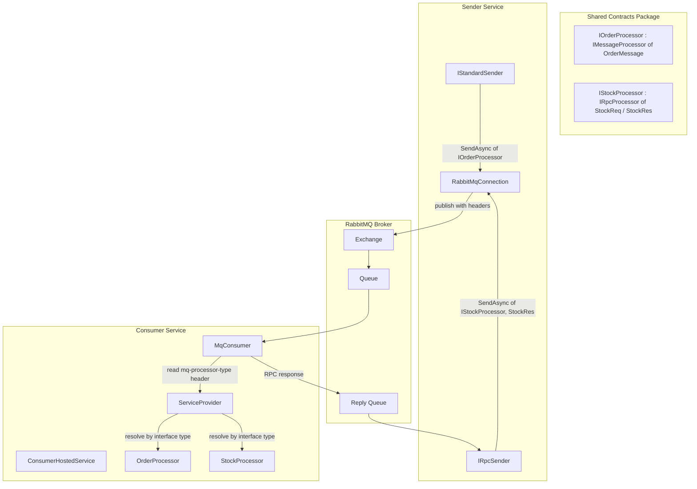

# Design Document: MqCSFramework

## Overview

MqCSFramework is a **three-module** RabbitMQ-only messaging framework. It provides compile-time type-safe sending via processor contract interfaces, automatic consumer dispatch using dependency injection resolution from message headers, and independent connection management per sender/consumer.

The three modules are:
- **MqCSFramework** — Core/shared: interfaces, models, exceptions, connection management, RPC response envelope
- **MqCSFramework.Sender** — Standard and RPC sender implementations, DI registration extensions
- **MqCSFramework.Consumer** — Consumer implementation, abstract processor base classes, DI registration extensions

The framework supports two messaging patterns:
- **Standard** (fire-and-forget): publish a message, no response expected
- **RPC** (request-reply): publish a request, await a typed response

The key design principle is **simplicity**: no transport abstraction, no routing tables, no processor registration at the consumer. The consumer resolves processors purely from the `mq-processor-type` header at runtime.

### Design Goals

1. Compile-time safety — the sender cannot send a message type that doesn't match the processor's expectation
2. Zero consumer configuration for processors — register in DI, the consumer auto-discovers via headers
3. Independent connections — each sender/consumer manages its own connection lifecycle
4. Minimal API surface — two sender interfaces, two processor base interfaces, direct DI container extensions

### Dependencies

| Dependency | Used By | Purpose |
|------------|---------|---------|
| RabbitMQ client library (fully async API) | Core, Sender, Consumer | Broker communication |
| Logging abstractions | Core, Sender, Consumer | Structured logging |
| DI abstractions (keyed/named services) | Sender, Consumer | DI registration |
| Configuration binding | Sender, Consumer | Config binding |
| Hosting abstractions (background service) | Consumer | Background service hosting |
| JSON serializer (built-in) | All | Message serialization |

## Module Structure

```
src/
├── MqCSFramework/                          ← Core module (shared by Sender and Consumer)
│   ├── IMessageProcessor                   ← Non-generic + generic standard processor interfaces
│   ├── IRpcProcessor                       ← Non-generic + generic RPC processor interfaces
│   ├── LoggingExtensions                   ← CorrelationScope() extension method
│   ├── MessageContext                      ← Metadata data class passed to processors
│   ├── MqHeaders                           ← Well-known header name constants
│   ├── Configuration/
│   │   └── RabbitMqConnectionOptions       ← Connection settings (host, port, credentials, SSL)
│   ├── Exceptions/
│   │   ├── MessageSerializationException
│   │   ├── RpcRemoteException
│   │   └── RpcTimeoutException
│   └── Internal/
│       ├── RabbitMqConnection              ← Lazy connection/channel management with auto-recovery
│       └── RpcResponseEnvelope             ← Wire format for RPC responses
│
├── MqCSFramework.Sender/                   ← Sender module
│   ├── IStandardSender                     ← Public interface for fire-and-forget sends
│   ├── IRpcSender                          ← Public interface for RPC sends
│   ├── ServiceCollectionExtensions         ← AddMqSender, AddMqRpcSender, AddMqSendersFromConfiguration
│   ├── Configuration/
│   │   ├── StandardSenderOptions           ← Connection + Exchange + RoutingKey
│   │   ├── RpcSenderOptions                ← Connection + Exchange + RoutingKey + Timeout
│   │   ├── SendOptions                     ← Per-message overrides (RoutingKey, AdditionalHeaders)
│   │   └── RpcOptions                      ← Per-message overrides (RoutingKey, Timeout, AdditionalHeaders)
│   └── Internal/
│       ├── RabbitMqStandardSender          ← IStandardSender implementation
│       ├── RabbitMqRpcSender               ← IRpcSender implementation
│       └── RpcRequestResponseHandler       ← Reply queue management and correlation
│
└── MqCSFramework.Consumer/                 ← Consumer module
    ├── StandardProcessor                   ← Abstract base class for standard processors
    ├── RpcProcessor                        ← Abstract base class for RPC processors
    ├── ServiceCollectionExtensions         ← AddMqConsumer, AddMqConsumersFromConfiguration
    ├── Configuration/
    │   └── ConsumerOptions                 ← Connection + Queue + Prefetch + Retries + Timeout + DLX + Masking
    └── Internal/
        ├── ConsumerHostedService           ← Background service managing all consumers
        ├── MqConsumer                      ← Single consumer: connection, channel, dispatch loop
        ├── MessageHelpers                  ← Static helpers for header parsing and context building
        └── LogMaskingHelper                ← JSON field masking for log output
```

## Architecture



### Message Flow — Standard Pattern

1. Sender calls `IStandardSender.SendAsync<TProcessor, TMessage>(message, correlationId)`
2. Framework serializes message to UTF-8 JSON
3. Framework generates a `MessageId` as a new GUID in "N" format (32 hex digits, no hyphens)
4. Framework sets headers: `mq-processor-type` = the processor type's assembly-qualified name, `mq-pattern` = `"standard"`
5. Framework publishes to configured exchange/routing key via the channel's async publish method
6. On publish failure: logs error, resets channel, re-throws
7. Returns the generated `MessageId`

Consumer side:
1. Consumer receives message, reads `mq-processor-type` header
2. Consumer resolves the type by name → resolves from DI via the service provider
3. Casts to `IMessageProcessor` (non-generic) → calls `ProcessRawAsync(body, context, cancellationToken)`
4. Cancellation token created from `ConsumerOptions.ProcessingTimeoutMs`
5. On success: ACK. On failure: retry logic (increment `mq-retry-count`, dead-letter if exceeded)

### Message Flow — RPC Pattern

1. Sender calls `IRpcSender.SendAsync<TProcessor, TResponse, TRequest>(request, correlationId)`
2. Framework serializes request to UTF-8 JSON
3. Framework generates `MessageId` as a new GUID in "N" format
4. Framework sets headers: `mq-processor-type`, `mq-pattern` = `"rpc"`, `mq-cancellation-deadline` = `(currentUtcTime + timeout).Ticks` as string
5. Sets `ReplyTo` = reply queue name (format: `{routingKey}.reply.{GUID:N}`)
6. `RpcRequestResponseHandler` lazily declares the exclusive auto-delete reply queue, starts consuming
7. Registers a pending completion source keyed by `correlationId`, publishes, awaits response
8. On timeout: `RpcTimeoutException` (via linked cancellation with timeout)
9. Consumer receives, resolves processor, calls `ProcessRawRpcAsync` which returns serialized response bytes
10. Consumer wraps in `RpcResponseEnvelope`, publishes to `ReplyTo` queue with matching `CorrelationId`
11. Cancellation token for RPC processing: created from `mq-cancellation-deadline` header (remaining time until deadline)
12. If processor throws: consumer wraps error in `RpcResponseEnvelope` with `IsError = true`
13. Sender deserializes envelope → throws `RpcRemoteException` if `IsError`, else deserializes `TResponse`

## Components and Interfaces

### Module: MqCSFramework (Core)

#### Processor Contract Interfaces

**Interface: IMessageProcessor** (non-generic base)

The non-generic base interface for standard processors. The consumer calls `ProcessRawAsync` — the implementation deserializes and delegates to the typed method.

```
Method: ProcessRawAsync
Parameters:
  - body: byte buffer (read-only) - the raw message bytes
  - context: MessageContext - metadata about the message
  - cancellationToken: cancellation token (optional, default none)
Returns: asynchronous completion (void)
```

**Interface: IMessageProcessor\<TMessage\>** (generic, extends IMessageProcessor)

Generic interface for standard message processors. Define a contract interface inheriting this in your shared contracts module.

- Type constraint: `TMessage` must be a reference type (class)

```
Method: ProcessAsync
Parameters:
  - message: TMessage - the deserialized message
  - context: MessageContext - metadata about the message
  - cancellationToken: cancellation token (optional, default none)
Returns: asynchronous completion (void)
```

**Interface: IRpcProcessor** (non-generic base)

The non-generic base interface for RPC processors. The consumer calls `ProcessRawRpcAsync` — the implementation deserializes, processes, and serializes the response.

```
Method: ProcessRawRpcAsync
Parameters:
  - body: byte buffer (read-only) - the raw request bytes
  - context: MessageContext - metadata about the message
  - cancellationToken: cancellation token (optional, default none)
Returns: asynchronous method returning byte array (the serialized response)
```

**Interface: IRpcProcessor\<TRequest, TResponse\>** (generic, extends IRpcProcessor)

Generic interface for RPC processors that return a typed response. Define a contract interface inheriting this in your shared contracts module.

- Type constraints: `TRequest` must be a reference type (class), `TResponse` must be a reference type (class)

```
Method: ProcessAsync
Parameters:
  - request: TRequest - the deserialized request
  - context: MessageContext - metadata about the message
  - cancellationToken: cancellation token (optional, default none)
Returns: asynchronous method returning TResponse
```

#### MessageContext

```
Data class: MessageContext (immutable)
Properties:
  - MessageId: string (required)
  - CorrelationId: string (required)
  - Timestamp: datetime with timezone (required)
  - Pattern: string (required) - "standard" or "rpc"
  - Headers: read-only dictionary of string→string (required)
```

#### MqHeaders

Static class containing well-known header name constants used by the framework.

```
Constants:
  - ProcessorType = "mq-processor-type"
  - Pattern = "mq-pattern"
  - RetryCount = "mq-retry-count"
  - PatternStandard = "standard"
  - PatternRpc = "rpc"
  - CancellationDeadline = "mq-cancellation-deadline"
```

#### LoggingExtensions

Static utility providing a method to simplify creating a logging scope with a CorrelationId.

```
Method: CorrelationScope (extension on logger)
Parameters:
  - logger: the logger instance (implicit receiver)
  - correlationId: string - the correlation ID to include in all log entries within the scope
Returns: disposable scope object (or null)
Behavior:
  Creates a logging scope that includes the CorrelationId in all log entries within the scope.
  Requires the logging provider to support scope-based enrichment.
```

#### RabbitMqConnectionOptions

Configuration class for RabbitMQ connection settings. Each sender/consumer carries its own instance. All properties have defaults suitable for local development.

```
Class: RabbitMqConnectionOptions
Properties:
  - HostName: string (default "localhost")
  - Port: integer (default 5672)
  - UserName: string (default "guest")
  - Password: string (default "guest")
  - VirtualHost: string (default "/")
  - UseSsl: boolean (default false)
  - ClientProvidedName: string or null (default null)
```

#### Exceptions

**Class: MessageSerializationException** (final/non-inheritable, extends base exception)

Thrown when message serialization or deserialization fails.

```
Properties:
  - MessageId: string or null
Constructor parameters:
  - message: string - error description
  - messageId: string or null (optional) - ID of the affected message
  - innerException: exception or null (optional) - the underlying cause
```

**Class: RpcTimeoutException** (final/non-inheritable, extends base exception)

Thrown when an RPC call times out waiting for a response.

```
Properties:
  - CorrelationId: string
  - Timeout: duration
Constructor parameters:
  - correlationId: string
  - timeout: duration
Message format: "RPC call {correlationId} timed out after {timeout.TotalSeconds}s"
```

**Class: RpcRemoteException** (final/non-inheritable, extends base exception)

Thrown when the remote processor threw an exception during RPC processing.

```
Properties:
  - CorrelationId: string
  - RemoteExceptionType: string (default "Unknown")
Constructor parameters:
  - correlationId: string
  - message: string
  - remoteExceptionType: string or null (optional)
Message format: "Remote processor error for {correlationId}: {message}"
```

#### RpcResponseEnvelope (Internal)

Internal data class used by both sender (deserialization) and consumer (serialization). Shared across modules via internal visibility.

```
Data class: RpcResponseEnvelope (immutable, internal)
Properties:
  - IsError: boolean (required) - true if the processor threw an exception
  - Payload: byte array or null - serialized TResponse bytes (success only)
  - ErrorMessage: string or null - exception message (error only)
  - ErrorType: string or null - exception type full name (error only)
```

#### RabbitMqConnection (Internal)

Manages a single RabbitMQ connection and channel for a sender or consumer. Uses lazy initialization and relies on RabbitMQ client's built-in automatic recovery. Internal, shared across modules via internal visibility.

```
Class: RabbitMqConnection (final/non-inheritable, internal)
Implements: async disposable/cleanup pattern
Constructor parameters:
  - options: RabbitMqConnectionOptions
  - logger: logger instance

Method: GetChannelAsync
Parameters:
  - cancellationToken: cancellation token (optional, default none)
Returns: asynchronous method returning a channel object
Behavior:
  Returns existing open channel if available.
  Otherwise: closes stale channel, ensures connection is alive, creates new channel.
  Thread-safe via semaphore (mutual exclusion lock).

Method: ResetChannelAsync
Parameters: none
Returns: asynchronous completion (void)
Behavior:
  Closes and nulls the channel under lock.
  Forces a new channel on next GetChannelAsync call.

Internal behavior (CreateConnection):
  Creates a connection factory with:
    HostName, Port, UserName, Password, VirtualHost from options
    AutomaticRecoveryEnabled = true
    TopologyRecoveryEnabled = true
    ClientProvidedName = options.ClientProvidedName
    SSL enabled = options.UseSsl (ServerName = HostName)
  Calls factory's async create connection method.

DisposeAsync behavior:
  Closes channel and connection gracefully, disposes the semaphore.
```

### Module: MqCSFramework.Sender

#### IStandardSender

Public interface for sending standard (fire-and-forget) messages. The generic constraints enforce compile-time type safety between processor and message.

```
Interface: IStandardSender

Method: SendAsync
Type parameters:
  - TProcessor (must implement IMessageProcessor<TMessage>)
  - TMessage (must be a reference type / class)
Parameters:
  - message: TMessage - the message to send
  - correlationId: string - mandatory correlation identifier
  - options: SendOptions (optional, default null) - per-message overrides
  - cancellationToken: cancellation token (optional, default none)
Returns: asynchronous method returning string (the generated message ID)
```

#### IRpcSender

Public interface for sending RPC (request-reply) messages and awaiting a typed response. The generic constraints enforce compile-time type safety between processor, request, and response.

```
Interface: IRpcSender

Method: SendAsync
Type parameters:
  - TProcessor (must implement IRpcProcessor<TRequest, TResponse>)
  - TResponse (must be a reference type / class)
  - TRequest (must be a reference type / class)
Parameters:
  - request: TRequest - the request to send
  - correlationId: string - mandatory correlation identifier
  - options: RpcOptions (optional, default null) - per-message overrides
  - cancellationToken: cancellation token (optional, default none)
Returns: asynchronous method returning TResponse (the deserialized response)
```

#### Configuration Options (Sender)

**Class: StandardSenderOptions** (final/non-inheritable)

Configuration for a standard (fire-and-forget) sender.

```
Properties:
  - Connection: RabbitMqConnectionOptions (default new instance)
  - Exchange: string (default "")
  - RoutingKey: string (default "")
```

**Class: RpcSenderOptions** (final/non-inheritable)

Configuration for an RPC (request-reply) sender.

```
Properties:
  - Connection: RabbitMqConnectionOptions (default new instance)
  - Exchange: string (default "")
  - RoutingKey: string (default "")
  - Timeout: duration (default 30 seconds)
```

**Class: SendOptions** (final/non-inheritable)

Per-message options for standard sends (override sender defaults).

```
Properties:
  - RoutingKey: string or null - overrides default routing key
  - AdditionalHeaders: read-only dictionary of string→string or null - extra headers to include
```

**Class: RpcOptions** (final/non-inheritable)

Per-message options for RPC sends (override sender defaults).

```
Properties:
  - RoutingKey: string or null - overrides default routing key
  - Timeout: duration or null - overrides default timeout
  - AdditionalHeaders: read-only dictionary of string→string or null - extra headers to include
```

Note: `SendOptions` and `RpcOptions` do NOT have a `CorrelationId` property. The `correlationId` is a mandatory method parameter on both sender interfaces.

#### DI Registration Extensions (Sender)

Static utility class providing extension methods for registering sender services in the DI container.

**Method: AddMqSender**

Registers a standard (fire-and-forget) sender as a keyed/named singleton implementing IStandardSender.

```
Parameters:
  - services: the DI service collection (implicit receiver)
  - name: string - the key/name to register under (must not be null or whitespace)
  - configure: callback accepting StandardSenderOptions - configures the sender
Returns: the service collection (for chaining)
Behavior:
  Validates name is not null/whitespace.
  Creates StandardSenderOptions, invokes the configure callback.
  Registers a keyed singleton factory that:
    - Resolves a logger from the service provider
    - Creates a new RabbitMqConnection with the configured options
    - Creates and returns a new RabbitMqStandardSender
```

**Method: AddMqRpcSender**

Registers an RPC (request-reply) sender as a keyed/named singleton implementing IRpcSender.

```
Parameters:
  - services: the DI service collection (implicit receiver)
  - name: string - the key/name to register under (must not be null or whitespace)
  - configure: callback accepting RpcSenderOptions - configures the sender
Returns: the service collection (for chaining)
Behavior:
  Validates name is not null/whitespace.
  Creates RpcSenderOptions, invokes the configure callback.
  Registers a keyed singleton factory that:
    - Resolves a logger from the service provider
    - Creates a new RabbitMqConnection with the configured options
    - Creates and returns a new RabbitMqRpcSender
```

**Method: AddMqSendersFromConfiguration**

Auto-registers all senders and RPC senders from the given config section. Reads "Senders" and "RpcSenders" sub-sections.

```
Parameters:
  - services: the DI service collection (implicit receiver)
  - configuration: configuration root object
  - sectionName: string (optional, default "MqCSFramework") - config section name
Returns: the service collection (for chaining)
Behavior:
  Gets the config section by sectionName.
  Iterates "Senders" children: for each, calls AddMqSender with child key as name, binding options from config.
  Iterates "RpcSenders" children: for each, calls AddMqRpcSender with child key as name, binding options from config.
```

#### RabbitMqStandardSender (Internal)

Standard (fire-and-forget) sender implementation. Each instance owns its own connection. Final/non-inheritable, internal.

```
Class: RabbitMqStandardSender
Implements: IStandardSender
Constructor parameters:
  - connection: RabbitMqConnection
  - options: StandardSenderOptions
  - logger: logger instance

SendAsync behavior:
  1. Generate messageId = new GUID in "N" format (32 hex, no hyphens)
  2. Determine routingKey = options.RoutingKey if provided, else sender's default RoutingKey
  3. Serialize message to UTF-8 JSON bytes
     - On serialization failure: throw MessageSerializationException with messageId
  4. Build message properties:
     - MessageId = generated messageId
     - CorrelationId = the correlationId parameter
     - Timestamp = current UTC time as Unix epoch seconds
     - ContentType = "application/json"
     - Headers:
       - "mq-processor-type" = TProcessor's assembly-qualified type name
       - "mq-pattern" = "standard"
  5. Merge any AdditionalHeaders from options into the headers
  6. Get channel from connection, publish message asynchronously
  7. On publish failure (any exception except MessageSerializationException):
     - Log error with messageId, exchange, routingKey
     - Call connection.ResetChannelAsync()
     - Re-throw the exception
  8. Log info: published standard message with messageId, processor name, exchange, routingKey
  9. Return messageId
```

#### RabbitMqRpcSender (Internal)

RPC (request-reply) sender implementation. Delegates reply correlation entirely to RpcRequestResponseHandler. Final/non-inheritable, internal. Implements async disposable/cleanup pattern.

```
Class: RabbitMqRpcSender
Implements: IRpcSender, async disposable/cleanup pattern
Constructor parameters:
  - connection: RabbitMqConnection
  - options: RpcSenderOptions
  - logger: logger instance
Constructor behavior:
  Generates reply queue name: "{options.RoutingKey}.reply.{newGUID:N}"
  Creates a RpcRequestResponseHandler with the connection, reply queue name, and logger.

SendAsync behavior:
  1. Generate messageId = new GUID in "N" format
  2. Determine routingKey = options.RoutingKey if provided, else sender's default RoutingKey
  3. Determine timeout = options.Timeout if provided, else sender's default Timeout
  4. Serialize request to UTF-8 JSON bytes
     - On serialization failure: throw MessageSerializationException with messageId
  5. Build message properties:
     - MessageId = generated messageId
     - CorrelationId = the correlationId parameter
     - ReplyTo = the reply queue name
     - Timestamp = current UTC time as Unix epoch seconds
     - ContentType = "application/json"
     - Headers:
       - "mq-processor-type" = TProcessor's assembly-qualified type name
       - "mq-pattern" = "rpc"
       - "mq-cancellation-deadline" = (currentUtcTime + timeout).Ticks as string
  6. Merge any AdditionalHeaders from options into the headers
  7. Log info: publishing RPC request with messageId, processor name, exchange, routingKey
  8. Call replyConsumer.PublishAndAwaitReplyAsync(exchange, routingKey, props, body, correlationId, timeout, ct)
  9. Deserialize response bytes as RpcResponseEnvelope
  10. If envelope.IsError is true: throw RpcRemoteException(correlationId, errorMessage, errorType)
  11. If envelope.Payload is null: throw MessageSerializationException("payload was null", messageId)
  12. Deserialize envelope.Payload as TResponse
  13. If deserialized response is null: throw MessageSerializationException("failed to deserialize", messageId)
  14. Return the deserialized TResponse

DisposeAsync behavior:
  Disposes the reply consumer, then disposes the connection.
```

#### RpcRequestResponseHandler (Internal)

Manages the reply queue consumer for RPC responses. Owns the pending request dictionary and handles the full correlation lifecycle: ensure started, register pending, publish, await reply, timeout, cleanup. Final/non-inheritable, internal. Implements disposable/cleanup pattern.

```
Class: RpcRequestResponseHandler
Implements: disposable/cleanup pattern
Fields:
  - connection: RabbitMqConnection
  - replyQueueName: string (read-only property: ReplyQueueName)
  - logger: logger instance
  - initLock: semaphore (initially 1)
  - pending: concurrent/thread-safe dictionary of string → completion source of byte array
  - started: boolean (initially false)
Constructor parameters:
  - connection: RabbitMqConnection
  - replyQueueName: string
  - logger: logger instance

Method: PublishAndAwaitReplyAsync
Parameters:
  - exchange: string
  - routingKey: string
  - props: message properties
  - body: byte array
  - correlationId: string
  - timeout: duration
  - cancellationToken: cancellation token
Returns: asynchronous method returning byte array (the raw response bytes)
Behavior:
  1. Call EnsureStartedAsync to guarantee the reply consumer is running
  2. Create a new completion source (with RunContinuationsAsynchronously flag)
  3. Store it in the pending dictionary keyed by correlationId
  4. Create a linked cancellation source that cancels after the timeout duration
  5. Register a cancellation callback: on cancellation, remove the pending entry and set RpcTimeoutException
  6. Get channel from connection, publish the message
  7. Await the completion source's result
  8. On failure before completion: remove pending entry, re-throw

Method: EnsureStartedAsync (private)
Parameters:
  - cancellationToken: cancellation token
Behavior:
  If already started, return immediately.
  Acquire the init lock.
  Double-check started flag (double-checked locking pattern).
  Get channel from connection.
  Declare queue: name=replyQueueName, durable=false, exclusive=true, autoDelete=true, no arguments.
  Create an async event consumer, attach HandleReplyAsync to its received event.
  Start consuming with autoAck=true.
  Set started=true.
  Log info: "RPC reply consumer started on queue '{ReplyQueue}'"
  Release the lock.

Method: HandleReplyAsync (private, event handler)
Behavior:
  Read correlationId from the incoming message properties.
  If correlationId is null, ignore.
  If a pending entry exists for that correlationId, remove it and set the result to the message body bytes.

Dispose behavior:
  Cancel all pending completion sources.
  Dispose the semaphore.
```

### Module: MqCSFramework.Consumer

#### ConsumerOptions

Configuration class for a message consumer. Final/non-inheritable.

```
Class: ConsumerOptions
Properties:
  - Connection: RabbitMqConnectionOptions (default new instance)
  - QueueName: string (default "")
  - PrefetchCount: unsigned short integer (default 10)
  - MaxRetries: integer (default 3)
  - ProcessingTimeoutMs: integer (default 30000)
  - DeadLetterExchange: string or null (default null)
  - DeadLetterRoutingKey: string or null (default null)
  - MaskedFields: read-only list of strings (default empty list)
```

Note: `ConsumerOptions` does NOT have a `SuppressMessageBodyLogging` property. Body logging is at debug level and is controlled via per-namespace log level overrides in configuration.

#### Abstract Processor Base Classes

These are in the Consumer module. Developers inherit from them in their processor implementations.

**Abstract class: StandardProcessor\<TMessage\>**

Implements `IMessageProcessor<TMessage>`. Handles deserialization internally — the consumer calls `ProcessRawAsync` directly (no reflection).

- Type constraint: `TMessage` must be a reference type (class)

```
Method: ProcessRawAsync (concrete implementation)
Behavior:
  1. Deserialize body bytes as TMessage using JSON
  2. If deserialization returns null: throw MessageSerializationException with context.MessageId
  3. Call the abstract ProcessAsync method with the deserialized message

Method: ProcessAsync (abstract, must be overridden)
Parameters:
  - message: TMessage
  - context: MessageContext
  - cancellationToken: cancellation token (optional, default none)
Returns: asynchronous completion (void)
```

**Abstract class: RpcProcessor\<TRequest, TResponse\>**

Implements `IRpcProcessor<TRequest, TResponse>`. Handles deserialization and response serialization internally — the consumer calls `ProcessRawRpcAsync` directly (no reflection).

- Type constraints: `TRequest` must be a reference type (class), `TResponse` must be a reference type (class)

```
Method: ProcessRawRpcAsync (concrete implementation)
Behavior:
  1. Deserialize body bytes as TRequest using JSON
  2. If deserialization returns null: throw MessageSerializationException with context.MessageId
  3. Call the abstract ProcessAsync method with the deserialized request
  4. Serialize the TResponse result to UTF-8 JSON bytes
  5. Return the serialized bytes

Method: ProcessAsync (abstract, must be overridden)
Parameters:
  - request: TRequest
  - context: MessageContext
  - cancellationToken: cancellation token (optional, default none)
Returns: asynchronous method returning TResponse
```

#### DI Registration Extensions (Consumer)

Static utility class providing extension methods for registering consumer services in the DI container.

**Method: AddMqConsumer**

Registers a consumer that listens on a queue and dispatches messages to processors. Also registers the background hosted service (idempotent — only one instance runs regardless of how many consumers are added).

```
Parameters:
  - services: the DI service collection (implicit receiver)
  - name: string - the consumer name (must not be null or whitespace)
  - configure: callback accepting ConsumerOptions - configures the consumer
Returns: the service collection (for chaining)
Behavior:
  Validates name is not null/whitespace.
  Creates ConsumerOptions, invokes the configure callback.
  Stores a ConsumerRegistration(name, options) as a singleton in DI.
  Registers the ConsumerHostedService as a hosted/background service (idempotent).
```

**Method: AddMqConsumersFromConfiguration**

Auto-registers all consumers from the given config section. Reads the "Consumers" sub-section.

```
Parameters:
  - services: the DI service collection (implicit receiver)
  - configuration: configuration root object
  - sectionName: string (optional, default "MqCSFramework") - config section name
Returns: the service collection (for chaining)
Behavior:
  Gets the config section by sectionName.
  Iterates "Consumers" children: for each, calls AddMqConsumer with child key as name, binding options from config.
```

#### ConsumerRegistration (Internal)

```
Data class: ConsumerRegistration (immutable, internal)
Properties:
  - Name: string
  - Options: ConsumerOptions
```

#### ConsumerHostedService (Internal)

Background service that starts and manages all registered consumers. Final/non-inheritable, internal.

```
Class: ConsumerHostedService
Extends: background/hosted service base class
Fields:
  - registrations: read-only list of ConsumerRegistration
  - serviceProvider: DI service provider
  - loggerFactory: logger factory
  - logger: logger instance
  - consumers: mutable list of MqConsumer
Constructor parameters:
  - registrations: collection of ConsumerRegistration (injected from DI)
  - serviceProvider: DI service provider
  - loggerFactory: logger factory
  - logger: logger instance

Execute behavior (runs on background thread):
  1. If no registrations: log warning "No consumers registered", idle indefinitely until cancellation, return
  2. Log info "Starting {Count} consumer(s)"
  3. For each registration:
     - Create a new MqConsumer with registration.Options, serviceProvider, and a new logger
     - Add to consumers list
     - Call consumer.StartAsync(cancellationToken)
  4. Log info "All consumers started"
  5. Idle indefinitely until cancellation token fires
  6. Log info "Shutdown requested. Disposing consumers..."
  7. For each consumer: call DisposeAsync
```

#### MqConsumer (Internal)

Manages a single consumer — owns its connection, channel, and message dispatch loop. Resolves processors directly from DI using the `mq-processor-type` header. Final/non-inheritable, internal. Implements async disposable/cleanup pattern.

```
Class: MqConsumer
Implements: async disposable/cleanup pattern
Fields:
  - options: ConsumerOptions
  - serviceProvider: DI service provider
  - logger: logger instance
  - maskedFields: set of strings (case-insensitive) or null
    Built from options.MaskedFields if non-empty, null otherwise.
  - connection: RabbitMqConnection or null
  - channel: channel object or null
Constructor parameters:
  - options: ConsumerOptions
  - serviceProvider: DI service provider
  - logger: logger instance

Method: StartAsync
Parameters:
  - cancellationToken: cancellation token
Behavior:
  1. Create a new RabbitMqConnection with options.Connection and the logger
  2. Get a channel from the connection
  3. Declare queue (idempotent): name=options.QueueName, durable=true, exclusive=false, autoDelete=false, no arguments
  4. Set prefetch: prefetchSize=0, prefetchCount=options.PrefetchCount, global=false
  5. Create an async event consumer, attach DispatchMessageAsync to its received event
  6. Start consuming: queue=options.QueueName, autoAck=false
  7. Log info: "Consumer started on queue '{QueueName}' with prefetch {PrefetchCount}"
```

**Method: DispatchMessageAsync** (event handler)

```
Behavior:
  1. Read MessageId from message properties (fallback: "unknown")
  2. Read CorrelationId from message properties (fallback: messageId)
  3. Wrap all processing in a logging scope via logger.CorrelationScope(correlationId)
  4. Call DispatchMessageCoreAsync
```

**Method: DispatchMessageCoreAsync** (private)

Dispatch logic:
1. Read `mq-processor-type` header → if missing, log warning + NACK without requeue, return
2. Resolve type by name from the header value → if null (type not found), log error + NACK without requeue, return
3. Resolve service from DI using the resolved type → if null (not registered), log error + NACK without requeue, return
4. Read `mq-pattern` header → if missing, log warning + NACK without requeue, return
5. Log message body at debug level (masked if `MaskedFields` configured)
6. Build `MessageContext` via `MessageHelpers.BuildContext(...)`
7. Dispatch based on pattern value:
   - `"standard"`: call DispatchStandardAsync
   - `"rpc"`: call DispatchRpcAsync
8. On unhandled exception during processing: call HandleFailureAsync

**Method: DispatchStandardAsync** (private)

```
Behavior:
  1. Cast processor to IMessageProcessor (non-generic)
     - If cast fails: log error, NACK without requeue, return
  2. Call processor.ProcessRawAsync(body, context, standardTimeoutToken)
  3. ACK the message
  4. Log info: "Message {MessageId} processed successfully by {Processor}. ACK."
```

**Method: DispatchRpcAsync** (private)

```
Behavior:
  1. Cast processor to IRpcProcessor (non-generic)
     - If cast fails: log error, NACK without requeue, return
  2. Try: call processor.ProcessRawRpcAsync(body, context, rpcTimeoutToken)
     - On success: create RpcResponseEnvelope with IsError=false, Payload=responseBytes
     - On exception: log error, create RpcResponseEnvelope with IsError=true,
       ErrorMessage=(innerException ?? exception).Message,
       ErrorType=(innerException ?? exception).TypeFullName
  3. Read ReplyTo from message properties
  4. If ReplyTo is not empty:
     - Serialize the envelope to UTF-8 JSON bytes
     - Create reply properties: CorrelationId=original message's CorrelationId, ContentType="application/json"
     - Publish to exchange="" (default), routingKey=ReplyTo
  5. ACK the original message
```

**Cancellation token creation:**

```
Method: CreateStandardTimeoutToken (private)
Behavior:
  If options.ProcessingTimeoutMs <= 0: return no-cancellation token
  Create a cancellation source with the timeout duration in milliseconds
  Return its token

Method: CreateRpcTimeoutToken (private)
Parameters:
  - deliveryEventArgs: the received message event
Behavior:
  Read "mq-cancellation-deadline" header as string
  If header is missing or not parseable as a long integer: return no-cancellation token
  Construct a datetime from the ticks value (UTC)
  Calculate remaining = deadline - currentUtcTime
  If remaining <= 0: return an already-canceled token
  Create a cancellation source with the remaining duration
  Return its token
```

**Retry and dead-letter logic (HandleFailureAsync):**

```
Method: HandleFailureAsync (private)
Parameters:
  - deliveryEventArgs: the received message event
  - messageId: string
Behavior:
  1. Read current retry count from headers via MessageHelpers.GetRetryCount (0 if not present)
  2. If MaxRetries > 0 AND retryCount >= MaxRetries:
     a. If DeadLetterExchange is configured (not null/empty):
        - Log warning: "Message {MessageId} exceeded max retries. Routing to dead-letter."
        - Create new properties copying: MessageId, CorrelationId, ContentType, Headers from original
        - Publish to DeadLetterExchange with DeadLetterRoutingKey (or "" if null)
        - ACK the original message
        - Return
     b. Otherwise: NACK without requeue, return
  3. If under retry limit:
     - Copy all headers from original (or create empty dictionary if none)
     - Set "mq-retry-count" = retryCount + 1
     - Create new properties copying: MessageId, CorrelationId, Timestamp, ContentType, ReplyTo, Headers
     - Republish to the same exchange/routing key as the original
     - ACK the original message
     - Log warning: "Message {MessageId} failed (retry {RetryCount}/{MaxRetries}). Requeued."
```

**Body logging:**

```
Method: LogMessageBody (private)
Parameters:
  - deliveryEventArgs: the received message event
  - messageId: string
Behavior:
  Convert body bytes to UTF-8 string.
  If maskedFields is configured (not null and not empty):
    Log at debug level: "Message {MessageId} body: {MaskedBody}" using LogMaskingHelper.Mask
  Otherwise:
    Log at debug level: "Message {MessageId} body: {Body}"
```

Body logging is at debug level. To enable/disable, use per-namespace log level overrides in configuration (e.g., set the MqConsumer namespace to "Debug" to see message bodies).

#### MessageHelpers (Internal)

Static helper class for RabbitMQ message header parsing and context building. Internal.

```
Class: MessageHelpers (static)

Method: GetHeaderString (static)
Parameters:
  - deliveryEventArgs: the received message event
  - headerName: string
Returns: string or null
Behavior:
  If message has no headers: return null
  If header not found by name: return null
  If value is byte array: decode as UTF-8 string
  If value is string: return as-is
  Otherwise: call toString on the value

Method: GetRetryCount (static)
Parameters:
  - deliveryEventArgs: the received message event
Returns: integer
Behavior:
  If message has no headers: return 0
  If "mq-retry-count" header not found: return 0
  If value is integer: return it
  If value is long: cast to integer
  If value is byte array: decode as UTF-8, try parse as integer (return 0 if not parseable)
  Otherwise: return 0

Method: BuildContext (static)
Parameters:
  - deliveryEventArgs: the received message event
  - messageId: string
  - correlationId: string
  - pattern: string
Returns: MessageContext
Behavior:
  Create a new string→string dictionary for headers.
  If message has headers: iterate all key-value pairs.
    For byte array values: decode as UTF-8 string.
    For other values: call toString (default to empty string if null).
  Determine timestamp:
    If message's AMQP timestamp > 0: parse from Unix epoch seconds
    Otherwise: use current UTC time
  Return new MessageContext with messageId, correlationId, timestamp, pattern, headers.
```

#### LogMaskingHelper (Internal)

Static utility for masking sensitive field values in JSON strings for logging purposes. Internal.

```
Class: LogMaskingHelper (static)
Constants:
  - MaskValue = "***MASKED***"

Method: Mask (static)
Parameters:
  - json: string or null - the JSON body to mask
  - maskedFields: set of strings (case-insensitive) or null
Returns: string - the masked JSON
Behavior:
  If maskedFields is null/empty or json is invalid: return original string unchanged.
  Parse JSON into a mutable document/node tree.
  Recursively walk all objects and arrays.
  For each property whose name matches (case-insensitive) a field in maskedFields:
    Replace its value with "***MASKED***"
  Serialize the result back to a compact (non-indented) JSON string.
  Return the result.

Method: BuildFieldSet (static)
Parameters:
  - fieldNames: read-only list of strings or null
Returns: set of strings (case-insensitive) or null
Behavior:
  If fieldNames is null or empty: return null.
  Return a new case-insensitive set containing all the field names.
```

## Data Models

### Wire Format

Messages on the wire have this structure:

| Component | Content |
|-----------|---------|
| Body | UTF-8 JSON-serialized message/request |
| Header: `mq-processor-type` | Processor interface's assembly-qualified type name (e.g., `MyApp.Contracts.IOrderProcessor, MyApp.Contracts`) |
| Header: `mq-pattern` | `"standard"` or `"rpc"` |
| Header: `mq-cancellation-deadline` | UTC ticks (as string) when the RPC request expires (RPC only) |
| Property: `MessageId` | GUID string (format "N" — 32 hex digits, no hyphens) |
| Property: `CorrelationId` | Caller-provided correlation ID (typically GUID "N" format) |
| Property: `Timestamp` | Unix epoch seconds (AMQP timestamp) |
| Property: `ReplyTo` | Reply queue name (RPC only, format: `{routingKey}.reply.{GUID:N}`) |
| Property: `ContentType` | `"application/json"` |

### RPC Response Envelope

For RPC responses published back to the reply queue:

```
Data class: RpcResponseEnvelope (immutable, internal)
Properties:
  - IsError: boolean (required) - true if the processor threw
  - Payload: byte array or null - serialized TResponse bytes (success only)
  - ErrorMessage: string or null - exception message (error only)
  - ErrorType: string or null - exception type full name (error only)
```

When a processor throws, the consumer serializes:
```json
{
  "IsError": true,
  "Payload": null,
  "ErrorMessage": "Order not found",
  "ErrorType": "System.InvalidOperationException"
}
```

On success:
```json
{
  "IsError": false,
  "Payload": "<base64-encoded TResponse JSON bytes>",
  "ErrorMessage": null,
  "ErrorType": null
}
```

### Dead Letter Tracking

Retry count is tracked via a custom header `mq-retry-count` (integer). On each failure, the consumer:
1. Reads the current retry count from the header (0 if not present)
2. If `retryCount >= MaxRetries`: publishes to dead-letter exchange (if configured) and ACKs, otherwise NACKs without requeue
3. If under limit: republishes the message to the same exchange/routing key with `mq-retry-count` incremented by 1, preserving all other properties (MessageId, CorrelationId, Timestamp, ContentType, ReplyTo, Headers), then ACKs the original

### Queue Declaration

The consumer declares its queue on startup with these settings:
- durable: true
- exclusive: false
- autoDelete: false
- arguments: none

This is idempotent — creates if not exists, no-op if already exists.

## DI Registration and Usage Patterns

### Sender Registration

```
// Manual registration
services.AddMqSender("orders", options => {
    options.Connection.HostName = "rabbitmq.local"
    options.Exchange = ""
    options.RoutingKey = "orders-queue"
})

services.AddMqRpcSender("stock", options => {
    options.Connection.HostName = "rabbitmq.local"
    options.Exchange = ""
    options.RoutingKey = "stock-queue"
    options.Timeout = 10 seconds
})

// Config-based registration (reads "Senders" and "RpcSenders" sub-sections)
services.AddMqSendersFromConfiguration(configuration)
services.AddMqSendersFromConfiguration(configuration, "CustomSection")
```

### Consumer Registration

```
// Manual registration
services.AddMqConsumer("orders", options => {
    options.Connection.HostName = "rabbitmq.local"
    options.QueueName = "orders-queue"
    options.PrefetchCount = 20
    options.MaxRetries = 3
    options.ProcessingTimeoutMs = 30000
    options.MaskedFields = ["password", "creditCard"]
})

// Config-based registration (reads "Consumers" sub-section)
services.AddMqConsumersFromConfiguration(configuration)
services.AddMqConsumersFromConfiguration(configuration, "CustomSection")
```

### Processor Registration (standard DI by the developer)

```
services.RegisterSingleton(IOrderProcessor → OrderProcessor)
services.RegisterSingleton(IStockProcessor → StockProcessor)
```

### Resolving Senders (keyed/named DI)

```
// Via constructor injection with keyed/named attribute
class MyService(sender: IStandardSender [keyed "orders"]) { }

// Via service provider
sender = services.GetRequiredKeyedService<IStandardSender>("orders")
rpcSender = services.GetRequiredKeyedService<IRpcSender>("stock")
```

### Configuration Format (JSON)

```json
{
  "MqCSFramework": {
    "Senders": {
      "orders": {
        "Connection": {
          "HostName": "localhost",
          "Port": 5672,
          "UserName": "guest",
          "Password": "guest",
          "VirtualHost": "/",
          "UseSsl": false,
          "ClientProvidedName": "sender-orders"
        },
        "Exchange": "",
        "RoutingKey": "orders-queue"
      }
    },
    "RpcSenders": {
      "stock": {
        "Connection": {
          "HostName": "localhost",
          "Port": 5672,
          "UserName": "guest",
          "Password": "guest"
        },
        "Exchange": "",
        "RoutingKey": "stock-queue",
        "Timeout": "00:00:10"
      }
    },
    "Consumers": {
      "orders": {
        "Connection": {
          "HostName": "localhost",
          "UserName": "guest",
          "Password": "guest"
        },
        "QueueName": "orders-queue",
        "PrefetchCount": 20,
        "MaxRetries": 3,
        "ProcessingTimeoutMs": 30000,
        "DeadLetterExchange": "dead-letter",
        "DeadLetterRoutingKey": "dead-letter-queue",
        "MaskedFields": ["password", "creditCard"]
      },
      "stock": {
        "Connection": {
          "HostName": "localhost",
          "UserName": "guest",
          "Password": "guest"
        },
        "QueueName": "stock-queue",
        "PrefetchCount": 10,
        "MaxRetries": 3,
        "ProcessingTimeoutMs": 30000
      }
    }
  }
}
```

## Key Behaviors

### GUID Format

All GUIDs generated by the framework use "N" format (32 hex digits, no hyphens):
- MessageId: `NewGuid().ToString("N")`
- Reply queue name: `"{options.RoutingKey}.reply.{NewGuid():N}"`

### Correlation ID

The `correlationId` is a **mandatory parameter** on both `IStandardSender.SendAsync` and `IRpcSender.SendAsync`. It is NOT part of `SendOptions` or `RpcOptions`. The caller is responsible for generating and passing it. Typically a GUID in "N" format.

### Cancellation Token Behavior

- **Standard messages**: Consumer creates a cancellation token from `ConsumerOptions.ProcessingTimeoutMs` (milliseconds). If `<= 0`, no timeout (no-cancellation token).
- **RPC messages**: The sender stamps `mq-cancellation-deadline` header with `(currentUtcTime + timeout).Ticks` as a string. The consumer reads this header and creates a cancellation token with the remaining time until the deadline. If the deadline has already passed, returns an already-canceled token. If the header is missing or unparseable, returns a no-cancellation token.

### Connection Recovery

Each `RabbitMqConnection` creates a connection factory with:
- AutomaticRecoveryEnabled = true
- TopologyRecoveryEnabled = true

The RabbitMQ client library handles reconnection internally. The framework relies on this rather than implementing custom reconnect logic.

### Channel Reset on Failure

When the standard sender encounters a publish failure (exception other than `MessageSerializationException`):
1. Logs the error
2. Calls `connection.ResetChannelAsync()` to close and null the channel
3. Re-throws the exception
4. Next send attempt will create a fresh channel via `GetChannelAsync`

### RPC Error Propagation

When an RPC processor throws:
1. Consumer catches the exception
2. Takes `innerException ?? exception` as the error source
3. Wraps in `RpcResponseEnvelope { IsError = true, ErrorMessage = innerEx.Message, ErrorType = innerEx.TypeFullName }`
4. Publishes to the reply queue
5. ACKs the original message
6. Sender deserializes the envelope, detects `IsError = true`, throws `RpcRemoteException(correlationId, errorMessage, errorType)`

### Logging

- All logging uses structured logging via a logging abstraction (ILogger)
- Consumer wraps each message's processing in `logger.CorrelationScope(correlationId)` — every log entry during that message's processing includes the CorrelationId automatically
- `LoggingExtensions.CorrelationScope()` is in the **core module** and usable by both consumer and sender/application code
- Message body logging is at debug level — controlled via per-namespace log level overrides in configuration, not a boolean property
- Sample projects configure a file-based logging sink writing to a configurable directory

## Correctness Properties

*A property is a characteristic or behavior that should hold true across all valid executions of a system — essentially, a formal statement about what the system should do.*

### Property 1: Message Envelope Correctness

*For any* processor type `TProcessor` and any valid message, when `SendAsync<TProcessor, TMessage>` is called (standard or RPC), the resulting published message SHALL have:
- Header `mq-processor-type` equal to TProcessor's assembly-qualified type name
- Header `mq-pattern` equal to `"standard"` for IStandardSender or `"rpc"` for IRpcSender
- A non-empty `MessageId` that is a valid 32-character hex string (GUID "N" format)
- A `Timestamp` > 0 representing the current time
- A non-empty `CorrelationId` matching the `correlationId` parameter

**Validates: Requirements 1.3, 1.4, 1.5, 2.3, 2.4**

### Property 2: Serialization Round-Trip

*For any* valid message object of type `TMessage`, serializing it to UTF-8 JSON bytes and then deserializing those bytes back to `TMessage` SHALL produce an object equal to the original.

**Validates: Requirements 1.6, 7.1**

### Property 3: Consumer Dispatch Correctness

*For any* message with a valid `mq-processor-type` header referencing a processor registered in DI, and a valid `mq-pattern` header (`"standard"` or `"rpc"`), the consumer SHALL:
- Resolve the correct processor from the service provider
- Deserialize the body to the processor's expected message type
- Call `ProcessAsync` on that processor with the deserialized message and a valid `MessageContext`

**Validates: Requirements 3.2, 3.3, 3.4, 3.5**

### Property 4: RPC Round-Trip Correlation

*For any* RPC request sent with a `correlationId`, when the consumer processes it successfully and publishes a response, the response SHALL carry the same `CorrelationId` and the sender SHALL receive the deserialized `TResponse` object matching what the processor returned.

**Validates: Requirements 2.5, 2.6**

### Property 5: RPC Error Propagation

*For any* RPC request where the processor throws an exception, the sender SHALL receive an `RpcRemoteException` containing the original exception's message.

**Validates: Requirements 2.8**

### Property 6: Processor Fault Tolerance

*For any* message where the processor throws an exception, the consumer SHALL handle the failure (retry or dead-letter) and continue processing subsequent messages without crashing.

**Validates: Requirements 9.1, 9.2**

### Property 7: Dead-Letter Routing on Retry Exhaustion

*For any* message with a retry count greater than or equal to `MaxRetries`, if a `DeadLetterExchange` is configured, the consumer SHALL publish the message to that exchange rather than requeuing it. If no dead-letter exchange is configured, the message is NACK'd without requeue.

**Validates: Requirements 9.3**

### Property 8: Sensitive Field Masking

*For any* message containing fields whose names appear in the configured `MaskedFields` list, the logged representation SHALL replace those field values with `"***MASKED***"` while preserving all non-masked field values.

**Validates: Requirements 8.4**

### Property 9: Correlation ID Propagation in Logs

*For any* message processed by the consumer, all log entries emitted during that message's processing SHALL include the `CorrelationId` in the logging scope.

**Validates: Requirements 8.3**

### Property 10: Cancellation Deadline Propagation (RPC)

*For any* RPC request, the sender SHALL stamp the `mq-cancellation-deadline` header with `(currentUtcTime + timeout).Ticks` as a string, and the consumer SHALL create a cancellation token that cancels when the deadline is reached (or immediately if already past).

**Validates: Requirements for RPC timeout coordination between sender and consumer**

## Implementation Notes (.NET 10)

This section contains all platform-specific details for implementing MqCSFramework in .NET 10 / C# 14.

### Target Framework and Language

- Target: .NET 10 (LTS)
- Language: C# 14 (latest)
- Nullable reference types: enabled
- Implicit usings: enabled

### Package/Project Structure

Three NuGet packages, each a separate `.csproj` project:
- `MqCSFramework` (core)
- `MqCSFramework.Sender`
- `MqCSFramework.Consumer`

### Namespace Conventions

- Core module: `MqCSFramework` (public types), `MqCSFramework.Internal` (internal types)
- Sender module: `MqCSFramework` (public interfaces/options — same namespace as core for convenience), `MqCSFramework.Sender` (extension methods), `MqCSFramework.Sender.Internal` (implementations)
- Consumer module: `MqCSFramework` (public abstract classes/options — same namespace as core), `MqCSFramework.Consumer` (extension methods), `MqCSFramework.Consumer.Internal` (implementations)

### File Layout

```
src/
├── MqCSFramework/
│   ├── MqCSFramework.csproj
│   ├── IMessageProcessor.cs
│   ├── IRpcProcessor.cs
│   ├── LoggingExtensions.cs
│   ├── MessageContext.cs
│   ├── MqHeaders.cs
│   ├── Configuration/
│   │   └── RabbitMqConnectionOptions.cs
│   ├── Exceptions/
│   │   ├── MessageSerializationException.cs
│   │   ├── RpcRemoteException.cs
│   │   └── RpcTimeoutException.cs
│   └── Internal/
│       ├── RabbitMqConnection.cs
│       └── RpcResponseEnvelope.cs
│
├── MqCSFramework.Sender/
│   ├── MqCSFramework.Sender.csproj
│   ├── IStandardSender.cs
│   ├── IRpcSender.cs
│   ├── ServiceCollectionExtensions.cs
│   ├── Configuration/
│   │   ├── StandardSenderOptions.cs
│   │   ├── RpcSenderOptions.cs
│   │   ├── SendOptions.cs
│   │   └── RpcOptions.cs
│   └── Internal/
│       ├── RabbitMqStandardSender.cs
│       ├── RabbitMqRpcSender.cs
│       └── RpcRequestResponseHandler.cs
│
└── MqCSFramework.Consumer/
    ├── MqCSFramework.Consumer.csproj
    ├── StandardProcessor.cs
    ├── RpcProcessor.cs
    ├── ServiceCollectionExtensions.cs
    ├── Configuration/
    │   └── ConsumerOptions.cs
    └── Internal/
        ├── ConsumerHostedService.cs
        ├── MqConsumer.cs
        ├── MessageHelpers.cs
        └── LogMaskingHelper.cs
```

### NuGet Dependencies (exact versions)

| Package | Version | Used By |
|---------|---------|---------|
| RabbitMQ.Client | 7.2.1 | Core, Sender, Consumer |
| Microsoft.Extensions.Logging.Abstractions | 10.0.10 | Core, Sender, Consumer |
| Microsoft.Extensions.DependencyInjection.Abstractions | 10.0.10 | Sender, Consumer |
| Microsoft.Extensions.Configuration.Binder | 10.0.10 | Sender, Consumer |
| Microsoft.Extensions.Hosting.Abstractions | 10.0.10 | Consumer |
| System.Text.Json | (built-in) | All |

### Directory.Build.props

```xml
<Project>
  <PropertyGroup>
    <TargetFramework>net10.0</TargetFramework>
    <Nullable>enable</Nullable>
    <ImplicitUsings>enable</ImplicitUsings>
    <LangVersion>latest</LangVersion>
  </PropertyGroup>
</Project>
```

### MqCSFramework.csproj (Core)

```xml
<Project Sdk="Microsoft.NET.Sdk">
  <PropertyGroup>
    <Description>Core shared contracts and interfaces for MqCSFramework</Description>
    <GeneratePackageOnBuild>true</GeneratePackageOnBuild>
  </PropertyGroup>

  <ItemGroup>
    <PackageReference Include="Microsoft.Extensions.Logging.Abstractions" Version="10.0.10" />
    <PackageReference Include="RabbitMQ.Client" Version="7.2.1" />
  </ItemGroup>

  <ItemGroup>
    <InternalsVisibleTo Include="MqCSFramework.Sender" />
    <InternalsVisibleTo Include="MqCSFramework.Consumer" />
    <InternalsVisibleTo Include="MqCSFramework.Tests" />
  </ItemGroup>
</Project>
```

### MqCSFramework.Sender.csproj

```xml
<Project Sdk="Microsoft.NET.Sdk">
  <PropertyGroup>
    <Description>RabbitMQ sender (standard + RPC) for MqCSFramework</Description>
    <GeneratePackageOnBuild>true</GeneratePackageOnBuild>
  </PropertyGroup>

  <ItemGroup>
    <PackageReference Include="Microsoft.Extensions.Configuration.Binder" Version="10.0.10" />
    <PackageReference Include="Microsoft.Extensions.DependencyInjection.Abstractions" Version="10.0.10" />
    <PackageReference Include="Microsoft.Extensions.Logging.Abstractions" Version="10.0.10" />
    <PackageReference Include="RabbitMQ.Client" Version="7.2.1" />
  </ItemGroup>

  <ItemGroup>
    <ProjectReference Include="..\MqCSFramework\MqCSFramework.csproj" />
  </ItemGroup>

  <ItemGroup>
    <InternalsVisibleTo Include="MqCSFramework.Tests" />
  </ItemGroup>
</Project>
```

### MqCSFramework.Consumer.csproj

```xml
<Project Sdk="Microsoft.NET.Sdk">
  <PropertyGroup>
    <Description>RabbitMQ consumer (standard + RPC) for MqCSFramework</Description>
    <GeneratePackageOnBuild>true</GeneratePackageOnBuild>
  </PropertyGroup>

  <ItemGroup>
    <PackageReference Include="Microsoft.Extensions.Configuration.Binder" Version="10.0.10" />
    <PackageReference Include="Microsoft.Extensions.DependencyInjection.Abstractions" Version="10.0.10" />
    <PackageReference Include="Microsoft.Extensions.Hosting.Abstractions" Version="10.0.10" />
    <PackageReference Include="Microsoft.Extensions.Logging.Abstractions" Version="10.0.10" />
    <PackageReference Include="RabbitMQ.Client" Version="7.2.1" />
  </ItemGroup>

  <ItemGroup>
    <ProjectReference Include="..\MqCSFramework\MqCSFramework.csproj" />
  </ItemGroup>

  <ItemGroup>
    <InternalsVisibleTo Include="MqCSFramework.Tests" />
  </ItemGroup>
</Project>
```

### .NET-Specific Patterns

**Keyed DI Services:**
- Senders are registered as keyed singletons via `services.AddKeyedSingleton<IStandardSender>(name, factory)`
- Consumers resolve senders via `[FromKeyedServices("name")]` attribute or `GetRequiredKeyedService<T>(key)`

**BackgroundService:**
- `ConsumerHostedService` inherits from `BackgroundService` (Microsoft.Extensions.Hosting)
- Registered via `services.AddHostedService<ConsumerHostedService>()`
- Uses `Task.Delay(Timeout.Infinite, stoppingToken).ConfigureAwait(ConfigureAwaitOptions.SuppressThrowing)` for idle waiting

**IConfiguration Binding:**
- Options classes are populated via `IConfigurationSection.Bind(optionsInstance)`
- Configuration hierarchy: `IConfiguration` → `GetSection("MqCSFramework")` → `GetSection("Senders"/"RpcSenders"/"Consumers")` → `GetChildren()` for each named instance

**Logging (Serilog):**
- Uses `Microsoft.Extensions.Logging.ILogger` as the abstraction
- Serilog configured as the provider with `Enrich.FromLogContext` for scope-based enrichment
- `CorrelationScope` uses `ILogger.BeginScope(new Dictionary<string, object> { ["CorrelationId"] = correlationId })`
- Per-namespace log level overrides control debug-level body logging:
  ```json
  {
    "Serilog": {
      "MinimumLevel": {
        "Override": {
          "MqCSFramework.Consumer.Internal.MqConsumer": "Debug"
        }
      }
    }
  }
  ```
- Sample projects use Serilog file sink writing to `C:\Logging\` directory

**Serialization:**
- `System.Text.Json.JsonSerializer.SerializeToUtf8Bytes<T>(instance)` for serialization
- `System.Text.Json.JsonSerializer.Deserialize<T>(ReadOnlySpan<byte>)` for deserialization
- `System.Text.Json.Nodes.JsonNode` for mutable JSON manipulation (masking)

**Async Patterns:**
- All I/O operations are `async Task` / `async Task<T>` / `async ValueTask`
- `SemaphoreSlim` for thread-safe lazy initialization
- `ConcurrentDictionary` for thread-safe pending request tracking
- `TaskCompletionSource<T>` with `TaskCreationOptions.RunContinuationsAsynchronously` for reply correlation
- `CancellationTokenSource.CreateLinkedTokenSource` + `CancelAfter` for timeout enforcement

**Record Types:**
- `MessageContext` is a `sealed record` (immutable value semantics)
- `RpcResponseEnvelope` is a `sealed record` (internal)
- `ConsumerRegistration` is a `sealed record` (internal)

**Sealed Classes:**
- All configuration classes, exceptions, and implementation classes are `sealed` (non-inheritable) for performance and clarity

**InternalsVisibleTo:**
- Core package exposes internals to Sender, Consumer, and Tests
- Sender and Consumer packages expose internals to Tests only

**RabbitMQ.Client 7.x:**
- Fully async API: `BasicPublishAsync`, `BasicConsumeAsync`, `QueueDeclareAsync`, etc.
- `AsyncEventingBasicConsumer` for async message delivery events
- `BasicProperties` for message properties
- `AmqpTimestamp` for Unix epoch seconds
- Built-in automatic recovery (no custom reconnect logic needed)
