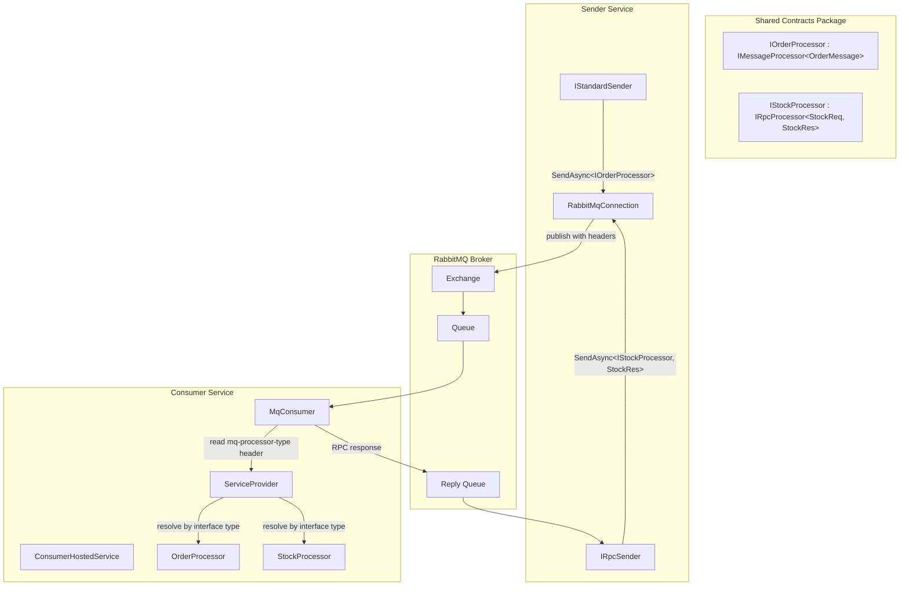

# Design Document: MqCSFramework

## Overview

MqCSFramework is a **three-package** RabbitMQ-only messaging framework for .NET 10. It provides compile-time type-safe sending via processor contract interfaces, automatic consumer dispatch using DI resolution from message headers, and independent connection management per sender/consumer.

The three NuGet packages are:
- **MqCSFramework** — Core/shared: interfaces, models, exceptions, connection management, `RpcResponseEnvelope`
- **MqCSFramework.Sender** — Standard and RPC sender implementations, DI registration extensions
- **MqCSFramework.Consumer** — Consumer implementation, abstract processor base classes, DI registration extensions

The framework supports two messaging patterns:
- **Standard** (fire-and-forget): publish a message, no response expected
- **RPC** (request-reply): publish a request, await a typed response

The key design principle is **simplicity**: no transport abstraction, no routing tables, no processor registration at the consumer. The consumer resolves processors purely from the `mq-processor-type` header at runtime.

### Design Goals

1. Compile-time safety — the sender cannot send a message type that doesn't match the processor's expectation
2. Zero consumer configuration for processors — register in DI, the consumer auto-discovers via headers
3. Independent connections — each sender/consumer manages its own connection lifecycle
4. Minimal API surface — two sender interfaces, two processor base interfaces, direct `IServiceCollection` extensions

### Dependencies

| Package | Version | Used By | Purpose |
|---------|---------|---------|---------|
| RabbitMQ.Client | 7.2.1 | Core, Sender, Consumer | Broker communication (fully async API) |
| Microsoft.Extensions.Logging.Abstractions | 10.0.10 | Core, Sender, Consumer | Structured logging |
| Microsoft.Extensions.DependencyInjection.Abstractions | 10.0.10 | Sender, Consumer | Keyed services, DI registration |
| Microsoft.Extensions.Configuration.Binder | 10.0.10 | Sender, Consumer | Config binding |
| Microsoft.Extensions.Hosting.Abstractions | 10.0.10 | Consumer | BackgroundService hosting |
| System.Text.Json | (built-in) | All | Message serialization |

### Shared Build Properties (Directory.Build.props)

```xml
<Project>
  <PropertyGroup>
    <TargetFramework>net10.0</TargetFramework>
    <Nullable>enable</Nullable>
    <ImplicitUsings>enable</ImplicitUsings>
    <LangVersion>latest</LangVersion>
  </PropertyGroup>
</Project>
```

## Project Structure

```
src/
├── MqCSFramework/                          ← Core package (shared by Sender and Consumer)
│   ├── MqCSFramework.csproj
│   ├── IMessageProcessor.cs                ← Non-generic + generic standard processor interfaces
│   ├── IRpcProcessor.cs                    ← Non-generic + generic RPC processor interfaces
│   ├── LoggingExtensions.cs                ← CorrelationScope() extension method
│   ├── MessageContext.cs                   ← Metadata record passed to processors
│   ├── MqHeaders.cs                        ← Well-known header name constants
│   ├── Configuration/
│   │   └── RabbitMqConnectionOptions.cs    ← Connection settings (host, port, credentials, SSL)
│   ├── Exceptions/
│   │   ├── MessageSerializationException.cs
│   │   ├── RpcRemoteException.cs
│   │   └── RpcTimeoutException.cs
│   └── Internal/
│       ├── RabbitMqConnection.cs           ← Lazy connection/channel management with auto-recovery
│       └── RpcResponseEnvelope.cs          ← Wire format for RPC responses
│
├── MqCSFramework.Sender/                   ← Sender package
│   ├── MqCSFramework.Sender.csproj
│   ├── IStandardSender.cs                  ← Public interface for fire-and-forget sends
│   ├── IRpcSender.cs                       ← Public interface for RPC sends
│   ├── ServiceCollectionExtensions.cs      ← AddMqSender, AddMqRpcSender, AddMqSendersFromConfiguration
│   ├── Configuration/
│   │   ├── StandardSenderOptions.cs        ← Connection + Exchange + RoutingKey
│   │   ├── RpcSenderOptions.cs             ← Connection + Exchange + RoutingKey + Timeout
│   │   ├── SendOptions.cs                  ← Per-message overrides (RoutingKey, AdditionalHeaders)
│   │   └── RpcOptions.cs                   ← Per-message overrides (RoutingKey, Timeout, AdditionalHeaders)
│   └── Internal/
│       ├── RabbitMqStandardSender.cs       ← IStandardSender implementation
│       ├── RabbitMqRpcSender.cs            ← IRpcSender implementation
│       └── RpcRequestResponseHandler.cs    ← Reply queue management and correlation
│
└── MqCSFramework.Consumer/                 ← Consumer package
    ├── MqCSFramework.Consumer.csproj
    ├── StandardProcessor.cs                ← Abstract base class for standard processors
    ├── RpcProcessor.cs                     ← Abstract base class for RPC processors
    ├── ServiceCollectionExtensions.cs      ← AddMqConsumer, AddMqConsumersFromConfiguration
    ├── Configuration/
    │   └── ConsumerOptions.cs              ← Connection + Queue + Prefetch + Retries + Timeout + DLX + Masking
    └── Internal/
        ├── ConsumerHostedService.cs        ← BackgroundService managing all consumers
        ├── MqConsumer.cs                   ← Single consumer: connection, channel, dispatch loop
        ├── MessageHelpers.cs               ← Static helpers for header parsing and context building
        └── LogMaskingHelper.cs             ← JSON field masking for log output
```

## Architecture



### Message Flow — Standard Pattern

1. Sender calls `IStandardSender.SendAsync<TProcessor, TMessage>(message, correlationId)`
2. Framework serializes message to UTF-8 JSON via `System.Text.Json`
3. Framework generates a `MessageId` as `Guid.NewGuid().ToString("N")`
4. Framework sets headers: `mq-processor-type` = `typeof(TProcessor).AssemblyQualifiedName`, `mq-pattern` = `"standard"`
5. Framework publishes to configured exchange/routing key via `channel.BasicPublishAsync`
6. On publish failure: logs error, resets channel (`ResetChannelAsync`), re-throws
7. Returns the generated `MessageId`

Consumer side:
1. Consumer receives message, reads `mq-processor-type` header
2. Consumer calls `Type.GetType(headerValue)` → resolves from DI via `_serviceProvider.GetService(type)`
3. Casts to `IMessageProcessor` (non-generic) → calls `ProcessRawAsync(body, context, ct)`
4. `CancellationToken` created from `ConsumerOptions.ProcessingTimeoutMs`
5. On success: ACK. On failure: retry logic (increment `mq-retry-count`, dead-letter if exceeded)

### Message Flow — RPC Pattern

1. Sender calls `IRpcSender.SendAsync<TProcessor, TResponse, TRequest>(request, correlationId)`
2. Framework serializes request to UTF-8 JSON
3. Framework generates `MessageId` as `Guid.NewGuid().ToString("N")`
4. Framework sets headers: `mq-processor-type`, `mq-pattern` = `"rpc"`, `mq-cancellation-deadline` = `(DateTimeOffset.UtcNow + timeout).Ticks.ToString()`
5. Sets `ReplyTo` = reply queue name (format: `{routingKey}.reply.{Guid:N}`)
6. `RpcRequestResponseHandler` lazily declares the exclusive auto-delete reply queue, starts consuming
7. Registers a `TaskCompletionSource<byte[]>` keyed by `correlationId`, publishes, awaits response
8. On timeout: `RpcTimeoutException` (via `CancellationTokenSource.CancelAfter`)
9. Consumer receives, resolves processor, calls `ProcessRawRpcAsync` which returns serialized response bytes
10. Consumer wraps in `RpcResponseEnvelope`, publishes to `ReplyTo` queue with matching `CorrelationId`
11. `CancellationToken` for RPC processing: created from `mq-cancellation-deadline` header (remaining time until deadline)
12. If processor throws: consumer wraps error in `RpcResponseEnvelope` with `IsError = true`
13. Sender deserializes envelope → throws `RpcRemoteException` if `IsError`, else deserializes `TResponse`

## Components and Interfaces

### Package: MqCSFramework (Core)

#### Processor Contract Interfaces

```csharp
namespace MqCSFramework;

/// <summary>
/// Non-generic base interface for standard processors.
/// The consumer calls ProcessRawAsync — the implementation deserializes and delegates to the typed method.
/// </summary>
public interface IMessageProcessor
{
    Task ProcessRawAsync(ReadOnlyMemory<byte> body, MessageContext context, CancellationToken ct = default);
}

/// <summary>
/// Generic interface for standard message processors.
/// Define a contract interface inheriting this in your shared contracts package.
/// </summary>
public interface IMessageProcessor<in TMessage> : IMessageProcessor where TMessage : class
{
    Task ProcessAsync(TMessage message, MessageContext context, CancellationToken ct = default);
}
```

```csharp
namespace MqCSFramework;

/// <summary>
/// Non-generic base interface for RPC processors.
/// The consumer calls ProcessRawRpcAsync — the implementation deserializes, processes, and serializes the response.
/// </summary>
public interface IRpcProcessor
{
    Task<byte[]> ProcessRawRpcAsync(ReadOnlyMemory<byte> body, MessageContext context, CancellationToken ct = default);
}

/// <summary>
/// Generic interface for RPC processors that return a typed response.
/// Define a contract interface inheriting this in your shared contracts package.
/// </summary>
public interface IRpcProcessor<in TRequest, TResponse> : IRpcProcessor where TRequest : class where TResponse : class
{
    Task<TResponse> ProcessAsync(TRequest request, MessageContext context, CancellationToken ct = default);
}
```

#### MessageContext

```csharp
namespace MqCSFramework;

/// <summary>
/// Metadata available to processors when handling a message.
/// </summary>
public sealed record MessageContext
{
    public required string MessageId { get; init; }
    public required string CorrelationId { get; init; }
    public required DateTimeOffset Timestamp { get; init; }
    public required string Pattern { get; init; }
    public required IReadOnlyDictionary<string, string> Headers { get; init; }
}
```

#### MqHeaders

```csharp
namespace MqCSFramework;

/// <summary>
/// Well-known header names used by the framework.
/// </summary>
public static class MqHeaders
{
    public const string ProcessorType = "mq-processor-type";
    public const string Pattern = "mq-pattern";
    public const string RetryCount = "mq-retry-count";

    public const string PatternStandard = "standard";
    public const string PatternRpc = "rpc";
    public const string CancellationDeadline = "mq-cancellation-deadline";
}
```

#### LoggingExtensions

```csharp
using Microsoft.Extensions.Logging;

namespace MqCSFramework;

/// <summary>
/// Extension method to simplify creating a logging scope with a CorrelationId.
/// </summary>
public static class LoggingExtensions
{
    /// <summary>
    /// Creates a logging scope that includes the CorrelationId in all log entries within the scope.
    /// Requires Serilog's Enrich.FromLogContext and {CorrelationId} in the output template.
    /// </summary>
    public static IDisposable? CorrelationScope(this ILogger logger, string correlationId)
    {
        return logger.BeginScope(new Dictionary<string, object> { ["CorrelationId"] = correlationId });
    }
}
```

#### RabbitMqConnectionOptions

```csharp
namespace MqCSFramework;

/// <summary>
/// RabbitMQ connection settings. Each sender/consumer carries its own instance.
/// All properties have defaults suitable for local development and config binding.
/// </summary>
public sealed class RabbitMqConnectionOptions
{
    public string HostName { get; set; } = "localhost";
    public int Port { get; set; } = 5672;
    public string UserName { get; set; } = "guest";
    public string Password { get; set; } = "guest";
    public string VirtualHost { get; set; } = "/";
    public bool UseSsl { get; set; }
    public string? ClientProvidedName { get; set; }
}
```

#### Exceptions

```csharp
namespace MqCSFramework;

/// <summary>
/// Thrown when message serialization or deserialization fails.
/// </summary>
public sealed class MessageSerializationException : Exception
{
    public string? MessageId { get; }

    public MessageSerializationException(string message, string? messageId = null, Exception? inner = null)
        : base(message, inner)
    {
        MessageId = messageId;
    }
}

/// <summary>
/// Thrown when an RPC call times out waiting for a response.
/// </summary>
public sealed class RpcTimeoutException : Exception
{
    public string CorrelationId { get; }
    public TimeSpan Timeout { get; }

    public RpcTimeoutException(string correlationId, TimeSpan timeout)
        : base($"RPC call {correlationId} timed out after {timeout.TotalSeconds}s")
    {
        CorrelationId = correlationId;
        Timeout = timeout;
    }
}

/// <summary>
/// Thrown when the remote processor threw an exception during RPC processing.
/// </summary>
public sealed class RpcRemoteException : Exception
{
    public string CorrelationId { get; }
    public string RemoteExceptionType { get; }

    public RpcRemoteException(string correlationId, string message, string? remoteExceptionType = null)
        : base($"Remote processor error for {correlationId}: {message}")
    {
        CorrelationId = correlationId;
        RemoteExceptionType = remoteExceptionType ?? "Unknown";
    }
}
```

#### RpcResponseEnvelope (Internal)

Located in `MqCSFramework/Internal/RpcResponseEnvelope.cs`. Used by both sender (deserialization) and consumer (serialization) via `InternalsVisibleTo`.

```csharp
namespace MqCSFramework.Internal;

/// <summary>
/// Wire format for RPC responses. Wraps either a success payload or an error.
/// </summary>
internal sealed record RpcResponseEnvelope
{
    public required bool IsError { get; init; }
    public byte[]? Payload { get; init; }
    public string? ErrorMessage { get; init; }
    public string? ErrorType { get; init; }
}
```

#### RabbitMqConnection (Internal)

Located in `MqCSFramework/Internal/RabbitMqConnection.cs`. Shared by both sender and consumer packages via `InternalsVisibleTo`.

```csharp
using Microsoft.Extensions.Logging;
using RabbitMQ.Client;

namespace MqCSFramework.Internal;

/// <summary>
/// Manages a single RabbitMQ connection and channel for a sender or consumer.
/// Uses lazy initialization and relies on RabbitMQ.Client 7.x built-in automatic recovery.
/// </summary>
internal sealed class RabbitMqConnection : IAsyncDisposable
{
    private readonly RabbitMqConnectionOptions _options;
    private readonly ILogger _logger;
    private readonly SemaphoreSlim _lock = new(1, 1);

    private IConnection? _connection;
    private IChannel? _channel;

    public RabbitMqConnection(RabbitMqConnectionOptions options, ILogger logger)
    {
        _options = options;
        _logger = logger;
    }

    public async Task<IChannel> GetChannelAsync(CancellationToken ct = default)
    {
        // Returns existing open channel if available
        // Otherwise: close stale channel, ensure connection is alive, create new channel
        // Thread-safe via SemaphoreSlim
    }

    /// <summary>
    /// Resets the channel after a publish failure, forcing a new one on next use.
    /// </summary>
    public async Task ResetChannelAsync()
    {
        // Closes and nulls the channel under lock
    }

    private async Task<IConnection> CreateConnectionAsync(CancellationToken ct)
    {
        // Creates ConnectionFactory with:
        //   HostName, Port, UserName, Password, VirtualHost from _options
        //   AutomaticRecoveryEnabled = true
        //   TopologyRecoveryEnabled = true
        //   ClientProvidedName = _options.ClientProvidedName
        //   Ssl.Enabled = _options.UseSsl (ServerName = HostName)
        // Calls factory.CreateConnectionAsync(ct)
    }

    public async ValueTask DisposeAsync()
    {
        // Closes channel and connection gracefully, disposes SemaphoreSlim
    }
}
```

#### MqCSFramework.csproj

```xml
<Project Sdk="Microsoft.NET.Sdk">
  <PropertyGroup>
    <Description>Core shared contracts and interfaces for MqCSFramework</Description>
    <GeneratePackageOnBuild>true</GeneratePackageOnBuild>
  </PropertyGroup>

  <ItemGroup>
    <PackageReference Include="Microsoft.Extensions.Logging.Abstractions" Version="10.0.10" />
    <PackageReference Include="RabbitMQ.Client" Version="7.2.1" />
  </ItemGroup>

  <ItemGroup>
    <InternalsVisibleTo Include="MqCSFramework.Sender" />
    <InternalsVisibleTo Include="MqCSFramework.Consumer" />
    <InternalsVisibleTo Include="MqCSFramework.Tests" />
  </ItemGroup>
</Project>
```

### Package: MqCSFramework.Sender

#### IStandardSender

```csharp
namespace MqCSFramework;

/// <summary>
/// Sends standard (fire-and-forget) messages.
/// The generic constraints enforce compile-time type safety between processor and message.
/// </summary>
public interface IStandardSender
{
    Task<string> SendAsync<TProcessor, TMessage>(
        TMessage message,
        string correlationId,
        SendOptions? options = null,
        CancellationToken ct = default)
        where TProcessor : IMessageProcessor<TMessage>
        where TMessage : class;
}
```

#### IRpcSender

```csharp
namespace MqCSFramework;

/// <summary>
/// Sends RPC (request-reply) messages and awaits a typed response.
/// The generic constraints enforce compile-time type safety between processor, request, and response.
/// </summary>
public interface IRpcSender
{
    Task<TResponse> SendAsync<TProcessor, TResponse, TRequest>(
        TRequest request,
        string correlationId,
        RpcOptions? options = null,
        CancellationToken ct = default)
        where TProcessor : IRpcProcessor<TRequest, TResponse>
        where TRequest : class
        where TResponse : class;
}
```

#### Configuration Options (Sender)

```csharp
namespace MqCSFramework;

/// <summary>
/// Configuration for a standard (fire-and-forget) sender.
/// </summary>
public sealed class StandardSenderOptions
{
    public RabbitMqConnectionOptions Connection { get; set; } = new();
    public string Exchange { get; set; } = "";
    public string RoutingKey { get; set; } = "";
}

/// <summary>
/// Configuration for an RPC (request-reply) sender.
/// </summary>
public sealed class RpcSenderOptions
{
    public RabbitMqConnectionOptions Connection { get; set; } = new();
    public string Exchange { get; set; } = "";
    public string RoutingKey { get; set; } = "";
    public TimeSpan Timeout { get; set; } = TimeSpan.FromSeconds(30);
}

/// <summary>
/// Per-message options for standard sends (override sender defaults).
/// </summary>
public sealed class SendOptions
{
    public string? RoutingKey { get; set; }
    public IReadOnlyDictionary<string, string>? AdditionalHeaders { get; set; }
}

/// <summary>
/// Per-message options for RPC sends (override sender defaults).
/// </summary>
public sealed class RpcOptions
{
    public string? RoutingKey { get; set; }
    public TimeSpan? Timeout { get; set; }
    public IReadOnlyDictionary<string, string>? AdditionalHeaders { get; set; }
}
```

Note: `SendOptions` and `RpcOptions` do NOT have a `CorrelationId` property. The `correlationId` is a mandatory method parameter on both sender interfaces.

#### ServiceCollectionExtensions (Sender)

```csharp
using Microsoft.Extensions.Configuration;
using Microsoft.Extensions.DependencyInjection;
using Microsoft.Extensions.Logging;
using MqCSFramework.Internal;
using MqCSFramework.Sender.Internal;

namespace MqCSFramework.Sender;

/// <summary>
/// Extension methods for registering MqCSFramework sender services.
/// </summary>
public static class ServiceCollectionExtensions
{
    /// <summary>
    /// Registers a standard (fire-and-forget) sender as a keyed IStandardSender singleton.
    /// </summary>
    public static IServiceCollection AddMqSender(
        this IServiceCollection services,
        string name,
        Action<StandardSenderOptions> configure)
    {
        ArgumentException.ThrowIfNullOrWhiteSpace(name);
        ArgumentNullException.ThrowIfNull(configure);

        var options = new StandardSenderOptions();
        configure(options);

        services.AddKeyedSingleton<IStandardSender>(name, (sp, _) =>
        {
            var logger = sp.GetRequiredService<ILogger<RabbitMqStandardSender>>();
            var connection = new RabbitMqConnection(options.Connection, logger);
            return new RabbitMqStandardSender(connection, options, logger);
        });

        return services;
    }

    /// <summary>
    /// Registers an RPC (request-reply) sender as a keyed IRpcSender singleton.
    /// </summary>
    public static IServiceCollection AddMqRpcSender(
        this IServiceCollection services,
        string name,
        Action<RpcSenderOptions> configure)
    {
        ArgumentException.ThrowIfNullOrWhiteSpace(name);
        ArgumentNullException.ThrowIfNull(configure);

        var options = new RpcSenderOptions();
        configure(options);

        services.AddKeyedSingleton<IRpcSender>(name, (sp, _) =>
        {
            var logger = sp.GetRequiredService<ILogger<RabbitMqRpcSender>>();
            var connection = new RabbitMqConnection(options.Connection, logger);
            return new RabbitMqRpcSender(connection, options, logger);
        });

        return services;
    }

    /// <summary>
    /// Auto-registers all senders and RPC senders from the given config section.
    /// Reads "Senders" and "RpcSenders" sub-sections.
    /// Default section name: "MqCSFramework".
    /// </summary>
    public static IServiceCollection AddMqSendersFromConfiguration(
        this IServiceCollection services,
        IConfiguration configuration,
        string sectionName = "MqCSFramework")
    {
        var section = configuration.GetSection(sectionName);

        foreach (var child in section.GetSection("Senders").GetChildren())
        {
            services.AddMqSender(child.Key, opts => child.Bind(opts));
        }

        foreach (var child in section.GetSection("RpcSenders").GetChildren())
        {
            services.AddMqRpcSender(child.Key, opts => child.Bind(opts));
        }

        return services;
    }
}
```

#### RabbitMqStandardSender (Internal)

```csharp
using MqCSFramework.Internal;
using System.Text.Json;
using Microsoft.Extensions.Logging;
using RabbitMQ.Client;

namespace MqCSFramework.Sender.Internal;

/// <summary>
/// Standard (fire-and-forget) sender implementation using RabbitMQ.
/// Each instance owns its own connection.
/// </summary>
internal sealed class RabbitMqStandardSender : IStandardSender
{
    private readonly RabbitMqConnection _connection;
    private readonly StandardSenderOptions _options;
    private readonly ILogger<RabbitMqStandardSender> _logger;

    public RabbitMqStandardSender(RabbitMqConnection connection, StandardSenderOptions options, ILogger<RabbitMqStandardSender> logger)
    {
        _connection = connection;
        _options = options;
        _logger = logger;
    }

    public async Task<string> SendAsync<TProcessor, TMessage>(
        TMessage message,
        string correlationId,
        SendOptions? options = null,
        CancellationToken ct = default)
        where TProcessor : IMessageProcessor<TMessage>
        where TMessage : class
    {
        var messageId = Guid.NewGuid().ToString("N");
        var routingKey = options?.RoutingKey ?? _options.RoutingKey;

        byte[] body;
        try
        {
            body = JsonSerializer.SerializeToUtf8Bytes(message);
        }
        catch (JsonException ex)
        {
            throw new MessageSerializationException(
                $"Failed to serialize message of type '{typeof(TMessage).FullName}'.", messageId, ex);
        }

        var props = new BasicProperties
        {
            MessageId = messageId,
            CorrelationId = correlationId,
            Timestamp = new AmqpTimestamp(DateTimeOffset.UtcNow.ToUnixTimeSeconds()),
            ContentType = "application/json",
            Headers = new Dictionary<string, object?>
            {
                [MqHeaders.ProcessorType] = typeof(TProcessor).AssemblyQualifiedName,
                [MqHeaders.Pattern] = MqHeaders.PatternStandard
            }
        };

        if (options?.AdditionalHeaders is not null)
        {
            foreach (var kvp in options.AdditionalHeaders)
            {
                props.Headers[kvp.Key] = kvp.Value;
            }
        }

        try
        {
            var channel = await _connection.GetChannelAsync(ct);
            await channel.BasicPublishAsync(_options.Exchange, routingKey, false, props, body, ct);
        }
        catch (Exception ex) when (ex is not MessageSerializationException)
        {
            _logger.LogError(ex, "Failed to publish standard message {MessageId} to {Exchange}/{RoutingKey}",
                messageId, _options.Exchange, routingKey);
            await _connection.ResetChannelAsync();
            throw;
        }

        _logger.LogInformation("Published standard message {MessageId} for processor {Processor} to {Exchange}/{RoutingKey}",
            messageId, typeof(TProcessor).Name, _options.Exchange, routingKey);

        return messageId;
    }
}
```

#### RabbitMqRpcSender (Internal)

```csharp
using MqCSFramework.Internal;
using System.Text.Json;
using Microsoft.Extensions.Logging;
using RabbitMQ.Client;

namespace MqCSFramework.Sender.Internal;

/// <summary>
/// RPC (request-reply) sender implementation.
/// Delegates reply correlation entirely to RpcRequestResponseHandler.
/// Reply queue format: {routingKey}.reply.{GUID:N}
/// </summary>
internal sealed class RabbitMqRpcSender : IRpcSender, IAsyncDisposable
{
    private readonly RabbitMqConnection _connection;
    private readonly RpcSenderOptions _options;
    private readonly ILogger<RabbitMqRpcSender> _logger;
    private readonly RpcRequestResponseHandler _replyConsumer;

    public RabbitMqRpcSender(RabbitMqConnection connection, RpcSenderOptions options, ILogger<RabbitMqRpcSender> logger)
    {
        _connection = connection;
        _options = options;
        _logger = logger;

        var replyQueueName = $"{options.RoutingKey}.reply.{Guid.NewGuid():N}";
        _replyConsumer = new RpcRequestResponseHandler(connection, replyQueueName, logger);
    }

    public async Task<TResponse> SendAsync<TProcessor, TResponse, TRequest>(
        TRequest request,
        string correlationId,
        RpcOptions? options = null,
        CancellationToken ct = default)
        where TProcessor : IRpcProcessor<TRequest, TResponse>
        where TRequest : class
        where TResponse : class
    {
        var messageId = Guid.NewGuid().ToString("N");
        var routingKey = options?.RoutingKey ?? _options.RoutingKey;
        var timeout = options?.Timeout ?? _options.Timeout;

        byte[] body;
        try
        {
            body = JsonSerializer.SerializeToUtf8Bytes(request);
        }
        catch (JsonException ex)
        {
            throw new MessageSerializationException(
                $"Failed to serialize RPC request of type '{typeof(TRequest).FullName}'.", messageId, ex);
        }

        var props = new BasicProperties
        {
            MessageId = messageId,
            CorrelationId = correlationId,
            ReplyTo = _replyConsumer.ReplyQueueName,
            Timestamp = new AmqpTimestamp(DateTimeOffset.UtcNow.ToUnixTimeSeconds()),
            ContentType = "application/json",
            Headers = new Dictionary<string, object?>
            {
                [MqHeaders.ProcessorType] = typeof(TProcessor).AssemblyQualifiedName,
                [MqHeaders.Pattern] = MqHeaders.PatternRpc,
                [MqHeaders.CancellationDeadline] = (DateTimeOffset.UtcNow + timeout).Ticks.ToString()
            }
        };

        if (options?.AdditionalHeaders is not null)
        {
            foreach (var kvp in options.AdditionalHeaders)
            {
                props.Headers[kvp.Key] = kvp.Value;
            }
        }

        _logger.LogInformation("Publishing RPC request {MessageId} for processor {Processor} to {Exchange}/{RoutingKey}",
            messageId, typeof(TProcessor).Name, _options.Exchange, routingKey);

        var responseBytes = await _replyConsumer.PublishAndAwaitReplyAsync(
            _options.Exchange, routingKey, props, body, correlationId, timeout, ct);

        // Check for error response
        var envelope = JsonSerializer.Deserialize<RpcResponseEnvelope>(responseBytes);
        if (envelope is { IsError: true })
        {
            throw new RpcRemoteException(correlationId, envelope.ErrorMessage ?? "Unknown error", envelope.ErrorType);
        }

        if (envelope?.Payload is null)
        {
            throw new MessageSerializationException("RPC response payload was null.", messageId);
        }

        var response = JsonSerializer.Deserialize<TResponse>(envelope.Payload);
        if (response is null)
        {
            throw new MessageSerializationException(
                $"Failed to deserialize RPC response to type '{typeof(TResponse).FullName}'.", messageId);
        }

        return response;
    }

    public async ValueTask DisposeAsync()
    {
        _replyConsumer.Dispose();
        await _connection.DisposeAsync();
    }
}
```

#### RpcRequestResponseHandler (Internal)

```csharp
using MqCSFramework.Internal;
using System.Collections.Concurrent;
using Microsoft.Extensions.Logging;
using RabbitMQ.Client;
using RabbitMQ.Client.Events;

namespace MqCSFramework.Sender.Internal;

/// <summary>
/// Manages the reply queue consumer for RPC responses.
/// Owns the pending request dictionary and handles the full correlation lifecycle:
/// ensure started, register pending, publish, await reply, timeout, cleanup.
/// </summary>
internal sealed class RpcRequestResponseHandler : IDisposable
{
    private readonly RabbitMqConnection _connection;
    private readonly string _replyQueueName;
    private readonly ILogger _logger;
    private readonly SemaphoreSlim _initLock = new(1, 1);
    private readonly ConcurrentDictionary<string, TaskCompletionSource<byte[]>> _pending = new();
    private bool _started;

    public string ReplyQueueName => _replyQueueName;

    public RpcRequestResponseHandler(RabbitMqConnection connection, string replyQueueName, ILogger logger)
    {
        _connection = connection;
        _replyQueueName = replyQueueName;
        _logger = logger;
    }

    /// <summary>
    /// Registers a pending request, ensures the consumer is started, publishes the message,
    /// and awaits the response. Handles timeout internally via CancellationTokenSource.CancelAfter.
    /// On timeout: removes pending TCS and throws RpcTimeoutException.
    /// </summary>
    public async Task<byte[]> PublishAndAwaitReplyAsync(
        string exchange,
        string routingKey,
        BasicProperties props,
        byte[] body,
        string correlationId,
        TimeSpan timeout,
        CancellationToken ct)
    {
        await EnsureStartedAsync(ct);

        var tcs = new TaskCompletionSource<byte[]>(TaskCreationOptions.RunContinuationsAsynchronously);
        _pending[correlationId] = tcs;

        using var cts = CancellationTokenSource.CreateLinkedTokenSource(ct);
        cts.CancelAfter(timeout);

        using var registration = cts.Token.Register(() =>
        {
            if (_pending.TryRemove(correlationId, out var pendingTcs))
            {
                pendingTcs.TrySetException(new RpcTimeoutException(correlationId, timeout));
            }
        });

        try
        {
            var channel = await _connection.GetChannelAsync(ct);
            await channel.BasicPublishAsync(exchange, routingKey, false, props, body, ct);
            return await tcs.Task;
        }
        catch (Exception) when (!tcs.Task.IsCompleted)
        {
            _pending.TryRemove(correlationId, out _);
            throw;
        }
    }

    private async Task EnsureStartedAsync(CancellationToken ct)
    {
        if (_started) return;

        await _initLock.WaitAsync(ct);
        try
        {
            if (_started) return;

            var channel = await _connection.GetChannelAsync(ct);

            // Declare exclusive auto-delete reply queue
            await channel.QueueDeclareAsync(
                queue: _replyQueueName,
                durable: false,
                exclusive: true,
                autoDelete: true,
                arguments: null,
                cancellationToken: ct);

            var consumer = new AsyncEventingBasicConsumer(channel);
            consumer.ReceivedAsync += HandleReplyAsync;
            await channel.BasicConsumeAsync(_replyQueueName, autoAck: true, consumer: consumer, cancellationToken: ct);
            _started = true;

            _logger.LogInformation("RPC reply consumer started on queue '{ReplyQueue}'", _replyQueueName);
        }
        finally
        {
            _initLock.Release();
        }
    }

    private Task HandleReplyAsync(object sender, BasicDeliverEventArgs ea)
    {
        var correlationId = ea.BasicProperties?.CorrelationId;
        if (correlationId is null) return Task.CompletedTask;

        if (_pending.TryRemove(correlationId, out var tcs))
        {
            tcs.TrySetResult(ea.Body.ToArray());
        }

        return Task.CompletedTask;
    }

    public void Dispose()
    {
        foreach (var kvp in _pending)
        {
            if (_pending.TryRemove(kvp.Key, out var tcs))
            {
                tcs.TrySetCanceled();
            }
        }
        _initLock.Dispose();
    }
}
```

#### MqCSFramework.Sender.csproj

```xml
<Project Sdk="Microsoft.NET.Sdk">
  <PropertyGroup>
    <Description>RabbitMQ sender (standard + RPC) for MqCSFramework</Description>
    <GeneratePackageOnBuild>true</GeneratePackageOnBuild>
  </PropertyGroup>

  <ItemGroup>
    <PackageReference Include="Microsoft.Extensions.Configuration.Binder" Version="10.0.10" />
    <PackageReference Include="Microsoft.Extensions.DependencyInjection.Abstractions" Version="10.0.10" />
    <PackageReference Include="Microsoft.Extensions.Logging.Abstractions" Version="10.0.10" />
    <PackageReference Include="RabbitMQ.Client" Version="7.2.1" />
  </ItemGroup>

  <ItemGroup>
    <ProjectReference Include="..\MqCSFramework\MqCSFramework.csproj" />
  </ItemGroup>

  <ItemGroup>
    <InternalsVisibleTo Include="MqCSFramework.Tests" />
  </ItemGroup>
</Project>
```

### Package: MqCSFramework.Consumer

#### ConsumerOptions

```csharp
namespace MqCSFramework;

/// <summary>
/// Configuration for a message consumer.
/// </summary>
public sealed class ConsumerOptions
{
    public RabbitMqConnectionOptions Connection { get; set; } = new();
    public string QueueName { get; set; } = "";
    public ushort PrefetchCount { get; set; } = 10;
    public int MaxRetries { get; set; } = 3;
    public int ProcessingTimeoutMs { get; set; } = 30000;
    public string? DeadLetterExchange { get; set; }
    public string? DeadLetterRoutingKey { get; set; }
    public IReadOnlyList<string> MaskedFields { get; set; } = [];
}
```

Note: `ConsumerOptions` does NOT have a `SuppressMessageBodyLogging` property. Body logging is at `LogDebug` level and is controlled via Serilog per-namespace log level overrides in `appsettings.json`.

#### Abstract Processor Base Classes

These are in the Consumer package. Developers inherit from them in their processor implementations.

```csharp
using System.Text.Json;

namespace MqCSFramework;

/// <summary>
/// Abstract base class for standard message processors.
/// Handles deserialization internally — the consumer calls ProcessRawAsync directly (no reflection).
/// Inherit this in your processor implementation.
/// </summary>
public abstract class StandardProcessor<TMessage> : IMessageProcessor<TMessage>
    where TMessage : class
{
    public Task ProcessRawAsync(ReadOnlyMemory<byte> body, MessageContext context, CancellationToken ct = default)
    {
        var message = JsonSerializer.Deserialize<TMessage>(body.Span);
        if (message is null)
        {
            throw new MessageSerializationException(
                $"Failed to deserialize message to type '{typeof(TMessage).FullName}'.",
                context.MessageId);
        }

        return ProcessAsync(message, context, ct);
    }

    public abstract Task ProcessAsync(TMessage message, MessageContext context, CancellationToken ct = default);
}
```

```csharp
using System.Text.Json;

namespace MqCSFramework;

/// <summary>
/// Abstract base class for RPC processors.
/// Handles deserialization and response serialization internally — the consumer calls ProcessRawRpcAsync directly (no reflection).
/// Inherit this in your processor implementation.
/// </summary>
public abstract class RpcProcessor<TRequest, TResponse> : IRpcProcessor<TRequest, TResponse>
    where TRequest : class
    where TResponse : class
{
    public async Task<byte[]> ProcessRawRpcAsync(ReadOnlyMemory<byte> body, MessageContext context, CancellationToken ct = default)
    {
        var request = JsonSerializer.Deserialize<TRequest>(body.Span);
        if (request is null)
        {
            throw new MessageSerializationException(
                $"Failed to deserialize RPC request to type '{typeof(TRequest).FullName}'.",
                context.MessageId);
        }

        var response = await ProcessAsync(request, context, ct);
        return JsonSerializer.SerializeToUtf8Bytes(response);
    }

    public abstract Task<TResponse> ProcessAsync(TRequest request, MessageContext context, CancellationToken ct = default);
}
```

#### ServiceCollectionExtensions (Consumer)

```csharp
using Microsoft.Extensions.Configuration;
using Microsoft.Extensions.DependencyInjection;
using Microsoft.Extensions.Hosting;
using Microsoft.Extensions.Logging;
using MqCSFramework.Consumer.Internal;

namespace MqCSFramework.Consumer;

/// <summary>
/// Extension methods for registering MqCSFramework consumer services.
/// </summary>
public static class ServiceCollectionExtensions
{
    /// <summary>
    /// Registers a consumer that listens on a queue and dispatches messages to processors.
    /// Also registers ConsumerHostedService (idempotent).
    /// </summary>
    public static IServiceCollection AddMqConsumer(
        this IServiceCollection services,
        string name,
        Action<ConsumerOptions> configure)
    {
        ArgumentException.ThrowIfNullOrWhiteSpace(name);
        ArgumentNullException.ThrowIfNull(configure);

        var options = new ConsumerOptions();
        configure(options);

        // Store consumer registrations for the hosted service
        services.AddSingleton(new ConsumerRegistration(name, options));

        // Ensure hosted service is registered (idempotent)
        services.AddHostedService<ConsumerHostedService>();

        return services;
    }

    /// <summary>
    /// Auto-registers all consumers from the given config section.
    /// Reads the "Consumers" sub-section.
    /// Default section name: "MqCSFramework".
    /// </summary>
    public static IServiceCollection AddMqConsumersFromConfiguration(
        this IServiceCollection services,
        IConfiguration configuration,
        string sectionName = "MqCSFramework")
    {
        var section = configuration.GetSection(sectionName);

        foreach (var child in section.GetSection("Consumers").GetChildren())
        {
            services.AddMqConsumer(child.Key, opts => child.Bind(opts));
        }

        return services;
    }
}
```

#### ConsumerHostedService (Internal)

```csharp
using Microsoft.Extensions.Hosting;
using Microsoft.Extensions.Logging;

namespace MqCSFramework.Consumer.Internal;

/// <summary>
/// BackgroundService that starts and manages all registered consumers.
/// </summary>
internal sealed class ConsumerHostedService : BackgroundService
{
    private readonly IReadOnlyList<ConsumerRegistration> _registrations;
    private readonly IServiceProvider _serviceProvider;
    private readonly ILoggerFactory _loggerFactory;
    private readonly ILogger<ConsumerHostedService> _logger;
    private readonly List<MqConsumer> _consumers = [];

    public ConsumerHostedService(
        IEnumerable<ConsumerRegistration> registrations,
        IServiceProvider serviceProvider,
        ILoggerFactory loggerFactory,
        ILogger<ConsumerHostedService> logger)
    {
        _registrations = registrations.ToList();
        _serviceProvider = serviceProvider;
        _loggerFactory = loggerFactory;
        _logger = logger;
    }

    protected override async Task ExecuteAsync(CancellationToken stoppingToken)
    {
        if (_registrations.Count == 0)
        {
            _logger.LogWarning("No consumers registered. ConsumerHostedService will idle.");
            await Task.Delay(Timeout.Infinite, stoppingToken).ConfigureAwait(ConfigureAwaitOptions.SuppressThrowing);
            return;
        }

        _logger.LogInformation("Starting {Count} consumer(s)", _registrations.Count);

        foreach (var reg in _registrations)
        {
            var consumer = new MqConsumer(reg.Options, _serviceProvider, _loggerFactory.CreateLogger<MqConsumer>());
            _consumers.Add(consumer);
            await consumer.StartAsync(stoppingToken);
        }

        _logger.LogInformation("All consumers started");
        await Task.Delay(Timeout.Infinite, stoppingToken).ConfigureAwait(ConfigureAwaitOptions.SuppressThrowing);

        _logger.LogInformation("Shutdown requested. Disposing consumers...");
        foreach (var consumer in _consumers)
        {
            await consumer.DisposeAsync();
        }
    }
}

internal sealed record ConsumerRegistration(string Name, ConsumerOptions Options);
```

#### MqConsumer (Internal)

```csharp
using MqCSFramework.Internal;
using System.Text;
using System.Text.Json;
using Microsoft.Extensions.Logging;
using RabbitMQ.Client;
using RabbitMQ.Client.Events;

namespace MqCSFramework.Consumer.Internal;

/// <summary>
/// Manages a single consumer — owns its connection, channel, and message dispatch loop.
/// Resolves processors directly from DI using the mq-processor-type header.
/// </summary>
internal sealed class MqConsumer : IAsyncDisposable
{
    private readonly ConsumerOptions _options;
    private readonly IServiceProvider _serviceProvider;
    private readonly ILogger<MqConsumer> _logger;
    private readonly HashSet<string>? _maskedFields;

    private RabbitMqConnection? _connection;
    private IChannel? _channel;

    public MqConsumer(ConsumerOptions options, IServiceProvider serviceProvider, ILogger<MqConsumer> logger)
    {
        _options = options;
        _serviceProvider = serviceProvider;
        _logger = logger;
        _maskedFields = options.MaskedFields.Count > 0
            ? new HashSet<string>(options.MaskedFields, StringComparer.OrdinalIgnoreCase)
            : null;
    }

    public async Task StartAsync(CancellationToken ct)
    {
        _connection = new RabbitMqConnection(_options.Connection, _logger);
        _channel = await _connection.GetChannelAsync(ct);

        // Declare queue (idempotent — creates if not exists, no-op if already exists)
        await _channel.QueueDeclareAsync(
            queue: _options.QueueName,
            durable: true,
            exclusive: false,
            autoDelete: false,
            arguments: null,
            cancellationToken: ct);

        await _channel.BasicQosAsync(prefetchSize: 0, prefetchCount: _options.PrefetchCount, global: false, cancellationToken: ct);

        var consumer = new AsyncEventingBasicConsumer(_channel);
        consumer.ReceivedAsync += DispatchMessageAsync;

        await _channel.BasicConsumeAsync(
            queue: _options.QueueName,
            autoAck: false,
            consumer: consumer,
            cancellationToken: ct);

        _logger.LogInformation("Consumer started on queue '{QueueName}' with prefetch {PrefetchCount}",
            _options.QueueName, _options.PrefetchCount);
    }

    private async Task DispatchMessageAsync(object sender, BasicDeliverEventArgs ea)
    {
        var messageId = ea.BasicProperties?.MessageId ?? "unknown";
        var correlationId = ea.BasicProperties?.CorrelationId ?? messageId;

        // Wrap all processing in a logging scope so every log entry includes CorrelationId
        using (_logger.CorrelationScope(correlationId))
        {
            await DispatchMessageCoreAsync(ea, messageId, correlationId);
        }
    }
```

**Dispatch logic (DispatchMessageCoreAsync):**

1. Read `mq-processor-type` header → if missing, log warning + NACK without requeue
2. `Type.GetType(processorTypeName)` → if null, log error + NACK without requeue
3. `_serviceProvider.GetService(processorType)` → if null, log error + NACK without requeue
4. Read `mq-pattern` header → if missing, log warning + NACK without requeue
5. Log message body at Debug level (masked if `MaskedFields` configured)
6. Build `MessageContext` via `MessageHelpers.BuildContext(...)`
7. Dispatch based on pattern:
   - **Standard**: cast to `IMessageProcessor`, call `ProcessRawAsync(body, context, ct)` with timeout token from `ProcessingTimeoutMs`
   - **RPC**: cast to `IRpcProcessor`, call `ProcessRawRpcAsync(body, context, ct)` with timeout token from `mq-cancellation-deadline` header
8. On success: ACK
9. On unhandled exception: apply retry logic via `HandleFailureAsync`

**Standard dispatch:**
```csharp
    private async Task DispatchStandardAsync(BasicDeliverEventArgs ea, object processor, Type processorType, MessageContext context)
    {
        if (processor is not IMessageProcessor standardProcessor)
        {
            _logger.LogError("Processor {ProcessorType} does not implement IMessageProcessor...");
            await NackWithoutRequeueAsync(ea);
            return;
        }

        await standardProcessor.ProcessRawAsync(ea.Body, context, CreateStandardTimeoutToken());
        await _channel!.BasicAckAsync(ea.DeliveryTag, multiple: false);
        _logger.LogInformation("Message {MessageId} processed successfully by {Processor}. ACK.", ...);
    }
```

**RPC dispatch:**
```csharp
    private async Task DispatchRpcAsync(BasicDeliverEventArgs ea, object processor, Type processorType, MessageContext context)
    {
        if (processor is not IRpcProcessor rpcProcessor)
        {
            _logger.LogError("Processor {ProcessorType} does not implement IRpcProcessor...");
            await NackWithoutRequeueAsync(ea);
            return;
        }

        RpcResponseEnvelope envelope;
        try
        {
            var responseBytes = await rpcProcessor.ProcessRawRpcAsync(ea.Body, context, CreateRpcTimeoutToken(ea));
            envelope = new RpcResponseEnvelope { IsError = false, Payload = responseBytes };
        }
        catch (Exception ex)
        {
            _logger.LogError(ex, "RPC processor {ProcessorType} threw for message {MessageId}. Returning error response.", ...);
            var innerEx = ex.InnerException ?? ex;
            envelope = new RpcResponseEnvelope
            {
                IsError = true,
                ErrorMessage = innerEx.Message,
                ErrorType = innerEx.GetType().FullName
            };
        }

        // Publish response to ReplyTo
        var replyTo = ea.BasicProperties?.ReplyTo;
        if (!string.IsNullOrEmpty(replyTo))
        {
            var responseBody = JsonSerializer.SerializeToUtf8Bytes(envelope);
            var replyProps = new BasicProperties
            {
                CorrelationId = ea.BasicProperties?.CorrelationId,
                ContentType = "application/json"
            };
            await _channel!.BasicPublishAsync("", replyTo, false, replyProps, responseBody);
        }

        await _channel!.BasicAckAsync(ea.DeliveryTag, multiple: false);
    }
```

**Cancellation token creation:**
```csharp
    private CancellationToken CreateStandardTimeoutToken()
    {
        if (_options.ProcessingTimeoutMs <= 0) return CancellationToken.None;
        var cts = new CancellationTokenSource(TimeSpan.FromMilliseconds(_options.ProcessingTimeoutMs));
        return cts.Token;
    }

    private CancellationToken CreateRpcTimeoutToken(BasicDeliverEventArgs ea)
    {
        var deadlineStr = MessageHelpers.GetHeaderString(ea, MqHeaders.CancellationDeadline);
        if (deadlineStr is null || !long.TryParse(deadlineStr, out var deadlineTicks))
            return CancellationToken.None;

        var deadline = new DateTimeOffset(deadlineTicks, TimeSpan.Zero);
        var remaining = deadline - DateTimeOffset.UtcNow;

        if (remaining <= TimeSpan.Zero)
            return new CancellationToken(canceled: true); // Already expired

        var cts = new CancellationTokenSource(remaining);
        return cts.Token;
    }
```

**Retry and dead-letter logic (HandleFailureAsync):**
```csharp
    private async Task HandleFailureAsync(BasicDeliverEventArgs ea, string messageId)
    {
        var retryCount = MessageHelpers.GetRetryCount(ea);

        if (_options.MaxRetries > 0 && retryCount >= _options.MaxRetries)
        {
            if (!string.IsNullOrEmpty(_options.DeadLetterExchange))
            {
                // Publish to dead-letter exchange, ACK original
                _logger.LogWarning("Message {MessageId} exceeded max retries ({MaxRetries}). Routing to dead-letter.", ...);
                var dlProps = new BasicProperties { /* copy MessageId, CorrelationId, ContentType, Headers */ };
                await _channel!.BasicPublishAsync(_options.DeadLetterExchange, _options.DeadLetterRoutingKey ?? "", false, dlProps, ea.Body, CancellationToken.None);
                await _channel.BasicAckAsync(ea.DeliveryTag, multiple: false);
                return;
            }

            await NackWithoutRequeueAsync(ea);
            return;
        }

        // Retry: republish with incremented mq-retry-count header and ACK the original
        var headers = ea.BasicProperties?.Headers != null
            ? new Dictionary<string, object?>(ea.BasicProperties.Headers)
            : new Dictionary<string, object?>();
        headers[MqHeaders.RetryCount] = retryCount + 1;

        var retryProps = new BasicProperties
        {
            MessageId = ea.BasicProperties?.MessageId,
            CorrelationId = ea.BasicProperties?.CorrelationId,
            Timestamp = ea.BasicProperties?.Timestamp ?? new AmqpTimestamp(0),
            ContentType = ea.BasicProperties?.ContentType,
            ReplyTo = ea.BasicProperties?.ReplyTo,
            Headers = headers
        };

        await _channel!.BasicPublishAsync(ea.Exchange ?? "", ea.RoutingKey, false, retryProps, ea.Body, CancellationToken.None);
        await _channel.BasicAckAsync(ea.DeliveryTag, multiple: false);

        _logger.LogWarning("Message {MessageId} failed (retry {RetryCount}/{MaxRetries}). Requeued.", ...);
    }
```

**Body logging:**
```csharp
    private void LogMessageBody(BasicDeliverEventArgs ea, string messageId)
    {
        var bodyString = Encoding.UTF8.GetString(ea.Body.Span);

        if (_maskedFields is not null && _maskedFields.Count > 0)
        {
            _logger.LogDebug("Message {MessageId} body: {Body}", messageId, LogMaskingHelper.Mask(bodyString, _maskedFields));
            return;
        }

        _logger.LogDebug("Message {MessageId} body: {Body}", messageId, bodyString);
    }
```

Body logging is at `LogDebug` level. To enable/disable, use Serilog per-namespace log level overrides:
```json
{
  "Serilog": {
    "MinimumLevel": {
      "Override": {
        "MqCSFramework.Consumer.Internal.MqConsumer": "Debug"
      }
    }
  }
}
```

#### MessageHelpers (Internal)

```csharp
using System.Text;
using RabbitMQ.Client.Events;

namespace MqCSFramework.Consumer.Internal;

/// <summary>
/// Static helper methods for RabbitMQ message header parsing and context building.
/// </summary>
internal static class MessageHelpers
{
    /// <summary>
    /// Reads a header value from BasicDeliverEventArgs as a string.
    /// RabbitMQ stores string headers as byte[] (UTF-8).
    /// </summary>
    public static string? GetHeaderString(BasicDeliverEventArgs ea, string headerName)
    {
        if (ea.BasicProperties?.Headers is null) return null;
        if (!ea.BasicProperties.Headers.TryGetValue(headerName, out var value)) return null;

        return value switch
        {
            byte[] bytes => Encoding.UTF8.GetString(bytes),
            string s => s,
            _ => value?.ToString()
        };
    }

    /// <summary>
    /// Reads the mq-retry-count header as an integer. Returns 0 if not present.
    /// </summary>
    public static int GetRetryCount(BasicDeliverEventArgs ea)
    {
        if (ea.BasicProperties?.Headers is null) return 0;
        if (!ea.BasicProperties.Headers.TryGetValue(MqHeaders.RetryCount, out var value)) return 0;

        return value switch
        {
            int i => i,
            long l => (int)l,
            byte[] bytes => int.TryParse(Encoding.UTF8.GetString(bytes), out var parsed) ? parsed : 0,
            _ => 0
        };
    }

    /// <summary>
    /// Builds a MessageContext from the RabbitMQ delivery event args.
    /// Converts all headers to string dictionary, parses timestamp from Unix epoch seconds.
    /// </summary>
    public static MessageContext BuildContext(BasicDeliverEventArgs ea, string messageId, string correlationId, string pattern)
    {
        var headers = new Dictionary<string, string>();
        if (ea.BasicProperties?.Headers is not null)
        {
            foreach (var kvp in ea.BasicProperties.Headers)
            {
                var val = kvp.Value switch
                {
                    byte[] bytes => Encoding.UTF8.GetString(bytes),
                    _ => kvp.Value?.ToString() ?? ""
                };
                headers[kvp.Key] = val;
            }
        }

        var timestamp = ea.BasicProperties?.Timestamp.UnixTime > 0
            ? DateTimeOffset.FromUnixTimeSeconds(ea.BasicProperties.Timestamp.UnixTime)
            : DateTimeOffset.UtcNow;

        return new MessageContext
        {
            MessageId = messageId,
            CorrelationId = correlationId,
            Timestamp = timestamp,
            Pattern = pattern,
            Headers = headers
        };
    }
}
```

#### LogMaskingHelper (Internal)

```csharp
using System.Text.Json;
using System.Text.Json.Nodes;

namespace MqCSFramework.Consumer.Internal;

/// <summary>
/// Masks sensitive field values in JSON strings for logging purposes.
/// Replaces values of matching fields with "***MASKED***" (case-insensitive match).
/// </summary>
internal static class LogMaskingHelper
{
    private const string MaskValue = "***MASKED***";

    /// <summary>
    /// Returns a copy of the JSON string with masked field values.
    /// Returns the original string unchanged if maskedFields is null/empty or json is invalid.
    /// Recursively masks nested objects and arrays.
    /// </summary>
    public static string Mask(string? json, HashSet<string>? maskedFields)
    {
        // Parse JSON, recursively walk JsonObject/JsonArray
        // Replace matching field values with MaskValue
        // Return serialized result (non-indented)
    }

    /// <summary>
    /// Creates a case-insensitive HashSet from field names for efficient lookup.
    /// Returns null if the input is null or empty.
    /// </summary>
    public static HashSet<string>? BuildFieldSet(IReadOnlyList<string>? fieldNames)
    {
        if (fieldNames is null || fieldNames.Count == 0) return null;
        return new HashSet<string>(fieldNames, StringComparer.OrdinalIgnoreCase);
    }
}
```

#### MqCSFramework.Consumer.csproj

```xml
<Project Sdk="Microsoft.NET.Sdk">
  <PropertyGroup>
    <Description>RabbitMQ consumer (standard + RPC) for MqCSFramework</Description>
    <GeneratePackageOnBuild>true</GeneratePackageOnBuild>
  </PropertyGroup>

  <ItemGroup>
    <PackageReference Include="Microsoft.Extensions.Configuration.Binder" Version="10.0.10" />
    <PackageReference Include="Microsoft.Extensions.DependencyInjection.Abstractions" Version="10.0.10" />
    <PackageReference Include="Microsoft.Extensions.Hosting.Abstractions" Version="10.0.10" />
    <PackageReference Include="Microsoft.Extensions.Logging.Abstractions" Version="10.0.10" />
    <PackageReference Include="RabbitMQ.Client" Version="7.2.1" />
  </ItemGroup>

  <ItemGroup>
    <ProjectReference Include="..\MqCSFramework\MqCSFramework.csproj" />
  </ItemGroup>

  <ItemGroup>
    <InternalsVisibleTo Include="MqCSFramework.Tests" />
  </ItemGroup>
</Project>
```

## Data Models

### Wire Format

Messages on the wire have this structure:

| Component | Content |
|-----------|---------|
| Body | UTF-8 JSON-serialized message/request |
| Header: `mq-processor-type` | Processor interface AssemblyQualifiedName (e.g., `MyApp.Contracts.IOrderProcessor, MyApp.Contracts`) |
| Header: `mq-pattern` | `"standard"` or `"rpc"` |
| Header: `mq-cancellation-deadline` | UTC ticks when the RPC request expires (RPC only) |
| Property: `MessageId` | GUID string (format "N" — 32 hex digits, no hyphens) |
| Property: `CorrelationId` | Caller-provided correlation ID (typically GUID "N" format) |
| Property: `Timestamp` | Unix epoch seconds (`AmqpTimestamp`) |
| Property: `ReplyTo` | Reply queue name (RPC only, format: `{routingKey}.reply.{GUID:N}`) |
| Property: `ContentType` | `"application/json"` |

### RPC Response Envelope

For RPC responses published back to the reply queue:

```csharp
internal sealed record RpcResponseEnvelope
{
    public required bool IsError { get; init; }
    public byte[]? Payload { get; init; }       // Serialized TResponse bytes (success only)
    public string? ErrorMessage { get; init; }   // Exception message (error only)
    public string? ErrorType { get; init; }      // Exception type full name (error only)
}
```

When a processor throws, the consumer serializes:
```json
{
  "IsError": true,
  "Payload": null,
  "ErrorMessage": "Order not found",
  "ErrorType": "System.InvalidOperationException"
}
```

On success:
```json
{
  "IsError": false,
  "Payload": "<base64-encoded TResponse JSON bytes>",
  "ErrorMessage": null,
  "ErrorType": null
}
```

### Dead Letter Tracking

Retry count is tracked via a custom header `mq-retry-count` (integer). On each failure, the consumer:
1. Reads the current retry count from the header (0 if not present)
2. If `retryCount >= MaxRetries`: publishes to dead-letter exchange (if configured) and ACKs, otherwise NACKs without requeue
3. If under limit: republishes the message to the same exchange/routing key with `mq-retry-count` incremented by 1, preserving all other properties (MessageId, CorrelationId, Timestamp, ContentType, ReplyTo, Headers), then ACKs the original

### Queue Declaration

The consumer declares its queue on startup with these settings:
- `durable: true`
- `exclusive: false`
- `autoDelete: false`
- `arguments: null`

This is idempotent — creates if not exists, no-op if already exists.

## DI Registration and Usage Patterns

### Sender Registration (via `MqCSFramework.Sender` namespace)

```csharp
using MqCSFramework.Sender;

// Manual registration
services.AddMqSender("orders", opts =>
{
    opts.Connection.HostName = "rabbitmq.local";
    opts.Exchange = "";
    opts.RoutingKey = "orders-queue";
});

services.AddMqRpcSender("stock", opts =>
{
    opts.Connection.HostName = "rabbitmq.local";
    opts.Exchange = "";
    opts.RoutingKey = "stock-queue";
    opts.Timeout = TimeSpan.FromSeconds(10);
});

// Config-based registration (reads "Senders" and "RpcSenders" sub-sections)
services.AddMqSendersFromConfiguration(configuration);
services.AddMqSendersFromConfiguration(configuration, "CustomSection");
```

### Consumer Registration (via `MqCSFramework.Consumer` namespace)

```csharp
using MqCSFramework.Consumer;

// Manual registration
services.AddMqConsumer("orders", opts =>
{
    opts.Connection.HostName = "rabbitmq.local";
    opts.QueueName = "orders-queue";
    opts.PrefetchCount = 20;
    opts.MaxRetries = 3;
    opts.ProcessingTimeoutMs = 30000;
    opts.MaskedFields = ["password", "creditCard"];
});

// Config-based registration (reads "Consumers" sub-section)
services.AddMqConsumersFromConfiguration(configuration);
services.AddMqConsumersFromConfiguration(configuration, "CustomSection");
```

### Processor Registration (standard DI by the developer)

```csharp
services.AddSingleton<IOrderProcessor, OrderProcessor>();
services.AddSingleton<IStockProcessor, StockProcessor>();
```

### Resolving Senders (keyed DI)

```csharp
// Via constructor injection
public class MyService([FromKeyedServices("orders")] IStandardSender sender) { }

// Via service provider
var sender = services.GetRequiredKeyedService<IStandardSender>("orders");
var rpcSender = services.GetRequiredKeyedService<IRpcSender>("stock");
```

### Configuration Format (appsettings.json)

```json
{
  "MqCSFramework": {
    "Senders": {
      "orders": {
        "Connection": {
          "HostName": "localhost",
          "Port": 5672,
          "UserName": "guest",
          "Password": "guest",
          "VirtualHost": "/",
          "UseSsl": false,
          "ClientProvidedName": "sender-orders"
        },
        "Exchange": "",
        "RoutingKey": "orders-queue"
      }
    },
    "RpcSenders": {
      "stock": {
        "Connection": {
          "HostName": "localhost",
          "Port": 5672,
          "UserName": "guest",
          "Password": "guest"
        },
        "Exchange": "",
        "RoutingKey": "stock-queue",
        "Timeout": "00:00:10"
      }
    },
    "Consumers": {
      "orders": {
        "Connection": {
          "HostName": "localhost",
          "UserName": "guest",
          "Password": "guest"
        },
        "QueueName": "orders-queue",
        "PrefetchCount": 20,
        "MaxRetries": 3,
        "ProcessingTimeoutMs": 30000,
        "DeadLetterExchange": "dead-letter",
        "DeadLetterRoutingKey": "dead-letter-queue",
        "MaskedFields": ["password", "creditCard"]
      },
      "stock": {
        "Connection": {
          "HostName": "localhost",
          "UserName": "guest",
          "Password": "guest"
        },
        "QueueName": "stock-queue",
        "PrefetchCount": 10,
        "MaxRetries": 3,
        "ProcessingTimeoutMs": 30000
      }
    }
  }
}
```

## Key Behaviors

### GUID Format

All GUIDs generated by the framework use `ToString("N")` format (32 hex digits, no hyphens):
- `MessageId`: `Guid.NewGuid().ToString("N")`
- Reply queue name: `$"{options.RoutingKey}.reply.{Guid.NewGuid():N}"`

### Correlation ID

The `correlationId` is a **mandatory parameter** on both `IStandardSender.SendAsync` and `IRpcSender.SendAsync`. It is NOT part of `SendOptions` or `RpcOptions`. The caller is responsible for generating and passing it. Typically `Guid.NewGuid().ToString("N")`.

### Cancellation Token Behavior

- **Standard messages**: Consumer creates a `CancellationToken` from `ConsumerOptions.ProcessingTimeoutMs` (milliseconds). If `<= 0`, no timeout (`CancellationToken.None`).
- **RPC messages**: The sender stamps `mq-cancellation-deadline` header with `(DateTimeOffset.UtcNow + timeout).Ticks.ToString()`. The consumer reads this header and creates a `CancellationToken` with the remaining time until the deadline. If the deadline has already passed, returns an already-canceled token. If the header is missing or unparseable, returns `CancellationToken.None`.

### Connection Recovery

Each `RabbitMqConnection` creates a `ConnectionFactory` with:
- `AutomaticRecoveryEnabled = true`
- `TopologyRecoveryEnabled = true`

RabbitMQ.Client 7.x handles reconnection internally. The framework relies on this rather than implementing custom reconnect logic.

### Channel Reset on Failure

When the standard sender encounters a publish failure (exception other than `MessageSerializationException`):
1. Logs the error
2. Calls `_connection.ResetChannelAsync()` to close and null the channel
3. Re-throws the exception
4. Next send attempt will create a fresh channel via `GetChannelAsync`

### RPC Error Propagation

When an RPC processor throws:
1. Consumer catches the exception
2. Takes `ex.InnerException ?? ex` as the error source
3. Wraps in `RpcResponseEnvelope { IsError = true, ErrorMessage = innerEx.Message, ErrorType = innerEx.GetType().FullName }`
4. Publishes to the reply queue
5. ACKs the original message
6. Sender deserializes the envelope, detects `IsError = true`, throws `RpcRemoteException(correlationId, errorMessage, errorType)`

### Logging

- All logging uses `ILogger` via Microsoft.Extensions.Logging (Serilog as the provider)
- Consumer wraps each message's processing in `_logger.CorrelationScope(correlationId)` — every log entry during that message's processing includes the CorrelationId automatically
- `LoggingExtensions.CorrelationScope()` is in the **core package** (`MqCSFramework`) and usable by both consumer and sender/application code
- Message body logging is at `LogDebug` level — controlled via Serilog per-namespace overrides, not a boolean property
- Sample projects configure Serilog with file sink writing to `C:\Logging\` directory

## Correctness Properties

*A property is a characteristic or behavior that should hold true across all valid executions of a system — essentially, a formal statement about what the system should do.*

### Property 1: Message Envelope Correctness

*For any* processor type `TProcessor` and any valid message, when `SendAsync<TProcessor, TMessage>` is called (standard or RPC), the resulting published message SHALL have:
- Header `mq-processor-type` equal to `typeof(TProcessor).AssemblyQualifiedName`
- Header `mq-pattern` equal to `"standard"` for `IStandardSender` or `"rpc"` for `IRpcSender`
- A non-empty `MessageId` that is a valid 32-character hex string (GUID "N" format)
- A `Timestamp` > 0 representing the current time
- A non-empty `CorrelationId` matching the `correlationId` parameter

**Validates: Requirements 1.3, 1.4, 1.5, 2.3, 2.4**

### Property 2: Serialization Round-Trip

*For any* valid message object of type `TMessage`, serializing it to JSON bytes via `JsonSerializer.SerializeToUtf8Bytes` and then deserializing those bytes back to `TMessage` SHALL produce an object equal to the original.

**Validates: Requirements 1.6, 7.1**

### Property 3: Consumer Dispatch Correctness

*For any* message with a valid `mq-processor-type` header referencing a processor registered in DI, and a valid `mq-pattern` header (`"standard"` or `"rpc"`), the consumer SHALL:
- Resolve the correct processor from the service provider
- Deserialize the body to the processor's expected message type
- Call `ProcessAsync` on that processor with the deserialized message and a valid `MessageContext`

**Validates: Requirements 3.2, 3.3, 3.4, 3.5**

### Property 4: RPC Round-Trip Correlation

*For any* RPC request sent with a `correlationId`, when the consumer processes it successfully and publishes a response, the response SHALL carry the same `CorrelationId` and the sender SHALL receive the deserialized `TResponse` object matching what the processor returned.

**Validates: Requirements 2.5, 2.6**

### Property 5: RPC Error Propagation

*For any* RPC request where the processor throws an exception, the sender SHALL receive an `RpcRemoteException` containing the original exception's message.

**Validates: Requirements 2.8**

### Property 6: Processor Fault Tolerance

*For any* message where the processor throws an exception, the consumer SHALL handle the failure (retry or dead-letter) and continue processing subsequent messages without crashing.

**Validates: Requirements 9.1, 9.2**

### Property 7: Dead-Letter Routing on Retry Exhaustion

*For any* message with a retry count greater than or equal to `MaxRetries`, if a `DeadLetterExchange` is configured, the consumer SHALL publish the message to that exchange rather than requeuing it. If no dead-letter exchange is configured, the message is NACK'd without requeue.

**Validates: Requirements 9.3**

### Property 8: Sensitive Field Masking

*For any* message containing fields whose names appear in the configured `MaskedFields` list, the logged representation SHALL replace those field values with `"***MASKED***"` while preserving all non-masked field values.

**Validates: Requirements 8.4**

### Property 9: Correlation ID Propagation in Logs

*For any* message processed by the consumer, all log entries emitted during that message's processing SHALL include the `CorrelationId` in the logging scope (via `ILogger.BeginScope`).

**Validates: Requirements 8.3**

### Property 10: Cancellation Deadline Propagation (RPC)

*For any* RPC request, the sender SHALL stamp the `mq-cancellation-deadline` header with `(DateTimeOffset.UtcNow + timeout).Ticks.ToString()`, and the consumer SHALL create a `CancellationToken` that cancels when the deadline is reached (or immediately if already past).

**Validates: Requirements for RPC timeout coordination between sender and consumer**
